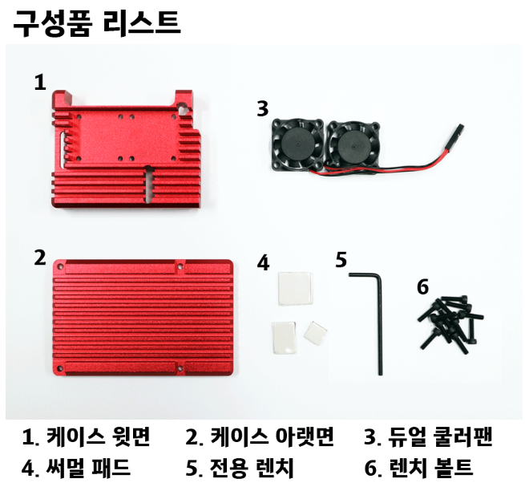
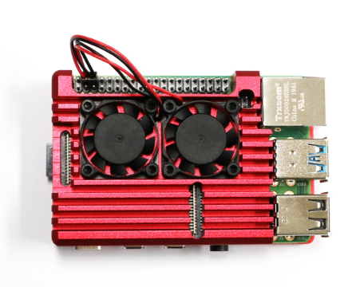
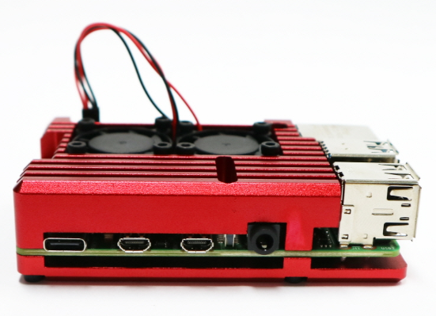
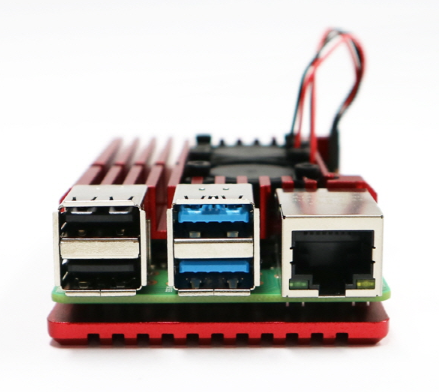
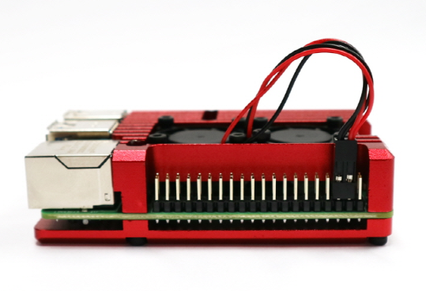

# 🍓 Raspberry Pi 4 방열판 조립 방법

* https://youtu.be/CPs3PmHuEw8

  
   
   

## 1. 나사
 - 머리 높이가 높은것 : 4개 - 바닥면에 조립
 - 머리 높이가 낮은것 : 8개 - 팬에 조립

## 2. 써멀패드(thermal pad)는 
 - 보통 양쪽 모두 열전도용 실리콘 패드 이고,
 - 운반 및 부착을 쉽게 하기 위해서 보호필름이 붙어 있습니다.
 - 다만 일부 제품은 한쪽에 약한 접착(양면테이프)이 있습니다.
 - 한쪽: 양면테이프처럼 접착성 있음
 - 한쪽: 비닐 보호필름

## 1️⃣ 칩(IC)에 붙이는 면
 - ➡ 양면테이프(접착면)을 칩에 먼저 부착
 - * 이유
   * 칩에 고정하기 위해 접착력이 있는 면을 사용
   * 조립 중 패드가 움직이지 않음

## 2️⃣ 방열판 쪽
 - ➡ 비닐 보호필름을 제거한 면이 방열판과 접촉

## 3.  바닥면 나사 조립시 한번에 다 조립하지 말고 조금씩 4곳을 돌려가면서 조립할것

## 4. 최종 조립이 되면 팬을 전원에 잘 연결할것

## 5. 테스터기로 전원 핀들의 쇼트를 확인하고, 옆면의 헤더틴의 바닥이 알루미늄 케이스에 좁속하는지 확인.

## 6. 이후에 전원 인가할것.
