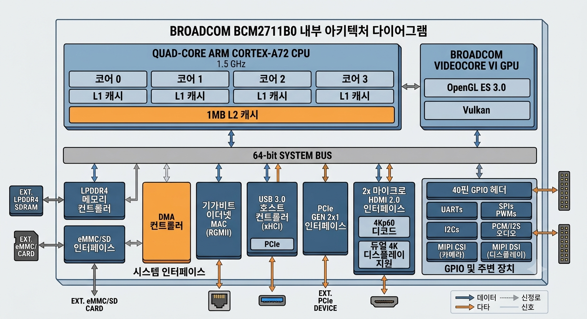
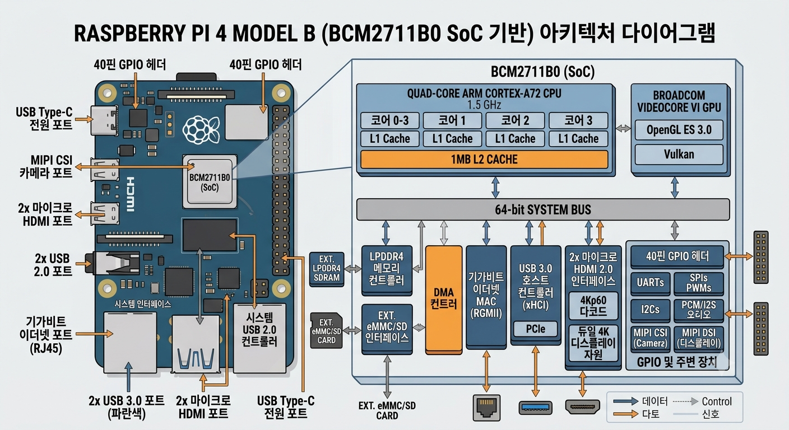
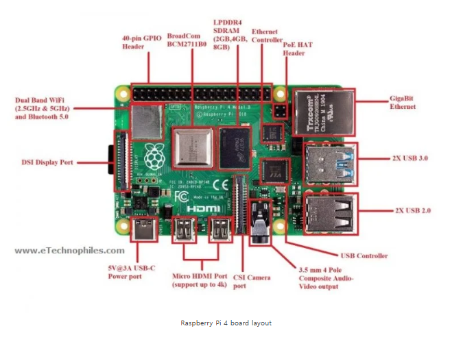
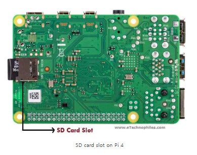

# 🍓 Raspberry Pi 4 GPIO Pinout & Specifications


> Raspberry Pi 4 Model B의 GPIO 핀 배치, 통신 프로토콜, 주요 사양을 정리한 레퍼런스 문서입니다.

---

## 📋 목차

- [보드 개요](#-보드-개요)
- [주요 사양](#-주요-사양)
- [GPIO 핀 배치](#-gpio-핀-배치)
  - [전원 핀 (Power Pins)](#전원-핀-power-pins)
  - [입출력 핀 (I/O Pins)](#입출력-핀-io-pins)
  - [PWM 핀](#pwm-핀)
  - [SPI 핀](#spi-핀)
  - [I2C 핀](#i2c-핀)
  - [UART 핀](#uart-핀)
- [물리적 치수](#-물리적-치수)
- [프로그래밍 방법](#-프로그래밍-방법)
- [FAQ](#-faq)

---

## 🖥️ 보드 개요

Raspberry Pi 4 Model B는 2019년 6월 출시되었으며, 이전 모델 대비 **전력 소비 20% 절감**, **성능 90% 향상**을 실현한 싱글보드 컴퓨터입니다.

| 구성 요소 | 설명 |
|-----------|------|
| **CPU** | Broadcom BCM2711 — Quad-core ARM Cortex-A72 (ARMv8) 64-bit @ 1.5GHz |
| **GPU** | Broadcom VideoCore VI @ 500MHz — H.265 4Kp60 디코드, H.264 1080p60 디코드 |
| **RAM** | LPDDR4 SDRAM (2GB / 4GB / 8GB) |
| **전원** | USB Type-C 5.1V / 3A |
| **저장** | Micro-SD 카드 슬롯 (보드 후면) |
| **디스플레이** | Micro-HDMI × 2 (최대 4K@60Hz) |
| **USB** | USB 3.0 × 2, USB 2.0 × 2 |
| **네트워크** | 기가비트 이더넷, 듀얼밴드 Wi-Fi 2.4/5GHz (802.11ac), Bluetooth 5.0 / BLE |
| **오디오/영상** | 4-pole 3.5mm 스테레오 오디오 + 컴포지트 비디오 통합 소켓 |
| **카메라/디스플레이** | 2-lane MIPI CSI / 2-lane MIPI DSI |
| **PoE** | 지원 (별도 PoE HAT 필요) |

---
# Raspberry Pi 3 Arch


<br>


---
# Raspberry Pi 4 Arch

| | |
|:----------------:|:----------------:|
|  |  | 
|  |  | 

```

admin@rp4-nwk:~ $ pinout
Description        : Raspberry Pi 4B rev 1.5
Revision           : d03115
SoC                : BCM2711
RAM                : 8GB
Storage            : MicroSD
USB ports          : 4 (of which 2 USB3)
Ethernet ports     : 1 (1000Mbps max. speed)
Wi-fi              : True
Bluetooth          : True
Camera ports (CSI) : 1
Display ports (DSI): 1

,--------------------------------.
| oooooooooooooooooooo J8   +======
| 1ooooooooooooooooooo  J14 |   Net
|  Wi                    12 +======
|  Fi  Pi Model 4B  V1.5 oo      |
| |D     ,---. +---+          +====
| |S     |SoC| |RAM|          |USB3
| |I     `---' +---+          +====
| |0                C|           |
| oo1 J2            S|        +====
|                   I| |A|    |USB2
| pwr   |hd|   |hd| 0| |u|    +====
`-| |---|m0|---|m1|----|x|-------'

J8:
   3V3  (1) (2)  5V
 GPIO2  (3) (4)  5V
 GPIO3  (5) (6)  GND
 GPIO4  (7) (8)  GPIO14
   GND  (9) (10) GPIO15
GPIO17 (11) (12) GPIO18
GPIO27 (13) (14) GND
GPIO22 (15) (16) GPIO23
   3V3 (17) (18) GPIO24
GPIO10 (19) (20) GND
 GPIO9 (21) (22) GPIO25
GPIO11 (23) (24) GPIO8
   GND (25) (26) GPIO7
 GPIO0 (27) (28) GPIO1
 GPIO5 (29) (30) GND
 GPIO6 (31) (32) GPIO12
GPIO13 (33) (34) GND
GPIO19 (35) (36) GPIO16
GPIO26 (37) (38) GPIO20
   GND (39) (40) GPIO21

J2:
GLOBAL ENABLE (1)
          GND (2)
          RUN (3)

J14:
TR01 TAP (1) (2) TR00 TAP
TR03 TAP (3) (4) TR02 TAP

For further information, please refer to https://pinout.xyz/

```

---

## 📊 주요 사양

| 항목 | 상세 |
|------|------|
| Processor | Broadcom BCM2711, Quad-core Cortex-A72 (ARM v8) 64-bit @ 1.5GHz |
| Memory | 2GB / 4GB / 8GB LPDDR4 SDRAM |
| Wireless | 2.4/5.0GHz IEEE 802.11ac, Bluetooth 5.0, BLE |
| Video Decode | H.265 4K@60fps, H.264 1080@60fps |
| Video Encode | H.264 1080@30fps |
| Graphics | OpenGL ES 3.0 |
| Operating Temp | 0 ~ 50°C |
| 크기 | 85mm × 56mm |

---

## 📌 GPIO 핀 배치

Raspberry Pi 4는 **40핀 GPIO 헤더**를 제공합니다.


<br>

<br>

| 핀 종류 | 수량 |
|---------|------|
| GPIO 핀 | 26개 |
| 5V 핀 | 2개 |
| 3.3V 핀 | 2개 |
| GND 핀 | 7개 (0V) |
| **합계** | **40개** |

```
 3V3  (1) (2)  5V
 GPIO2(3) (4)  5V
 GPIO3(5) (6)  GND
 GPIO4(7) (8)  GPIO14 (TX)
  GND (9) (10) GPIO15 (RX)
GPIO17(11)(12) GPIO18 (PWM0)
GPIO27(13)(14) GND
GPIO22(15)(16) GPIO23
 3V3 (17)(18) GPIO24
GPIO10(19)(20) GND
 GPIO9(21)(22) GPIO25
GPIO11(23)(24) GPIO8  (CE0)
  GND(25)(26) GPIO7  (CE1)
 GPIO0(27)(28) GPIO1
 GPIO5(29)(30) GND
 GPIO6(31)(32) GPIO12 (PWM0)
GPIO13(33)(34) GND
GPIO19(35)(36) GPIO16
GPIO26(37)(38) GPIO20
  GND(39)(40) GPIO21
```


---

### 전원 핀 (Power Pins)


| 핀 | 전압 | 설명 |
|----|------|------|
| **5V** | 5V | USB Type-C 포트로부터 공급되는 5V 출력 |
| **3.3V** | 3.3V | 외부 컴포넌트에 안정적인 3.3V 공급 |
| **GND** | 0V | 공통 접지 (7개 핀) |

> ⚠️ **주의**: GPIO 핀에 **3.3V 초과** 전압을 인가하면 보드가 손상될 수 있습니다.

---

### 입출력 핀 (I/O Pins)

GPIO 핀은 **Input** 또는 **Output**으로 런타임에 설정 가능합니다.

| 모드 | 동작 |
|------|------|
| **Input** | 외부 장치 신호 수신 |
| **Output** | HIGH(3.3V) 또는 LOW(0V) 출력 |

**입력 전압 기준:**

| 전압 범위 | 읽힘 값 |
|-----------|---------|
| 1.8V ~ 3.3V | HIGH |
| 1.8V 미만 | LOW |

---

### PWM 핀

PWM(Pulse Width Modulation): 디지털 신호에 아날로그 값을 변조하는 방식

| 구분 | 핀 |
|------|----|
| **Software PWM** | 모든 GPIO 핀 |
| **Hardware PWM** | GPIO12, GPIO13, GPIO18, GPIO19 |

**Hardware PWM 채널:**

| 채널 | 핀 |
|------|----|
| Channel 0 | GPIO12, GPIO18 |
| Channel 1 | GPIO13, GPIO19 |

> 동시에 최대 **2개의 독립 PWM 신호** 생성 가능

---

### SPI 핀

SPI(Serial Peripheral Interface): 마스터-슬레이브 방식의 고속 직렬 통신 프로토콜


#### SPI0

| 신호 | GPIO | 설명 |
|------|------|------|
| MISO | GPIO9 | Master In Slave Out |
| MOSI | GPIO10 | Master Out Slave In |
| SCLK | GPIO11 | SPI 클럭 |
| CE0 | GPIO8 | Chip Enable 0 |
| CE1 | GPIO7 | Chip Enable 1 |

#### SPI1

| 신호 | GPIO | 설명 |
|------|------|------|
| MISO | GPIO19 | Master In Slave Out |
| MOSI | GPIO20 | Master Out Slave In |
| SCLK | GPIO21 | SPI 클럭 |
| CE0 | GPIO18 | Chip Enable 0 |
| CE1 | GPIO17 | Chip Enable 1 |
| CE2 | GPIO16 | Chip Enable 2 |

**SPI 핀 연결 요약:**

| 핀 | 역할 |
|----|------|
| GND | 슬레이브 공통 접지 |
| SCLK | 통신 클럭 (마스터 생성) |
| MOSI | 마스터 → 슬레이브 데이터 전송 |
| MISO | 슬레이브 → 마스터 데이터 수신 |
| CE | 슬레이브 선택 (슬레이브당 1개 필요) |

---

### I2C 핀

I2C(Inter-Integrated Circuit): 저속 2선식 직렬 통신 프로토콜 (마스터-슬레이브)


| 신호 | GPIO | 설명 |
|------|------|------|
| SDA (Data) | GPIO2 | 직렬 데이터 |
| SCL (Clock) | GPIO3 | 직렬 클럭 |
| EEPROM SDA | GPIO0 | EEPROM 데이터 |
| EEPROM SCL | GPIO1 | EEPROM 클럭 |

> I2C는 **SDA + SCL** 2선만으로 다수의 슬레이브 디바이스와 통신 가능

---

### UART 핀

UART(Universal Asynchronous Receiver/Transmitter): 비동기 직렬 통신 프로토콜

| 신호 | GPIO | 설명 |
|------|------|------|
| TX | GPIO14 | 데이터 송신 → 상대 장치 RX 연결 |
| RX | GPIO15 | 데이터 수신 ← 상대 장치 TX 연결 |

---

## 📐 물리적 치수

```
┌──────────────────────────────────────┐
│                                      │
│   Raspberry Pi 4 Model B             │
│                                      │
│   길이: 85mm                          │
│   너비: 56mm                          │
│                                      │
└──────────────────────────────────────┘
```


---

## 💻 프로그래밍 방법

Raspberry Pi 4 GPIO는 다양한 언어로 제어 가능합니다.

| 방법 | 설명 |
|------|------|
| **Python** | `RPi.GPIO`, `gpiozero` 라이브러리 사용 |
| **C/C++ (libgpiod)** | 표준 커널 인터페이스 사용 |
| **C/C++ (pigpio)** | 서드파티 라이브러리 사용 |
| **Scratch 1.4 / 2** | 블록형 비주얼 프로그래밍 |
| **Processing 3** | 비주얼/인터랙티브 프로그래밍 |

**Python 예시 (LED 제어):**

```python
import RPi.GPIO as GPIO
import time

LED_PIN = 18  # GPIO18 (PWM)

GPIO.setmode(GPIO.BCM)
GPIO.setup(LED_PIN, GPIO.OUT)

try:
    while True:
        GPIO.output(LED_PIN, GPIO.HIGH)
        time.sleep(1)
        GPIO.output(LED_PIN, GPIO.LOW)
        time.sleep(1)
finally:
    GPIO.cleanup()
```

**Python 예시 (I2C 통신):**

* I2C 활성화

```
# 1. I2C 활성화 (raspi-config)
sudo raspi-config
# → Interface Options → I2C → Enable → Finish → 재부팅

# 또는 config.txt 직접 수정
echo "dtparam=i2c_arm=on" | sudo tee -a /boot/firmware/config.txt
sudo reboot
```


```python
import smbus2

I2C_BUS = 1       # /dev/i2c-1 (GPIO2=SDA, GPIO3=SCL)
DEVICE_ADDR = 0x48

bus = smbus2.SMBus(I2C_BUS)
data = bus.read_byte(DEVICE_ADDR)
print(f"Received: {data}")
```

---

## ❓ FAQ

**Q. Raspberry Pi 4는 64비트 OS와 호환되나요?**  
A. 네, Pi 4는 64비트 아키텍처를 탑재하고 있어 공식 64비트 OS와 완전히 호환됩니다. Raspberry Pi 재단 공식 웹사이트에서 다운로드할 수 있습니다.

**Q. GPIO 핀이 총 몇 개인가요?**  
A. 40핀 헤더 중 GPIO 핀은 28개(실제 사용 가능한 범용 핀은 26개)입니다.

**Q. GPIO 핀으로 보드에 전원 공급이 가능한가요?**  
A. GPIO 핀으로는 불가능합니다. 대신 GPIO 헤더의 **5V 핀과 GND 핀**을 이용하면 외부 전원 공급이 가능합니다.

**Q. GPIO 핀의 주요 용도는 무엇인가요?**  
A. 센서, 액추에이터, 디스플레이 등 외부 컴포넌트를 SoC와 연결하는 데 사용됩니다.

---

## 📚 참고 자료

- [Raspberry Pi 공식 문서](https://www.raspberrypi.com/documentation/)
- [BCM2711 데이터시트](https://datasheets.raspberrypi.com/bcm2711/bcm2711-peripherals.pdf)
- [Raspberry Pi 4 공식 회로도](https://datasheets.raspberrypi.com/rpi4/raspberry-pi-4-reduced-schematics.pdf)
- [RPi.GPIO Python 라이브러리](https://pypi.org/project/RPi.GPIO/)
- [pigpio 라이브러리](http://abyz.me.uk/rpi/pigpio/)

---

<div align="center">

**Raspberry Pi 4 Model B GPIO Reference**  
Broadcom BCM2711 | Cortex-A72 @ 1.5GHz | 40-pin GPIO

</div>
