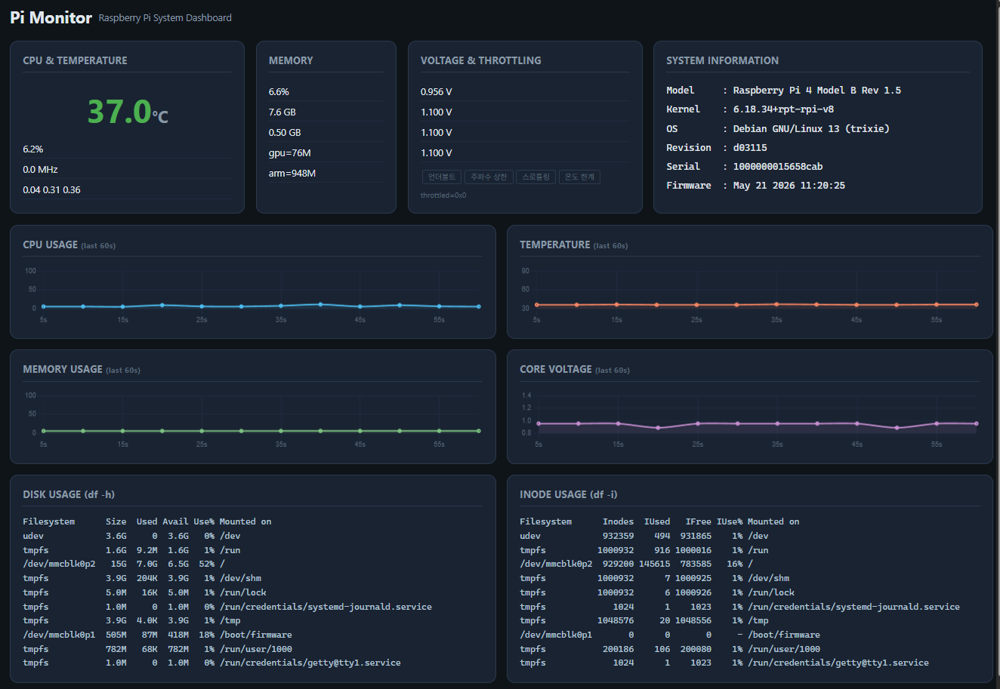

# 🍓 Raspberry Pi 4B 명령어 완전 정리

> Raspberry Pi 4B (Raspberry Pi OS 기반) 에서 실무에 자주 사용하는 명령어와 설정 방법을 체계적으로 정리한 레퍼런스입니다.

---

## 📋 목차

- [시스템 정보 확인](#1-시스템-정보-확인)
- [네트워크 설정](#2-네트워크-설정)
- [패키지 관리](#3-패키지-관리-apt)
- [파일 시스템 관리](#4-파일-시스템-관리)
- [프로세스 관리](#5-프로세스-관리)
- [서비스 관리 (systemd)](#6-서비스-관리-systemd)
- [GPIO 제어](#7-gpio-제어)
- [카메라 모듈](#8-카메라-모듈)
- [I2C / SPI / UART 설정](#9-i2c--spi--uart-설정)
- [디스플레이 설정](#10-디스플레이-설정)
- [전원 및 성능 관리](#11-전원-및-성능-관리)
- [SD카드 및 스토리지](#12-sd카드-및-스토리지)
- [raspi-config 설정](#13-raspi-config-설정)
- [Python 개발 환경](#14-python-개발-환경)
- [원격 접속](#15-원격-접속)
- [유용한 도구 모음](#16-유용한-도구-모음)

---

## 1. 시스템 정보 확인

### OS 및 커널 정보

```bash
# OS 버전 확인
cat /etc/os-release
lsb_release -a

# 커널 버전 확인
uname -r
uname -a

# 라즈베리 파이 모델 확인
cat /proc/device-tree/model
# 출력 예: Raspberry Pi 4 Model B Rev 1.4

# 하드웨어 리비전 확인
cat /proc/cpuinfo | grep Revision

# 시리얼 번호 확인
cat /proc/cpuinfo | grep Serial
```

### CPU / 메모리 정보

```bash
# CPU 정보
cat /proc/cpuinfo
lscpu

# CPU 현재 클럭 속도 확인
vcgencmd measure_clock arm
cat /sys/devices/system/cpu/cpu0/cpufreq/scaling_cur_freq

# CPU 온도 확인 (중요! 80°C 이상 주의)
vcgencmd measure_temp
cat /sys/class/thermal/thermal_zone0/temp   # 값 / 1000 = °C

# 메모리 정보
free -h
cat /proc/meminfo

# GPU 메모리 분할 확인
vcgencmd get_mem gpu
vcgencmd get_mem arm
```

### 전압 및 상태 확인

```bash
# 전압 확인 (언더볼트 감지)
vcgencmd measure_volts core
vcgencmd measure_volts sdram_c

# 스로틀링 상태 확인 (0x0 = 정상)
vcgencmd get_throttled
# 비트 의미:
# bit 0: 언더볼트 발생 중
# bit 1: 주파수 상한 설정됨
# bit 2: 현재 스로틀링 중
# bit 3: 소프트 온도 한계 도달
# bit 16~19: 위 상황이 이전에 발생한 이력

# 펌웨어 버전 확인
vcgencmd version
```

### 디스크 사용량

```bash
# 전체 디스크 사용량
df -h

# 특정 디렉토리 크기
du -sh /home/pi
du -sh /*

# inode 사용량 확인
df -i
```


* 모니터링 서버 구현

* 실행 방법
```bash
# 1. Node.js 설치 (없는 경우)
curl -fsSL https://deb.nodesource.com/setup_20.x | sudo -E bash -
sudo apt install -y nodejs

# 2. 프로젝트 폴더 구성
mkdir -p ~/pi-monitor/public
# server.js → ~/pi-monitor/
# package.json → ~/pi-monitor/
# index.html → ~/pi-monitor/public/

# 3. 의존성 설치 및 실행
cd ~/pi-monitor
npm install
node server.js
```


---

## 2. 네트워크 설정

### 🌐 네트워크 포트 번호 완전 정리

> TCP/IP 네트워크에서 사용되는 포트 번호(Port Number)의 분류, 예약 포트, 등록 포트, 사용자 포트를 체계적으로 정리한 레퍼런스입니다.

---

## 📋 목차

- [포트 번호 범위 분류](#1-포트-번호-범위-분류)
- [Well-Known 포트 (0 ~ 1023)](#2-well-known-포트-0--1023)
  - [네트워크 기반 프로토콜](#-네트워크-기반-프로토콜)
  - [이메일 관련](#-이메일-관련)
  - [파일 전송](#-파일-전송)
  - [웹 및 보안](#-웹-및-보안)
  - [원격 접속](#-원격-접속)
  - [디렉토리 및 인증](#-디렉토리-및-인증)
  - [데이터베이스](#-데이터베이스-well-known)
- [Registered 포트 (1024 ~ 49151)](#3-registered-포트-1024--49151)
  - [데이터베이스](#-데이터베이스)
  - [웹 및 API 서버](#-웹-및-api-서버)
  - [메시지 큐 및 미들웨어](#-메시지-큐-및-미들웨어)
  - [컨테이너 및 DevOps](#-컨테이너--devops)
  - [모니터링 및 로그](#-모니터링--로그)
  - [원격 데스크톱 및 관리](#-원격-데스크톱-및-관리)
  - [미디어 및 스트리밍](#-미디어--스트리밍)
  - [IoT 및 임베디드](#-iot--임베디드)
  - [게임 서버](#-게임-서버)
- [Dynamic / Private 포트 (49152 ~ 65535)](#4-dynamic--private-포트-49152--65535)
- [프로토콜별 포트 비교](#5-프로토콜별-포트-비교)
- [보안 관점 주의 포트](#6-보안-관점-주의-포트)
- [라즈베리 파이 개발 시 자주 쓰는 포트](#7-라즈베리-파이-개발-시-자주-쓰는-포트)

---

## 1. 포트 번호 범위 분류

| 범위 | 명칭 | 관리 기관 | 설명 |
|------|------|----------|------|
| **0 ~ 1023** | Well-Known Ports (시스템 포트) | IANA 공식 지정 | OS 또는 root 권한 필요, 표준 프로토콜 전용 |
| **1024 ~ 49151** | Registered Ports (등록 포트) | IANA 등록 권고 | 벤더/애플리케이션이 IANA에 등록하여 사용 |
| **49152 ~ 65535** | Dynamic / Private Ports (동적 포트) | 자유 사용 | OS가 임시 할당하거나 사용자가 자유롭게 사용 |

> 📌 **IANA** (Internet Assigned Numbers Authority): 전 세계 IP 주소, 포트 번호, 프로토콜 번호를 관리하는 국제 기관

---

## 2. Well-Known 포트 (0 ~ 1023)

> 운영체제 수준에서 예약된 포트입니다. Linux/Unix에서는 **root 권한** 없이 바인딩 불가합니다.

### 🔷 네트워크 기반 프로토콜

| 포트 | 프로토콜 | 전송 | 설명 |
|------|---------|------|------|
| **7** | Echo | TCP/UDP | 수신한 데이터를 그대로 반환 (네트워크 테스트) |
| **9** | Discard | TCP/UDP | 수신 데이터 폐기 (테스트용) |
| **13** | Daytime | TCP/UDP | 현재 날짜/시간 반환 |
| **17** | QOTD | TCP/UDP | Quote of the Day |
| **19** | Chargen | TCP/UDP | 문자 생성 서비스 (테스트) |
| **37** | Time | TCP/UDP | 1900년 1월 1일 기준 초 단위 시간 |
| **42** | WINS | TCP/UDP | Windows 인터넷 이름 서비스 |
| **43** | WHOIS | TCP | 도메인 등록 정보 조회 |
| **53** | DNS | TCP/UDP | 도메인 이름 해석 |
| **67** | DHCP Server | UDP | DHCP 서버 (IP 주소 할당) |
| **68** | DHCP Client | UDP | DHCP 클라이언트 |
| **69** | TFTP | UDP | 간단한 파일 전송 (임베디드 부트로더에 사용) |
| **123** | NTP | UDP | 네트워크 시간 동기화 |
| **137** | NetBIOS-NS | TCP/UDP | NetBIOS 이름 서비스 |
| **138** | NetBIOS-DGM | UDP | NetBIOS 데이터그램 서비스 |
| **139** | NetBIOS-SSN | TCP | NetBIOS 세션 서비스 |
| **161** | SNMP | UDP | 네트워크 장비 모니터링 |
| **162** | SNMP Trap | TCP/UDP | SNMP 알림 수신 |
| **179** | BGP | TCP | 인터넷 라우팅 프로토콜 |
| **389** | LDAP | TCP/UDP | 디렉토리 서비스 |
| **427** | SLP | TCP/UDP | 서비스 위치 프로토콜 |
| **514** | Syslog | UDP | 시스템 로그 전송 |
| **520** | RIP | UDP | 라우팅 정보 프로토콜 |
| **546** | DHCPv6 Client | UDP | IPv6 DHCP 클라이언트 |
| **547** | DHCPv6 Server | UDP | IPv6 DHCP 서버 |

### 📧 이메일 관련

| 포트 | 프로토콜 | 전송 | 설명 |
|------|---------|------|------|
| **25** | SMTP | TCP | 이메일 서버 간 전송 (MTA) |
| **110** | POP3 | TCP | 이메일 수신 (구식, 서버에서 삭제) |
| **143** | IMAP | TCP | 이메일 수신 (서버 보관, 동기화) |
| **465** | SMTPS | TCP | SMTP over SSL (구식) |
| **587** | SMTP Submission | TCP | 클라이언트 → 서버 이메일 제출 (현재 권장) |
| **993** | IMAPS | TCP | IMAP over SSL/TLS |
| **995** | POP3S | TCP | POP3 over SSL/TLS |

### 📁 파일 전송

| 포트 | 프로토콜 | 전송 | 설명 |
|------|---------|------|------|
| **20** | FTP-Data | TCP | FTP 데이터 전송 채널 |
| **21** | FTP | TCP | FTP 제어 채널 (명령) |
| **69** | TFTP | UDP | 단순 파일 전송 (인증 없음) |
| **115** | SFTP (구) | TCP | Simple FTP (SSH SFTP와 다름) |
| **445** | SMB | TCP | Windows 파일/프린터 공유 (Samba) |
| **548** | AFP | TCP | Apple Filing Protocol (macOS 파일 공유) |

### 🌐 웹 및 보안

| 포트 | 프로토콜 | 전송 | 설명 |
|------|---------|------|------|
| **80** | HTTP | TCP | 웹 서버 (평문) |
| **443** | HTTPS | TCP | 웹 서버 (SSL/TLS 암호화) |
| **8080** | HTTP-Alt | TCP | HTTP 대체 포트 (개발/프록시) |
| **8443** | HTTPS-Alt | TCP | HTTPS 대체 포트 |

### 💻 원격 접속

| 포트 | 프로토콜 | 전송 | 설명 |
|------|---------|------|------|
| **22** | SSH | TCP | 보안 원격 접속, SFTP, SCP |
| **23** | Telnet | TCP | 평문 원격 접속 (보안 취약, 사용 지양) |
| **512** | rexec | TCP | 원격 명령 실행 (구식) |
| **513** | rlogin | TCP | 원격 로그인 (구식) |
| **514** | rsh | TCP | 원격 셸 (구식, Syslog와 겹침) |
| **543** | Kerberos | TCP | Kerberos 인증 원격 로그인 |
| **992** | Telnets | TCP | Telnet over SSL |

### 🗂️ 디렉토리 및 인증

| 포트 | 프로토콜 | 전송 | 설명 |
|------|---------|------|------|
| **88** | Kerberos | TCP/UDP | Kerberos 인증 |
| **389** | LDAP | TCP/UDP | 경량 디렉토리 접근 프로토콜 |
| **464** | Kerberos | TCP/UDP | Kerberos 비밀번호 변경 |
| **636** | LDAPS | TCP | LDAP over SSL/TLS |

### 🗄️ 데이터베이스 (Well-Known)

| 포트 | 서비스 | 전송 | 설명 |
|------|--------|------|------|
| **118** | SQL | TCP/UDP | SQL 서비스 (구식) |

---

## 3. Registered 포트 (1024 ~ 49151)

> IANA에 등록된 애플리케이션 포트입니다. root 권한 없이 사용 가능합니다.

### 🗄️ 데이터베이스

| 포트 | 서비스 | 전송 | 설명 |
|------|--------|------|------|
| **1433** | MS SQL Server | TCP | Microsoft SQL Server |
| **1434** | MS SQL Monitor | UDP | MS SQL Server 브라우저 서비스 |
| **1521** | Oracle DB | TCP | Oracle Database |
| **1526** | Oracle DB (Alt) | TCP | Oracle 대체 포트 |
| **2484** | Oracle LDAP | TCP | Oracle SSL 연결 |
| **3306** | MySQL / MariaDB | TCP | 가장 널리 쓰이는 오픈소스 RDBMS |
| **5432** | PostgreSQL | TCP | 고급 오픈소스 RDBMS |
| **5433** | PostgreSQL (Alt) | TCP | PostgreSQL 대체 포트 |
| **6379** | Redis | TCP | 인메모리 키-값 저장소 |
| **6380** | Redis TLS | TCP | Redis SSL/TLS |
| **7474** | Neo4j HTTP | TCP | Neo4j 그래프 DB 웹 콘솔 |
| **7687** | Neo4j Bolt | TCP | Neo4j Bolt 드라이버 |
| **8086** | InfluxDB | TCP | 시계열 데이터베이스 |
| **8087** | InfluxDB (Alt) | TCP | InfluxDB Protobuf |
| **9042** | Cassandra | TCP | Apache Cassandra CQL |
| **9200** | Elasticsearch | TCP | Elasticsearch REST API |
| **9300** | Elasticsearch | TCP | Elasticsearch 노드 간 통신 |
| **27017** | MongoDB | TCP | MongoDB 기본 포트 |
| **27018** | MongoDB | TCP | MongoDB shard |
| **27019** | MongoDB | TCP | MongoDB config server |
| **28015** | RethinkDB | TCP | RethinkDB 드라이버 |
| **29015** | RethinkDB | TCP | RethinkDB 클러스터 |

### 🌐 웹 및 API 서버

| 포트 | 서비스 | 전송 | 설명 |
|------|--------|------|------|
| **3000** | Node.js / React Dev | TCP | Node.js Express, React 개발서버 |
| **3001** | React Dev (Alt) | TCP | React CRA 대체 |
| **4000** | GraphQL / Phoenix | TCP | GraphQL 서버, Elixir Phoenix |
| **4200** | Angular Dev | TCP | Angular CLI 개발서버 |
| **5000** | Flask / Python | TCP | Python Flask 기본 포트 |
| **5001** | Flask HTTPS | TCP | Flask HTTPS |
| **7000** | Cassandra / ArangoDB | TCP | 여러 서비스 혼용 |
| **8000** | Django / HTTP-Alt | TCP | Python Django 개발서버 |
| **8080** | Tomcat / HTTP-Alt | TCP | Apache Tomcat, 일반 HTTP 대체 |
| **8081** | HTTP-Alt | TCP | 보조 HTTP 서버 |
| **8082** | HTTP-Alt | TCP | 보조 HTTP 서버 |
| **8888** | Jupyter Notebook | TCP | Jupyter 개발 환경 |
| **9090** | HTTP-Alt / Prometheus | TCP | Prometheus 모니터링, HTTP 대체 |
| **9999** | HTTP-Alt | TCP | 개발용 HTTP 대체 |

### 📨 메시지 큐 및 미들웨어

| 포트 | 서비스 | 전송 | 설명 |
|------|--------|------|------|
| **1883** | MQTT | TCP | IoT 메시지 프로토콜 (평문) |
| **4369** | EPMD | TCP | Erlang Port Mapper (RabbitMQ) |
| **5671** | AMQP TLS | TCP | RabbitMQ SSL |
| **5672** | AMQP | TCP | RabbitMQ 메시지 큐 |
| **8161** | ActiveMQ | TCP | ActiveMQ 웹 콘솔 |
| **8883** | MQTT TLS | TCP | MQTT over SSL/TLS |
| **9092** | Kafka | TCP | Apache Kafka 브로커 |
| **9093** | Kafka TLS | TCP | Kafka SSL |
| **9094** | Kafka SASL | TCP | Kafka 인증 |
| **15672** | RabbitMQ | TCP | RabbitMQ 관리 웹 콘솔 |
| **61613** | STOMP | TCP | ActiveMQ STOMP 프로토콜 |
| **61614** | STOMP TLS | TCP | ActiveMQ STOMP SSL |
| **61616** | ActiveMQ | TCP | ActiveMQ 브로커 |

### 🐳 컨테이너 및 DevOps

| 포트 | 서비스 | 전송 | 설명 |
|------|--------|------|------|
| **2375** | Docker | TCP | Docker 데몬 REST API (평문, 보안 주의) |
| **2376** | Docker TLS | TCP | Docker 데몬 REST API (TLS) |
| **2377** | Docker Swarm | TCP | Docker Swarm 클러스터 관리 |
| **2379** | etcd | TCP | Kubernetes 키-값 저장소 |
| **2380** | etcd Peer | TCP | etcd 클러스터 통신 |
| **3000** | Grafana | TCP | Grafana 대시보드 |
| **5000** | Docker Registry | TCP | 프라이빗 Docker Registry |
| **6443** | Kubernetes API | TCP | Kubernetes API 서버 |
| **8080** | Jenkins | TCP | Jenkins CI/CD 웹 UI |
| **8443** | Kubernetes | TCP | Kubernetes 대시보드 |
| **9000** | SonarQube / Portainer | TCP | 코드 품질 분석, 컨테이너 관리 |
| **9090** | Prometheus | TCP | Prometheus 메트릭 수집 |
| **10250** | Kubelet | TCP | Kubernetes 노드 에이전트 |
| **10255** | Kubelet Read-Only | TCP | Kubernetes 읽기 전용 |
| **30000~32767** | NodePort | TCP | Kubernetes NodePort 범위 |

### 📊 모니터링 및 로그

| 포트 | 서비스 | 전송 | 설명 |
|------|--------|------|------|
| **514** | Syslog | UDP | 시스템 로그 (Well-Known) |
| **1514** | Syslog TLS | TCP | Syslog over TLS |
| **3000** | Grafana | TCP | 메트릭 시각화 대시보드 |
| **4317** | OpenTelemetry | TCP | OpenTelemetry gRPC |
| **4318** | OpenTelemetry | TCP | OpenTelemetry HTTP |
| **5044** | Logstash | TCP | Logstash Beats 입력 |
| **5601** | Kibana | TCP | ELK 스택 시각화 |
| **9090** | Prometheus | TCP | Prometheus 서버 |
| **9093** | Alertmanager | TCP | Prometheus 알림 매니저 |
| **9100** | Node Exporter | TCP | 시스템 메트릭 수집기 |
| **9187** | PostgreSQL Exporter | TCP | PostgreSQL 메트릭 |
| **9308** | Kafka Exporter | TCP | Kafka 메트릭 |
| **12201** | Graylog GELF | TCP/UDP | Graylog 로그 수집 |

### 🖥️ 원격 데스크톱 및 관리

| 포트 | 서비스 | 전송 | 설명 |
|------|--------|------|------|
| **1194** | OpenVPN | TCP/UDP | VPN 터널 |
| **3389** | RDP | TCP | Windows 원격 데스크톱 |
| **4848** | GlassFish | TCP | GlassFish 관리 콘솔 |
| **5500** | VNC (Listen) | TCP | VNC 역방향 연결 |
| **5900** | VNC | TCP | VNC 원격 데스크톱 |
| **5901** | VNC :1 | TCP | VNC 디스플레이 1 |
| **5902** | VNC :2 | TCP | VNC 디스플레이 2 |
| **6881~6889** | BitTorrent | TCP | BitTorrent P2P |
| **8006** | Proxmox | TCP | Proxmox VE 관리 웹 UI |
| **8888** | Jupyter | TCP | Jupyter Notebook |
| **9090** | Cockpit | TCP | Linux 웹 관리 패널 |
| **10000** | Webmin | TCP | Linux 서버 웹 관리 |
| **51820** | WireGuard | UDP | WireGuard VPN |

### 🎬 미디어 및 스트리밍

| 포트 | 서비스 | 전송 | 설명 |
|------|--------|------|------|
| **554** | RTSP | TCP/UDP | 실시간 스트리밍 프로토콜 |
| **1935** | RTMP | TCP | Flash/OBS 스트리밍 |
| **5004** | RTP | UDP | 실시간 전송 프로토콜 |
| **5005** | RTP Control | UDP | RTCP 제어 |
| **7070** | RTSP (Alt) | TCP | RTSP 대체 포트 |
| **8554** | RTSP (Alt) | TCP | RTSP 대체 포트 |
| **32400** | Plex | TCP | Plex 미디어 서버 |

### 📡 IoT 및 임베디드

| 포트 | 서비스 | 전송 | 설명 |
|------|--------|------|------|
| **502** | Modbus | TCP | 산업용 Modbus TCP |
| **1883** | MQTT | TCP | IoT 경량 메시지 프로토콜 |
| **4840** | OPC-UA | TCP | 산업 자동화 OPC-UA |
| **5683** | CoAP | UDP | IoT 경량 HTTP 대체 |
| **5684** | CoAP TLS | UDP | CoAP over DTLS |
| **8883** | MQTT TLS | TCP | MQTT 보안 연결 |
| **9001** | MQTT WebSocket | TCP | MQTT over WebSocket |
| **44818** | EtherNet/IP | TCP | 산업용 이더넷/IP |
| **47808** | BACnet | UDP | 빌딩 자동화 프로토콜 |

### 🎮 게임 서버

| 포트 | 서비스 | 전송 | 설명 |
|------|--------|------|------|
| **25565** | Minecraft Java | TCP | Minecraft Java Edition |
| **19132** | Minecraft Bedrock | UDP | Minecraft Bedrock Edition |
| **27015** | Steam / Source | TCP/UDP | Steam 게임 서버 |
| **27016** | Steam (Alt) | UDP | Steam 대체 |
| **27017** | Steam / MongoDB | TCP/UDP | Steam 또는 MongoDB |
| **28960** | Call of Duty | TCP/UDP | CoD 게임 서버 |

---

## 4. Dynamic / Private 포트 (49152 ~ 65535)

> 자유롭게 사용 가능한 포트 대역입니다.

| 구분 | 내용 |
|------|------|
| **용도** | OS가 클라이언트 소켓의 임시(Ephemeral) 포트로 자동 할당 |
| **Linux 기본 범위** | `32768 ~ 60999` (`/proc/sys/net/ipv4/ip_local_port_range`) |
| **Windows 기본 범위** | `49152 ~ 65535` (IANA 표준 준수) |
| **사용자 임의 사용** | 서비스 충돌만 없으면 자유롭게 사용 가능 |
| **권장 사용 범위** | `49152 ~ 65535` (IANA Dynamic/Private 영역) |

```bash
# Linux에서 임시 포트 범위 확인
cat /proc/sys/net/ipv4/ip_local_port_range

# 임시 포트 범위 변경 (예: 32768 ~ 60999)
sudo sysctl -w net.ipv4.ip_local_port_range="32768 60999"

# 영구 적용
echo "net.ipv4.ip_local_port_range = 32768 60999" | sudo tee -a /etc/sysctl.conf
```

### 자주 쓰이는 Dynamic 포트 대역 예시

| 포트 | 사용 예 |
|------|---------|
| **49152** | Windows RPC 동적 포트 시작 |
| **50000~50100** | 사용자 커스텀 서비스 영역 |
| **60000~61000** | 사용자 테스트/개발 영역 |
| **65535** | 포트 최대값 (16비트 최대) |

---

## 5. 프로토콜별 포트 비교

### TCP vs UDP 주요 차이

| 항목 | TCP | UDP |
|------|-----|-----|
| 연결 방식 | 연결 지향 (3-way handshake) | 비연결 (Connectionless) |
| 신뢰성 | 보장 (재전송) | 미보장 |
| 속도 | 상대적으로 느림 | 빠름 |
| 용도 | HTTP, SSH, DB, 파일 전송 | DNS, DHCP, NTP, 스트리밍, 게임 |

### 평문 vs 보안(TLS) 포트 대응표

| 서비스 | 평문 포트 | TLS 포트 |
|--------|---------|---------|
| HTTP | 80 | 443 (HTTPS) |
| FTP | 21 | 990 (FTPS) |
| SMTP | 25 | 465 / 587 |
| POP3 | 110 | 995 |
| IMAP | 143 | 993 |
| LDAP | 389 | 636 |
| MQTT | 1883 | 8883 |
| Redis | 6379 | 6380 |
| Docker API | 2375 | 2376 |
| RabbitMQ | 5672 | 5671 |

---

## 6. 보안 관점 주의 포트

> 공격자가 자주 스캔하거나 취약점이 알려진 포트입니다. 불필요하면 방화벽으로 차단을 권장합니다.

| 포트 | 서비스 | 위험 이유 | 권장 조치 |
|------|--------|----------|----------|
| **21** | FTP | 평문 전송, 익명 로그인 가능 | SFTP(22)로 대체 |
| **23** | Telnet | 모든 데이터 평문 전송 | SSH(22)로 대체 |
| **25** | SMTP | 스팸 릴레이 남용 | 인증 강제, 외부 차단 |
| **135** | RPC | Windows 원격 공격 경로 | 외부 차단 필수 |
| **137~139** | NetBIOS | 인터넷 노출 위험 | 외부 차단 필수 |
| **445** | SMB | EternalBlue 등 랜섬웨어 경로 | 외부 차단 필수 |
| **1433** | MS SQL | 무차별 대입 공격 대상 | 방화벽 IP 제한 |
| **2375** | Docker | 평문 Docker API 노출 시 풀권한 탈취 | TLS(2376) 또는 로컬만 허용 |
| **3306** | MySQL | 무차별 대입 공격 대상 | 로컬 또는 IP 제한 |
| **3389** | RDP | 랜섬웨어 주요 공격 경로 | VPN 내부만 허용 |
| **4444** | Metasploit | 악성코드 C2 서버 기본 포트 | 차단 |
| **5900** | VNC | 평문 또는 약한 인증 | SSH 터널링 사용 |
| **6379** | Redis | 인증 없이 노출 시 데이터 탈취 | 로컬 바인딩 또는 인증 설정 |
| **27017** | MongoDB | 기본 설정 시 인증 없음 | 인증 활성화, IP 제한 |

```bash
# UFW로 특정 포트 차단 예시 (라즈베리 파이 / Ubuntu)
sudo ufw deny 23        # Telnet 차단
sudo ufw deny 21        # FTP 차단
sudo ufw allow from 192.168.1.0/24 to any port 3306  # MySQL 내부망만 허용
sudo ufw allow 22       # SSH 허용
sudo ufw enable
sudo ufw status verbose
```

---

## 7. 라즈베리 파이 개발 시 자주 쓰는 포트

| 포트 | 용도 | 설명 |
|------|------|------|
| **22** | SSH | 원격 접속, SFTP, SCP |
| **80** | HTTP | Nginx, Apache 웹 서버 |
| **443** | HTTPS | SSL 웹 서버 |
| **1883** | MQTT | Mosquitto IoT 메시지 브로커 |
| **3000** | Node.js | Express 앱, Grafana |
| **3306** | MariaDB | 로컬 데이터베이스 |
| **4200** | Angular | Angular 개발 서버 |
| **5000** | Flask | Python 웹 API |
| **5432** | PostgreSQL | 로컬 데이터베이스 |
| **5900** | VNC | 원격 데스크톱 |
| **6379** | Redis | 캐시, 세션 저장 |
| **8000** | Django | Python 웹 프레임워크 |
| **8080** | HTTP-Alt | 개발/테스트용 HTTP |
| **8086** | InfluxDB | 센서 시계열 데이터 |
| **8088** | InfluxDB Backup | InfluxDB 백업 서비스 |
| **8161** | ActiveMQ | 메시지 큐 관리 UI |
| **8554** | RTSP | Pi Camera 스트리밍 |
| **8883** | MQTT TLS | 보안 MQTT |
| **8888** | Jupyter | 머신러닝 개발 환경 |
| **9090** | Prometheus | 시스템 메트릭 수집 |
| **9100** | Node Exporter | 시스템 리소스 메트릭 |
| **51820** | WireGuard | 경량 VPN |

```bash
# 현재 열린 포트 확인
sudo ss -tulnp
sudo netstat -tulnp

# 특정 포트 사용 프로세스 확인
sudo lsof -i :3000
sudo fuser 3000/tcp

# 포트 스캔 (같은 네트워크에서)
nmap -p 1-65535 192.168.1.100
nmap -sV 192.168.1.100        # 서비스 버전 포함
```

---

## 참고 자료

- [IANA Service Name and Port Number Registry](https://www.iana.org/assignments/service-names-port-numbers/service-names-port-numbers.xhtml)
- [RFC 6335 — Internet Assigned Numbers Authority (IANA) Procedures for the Management of the Service Name and Transport Protocol Port Number Registry](https://datatracker.ietf.org/doc/html/rfc6335)
- [Wikipedia — List of TCP and UDP port numbers](https://en.wikipedia.org/wiki/List_of_TCP_and_UDP_port_numbers)

---

### IP 주소 / 인터페이스 확인

```bash
# IP 주소 확인
ip addr show
ip a
hostname -I        # 간단히 IP만 출력

# 네트워크 인터페이스 목록
ip link show

# 라우팅 테이블
ip route show
route -n

# DNS 확인
cat /etc/resolv.conf
resolvectl status
```

### Wi-Fi 설정

```bash
# Wi-Fi 스캔
sudo iwlist wlan0 scan | grep ESSID

# NetworkManager로 Wi-Fi 연결 (Bookworm 이후)
nmcli dev wifi list
nmcli dev wifi connect "SSID명" password "비밀번호"
nmcli con show
nmcli con up "연결명"

# wpa_supplicant 방식 (구형 OS)
sudo nano /etc/wpa_supplicant/wpa_supplicant.conf
```

```conf
# /etc/wpa_supplicant/wpa_supplicant.conf 예시
ctrl_interface=DIR=/var/run/wpa_supplicant GROUP=netdev
update_config=1
country=KR

network={
    ssid="공유기SSID"
    psk="비밀번호"
    key_mgmt=WPA-PSK
}
```

```bash
# Wi-Fi 재시작
sudo systemctl restart NetworkManager
sudo wpa_cli -i wlan0 reconfigure

# Wi-Fi 상태 확인
iwconfig wlan0
iw wlan0 link
```

### 고정 IP 설정

```bash
# NetworkManager 방식 (Bookworm 이후 기본)
nmcli con modify "유선 연결 1" ipv4.addresses 192.168.1.100/24
nmcli con modify "유선 연결 1" ipv4.gateway 192.168.1.1
nmcli con modify "유선 연결 1" ipv4.dns "8.8.8.8 8.8.4.4"
nmcli con modify "유선 연결 1" ipv4.method manual
nmcli con up "유선 연결 1"

# dhcpcd 방식 (구형 OS)
sudo nano /etc/dhcpcd.conf
```

```conf
# /etc/dhcpcd.conf 고정 IP 예시
interface eth0
static ip_address=192.168.1.100/24
static routers=192.168.1.1
static domain_name_servers=8.8.8.8 8.8.4.4
```

### 포트 및 방화벽

```bash
# 열린 포트 확인
ss -tulnp
netstat -tulnp

# 방화벽 (ufw)
sudo apt install ufw
sudo ufw enable
sudo ufw allow 22        # SSH
sudo ufw allow 80        # HTTP
sudo ufw allow 443       # HTTPS
sudo ufw status verbose

# 핑 테스트
ping -c 4 google.com
ping -c 4 192.168.1.1
```

---

## 3. 패키지 관리 (APT)

```bash
# 패키지 목록 업데이트
sudo apt update

# 설치된 패키지 업그레이드
sudo apt upgrade -y
sudo apt full-upgrade -y    # 의존성 해결 포함

# 패키지 설치
sudo apt install 패키지명
sudo apt install -y 패키지명    # 확인 없이 설치

# 패키지 제거
sudo apt remove 패키지명
sudo apt purge 패키지명         # 설정 파일까지 제거
sudo apt autoremove             # 불필요한 의존성 제거

# 패키지 검색
apt search 키워드
apt-cache search 키워드

# 패키지 정보 확인
apt show 패키지명
dpkg -l | grep 패키지명

# 설치된 파일 목록 확인
dpkg -L 패키지명

# 캐시 정리
sudo apt clean
sudo apt autoclean

# 전체 시스템 업데이트 (한 번에)
sudo apt update && sudo apt full-upgrade -y && sudo apt autoremove -y
```

---

## 4. 파일 시스템 관리

### 기본 파일 조작

```bash
# 디렉토리 이동 및 확인
ls -la              # 숨김 파일 포함 상세 목록
ls -lh              # 파일 크기 사람이 읽기 쉽게
cd /home/pi
pwd                 # 현재 경로 출력

# 파일 복사/이동/삭제
cp 원본 대상
cp -r 폴더 대상폴더       # 디렉토리 재귀 복사
mv 원본 대상
rm 파일명
rm -rf 폴더명             # 강제 재귀 삭제 (주의!)

# 파일 생성/편집
touch 파일명
nano 파일명
vim 파일명

# 파일 내용 확인
cat 파일명
less 파일명         # 페이지 단위 보기
head -n 20 파일명   # 상위 20줄
tail -n 20 파일명   # 하위 20줄
tail -f 로그파일    # 실시간 로그 추적

# 파일 검색
find / -name "파일명"
find /home -name "*.py" -type f
locate 파일명        # updatedb 선행 필요

# 권한 변경
chmod 755 파일명
chmod +x 스크립트.sh
chown pi:pi 파일명
chown -R pi:pi 폴더/
```

### 마운트 / 외부 저장장치

```bash
# 연결된 장치 목록 확인
lsblk
lsblk -f            # 파일시스템 정보 포함
fdisk -l            # 파티션 정보

# USB 마운트
sudo mkdir -p /mnt/usb
sudo mount /dev/sda1 /mnt/usb
sudo umount /mnt/usb

# 자동 마운트 (/etc/fstab)
sudo blkid          # UUID 확인
sudo nano /etc/fstab
# 예: UUID=xxxx /mnt/usb vfat defaults,auto,users,rw 0 0

# SD카드 파티션 확장 (raspi-config로 자동 가능)
sudo raspi-config   # Advanced Options → Expand Filesystem
```

---

## 5. 프로세스 관리

```bash
# 실행 중인 프로세스 목록
ps aux
ps aux | grep python

# 실시간 프로세스 모니터링
top
htop                # 컬러 인터페이스 (sudo apt install htop)

# 프로세스 종료
kill PID
kill -9 PID         # 강제 종료
killall 프로그램명
pkill -f "파이썬스크립트.py"

# 백그라운드 실행
python3 script.py &
nohup python3 script.py &           # 터미널 종료 후에도 유지
nohup python3 script.py > out.log 2>&1 &

# 백그라운드 작업 관리
jobs                # 현재 세션 백그라운드 작업 목록
fg %1               # 포그라운드로 전환
bg %1               # 백그라운드로 전환
Ctrl + Z            # 현재 프로세스 일시 정지

# screen / tmux (세션 유지)
sudo apt install screen
screen -S 세션명
screen -ls          # 세션 목록
screen -r 세션명    # 세션 재접속
# Ctrl+A, D = 세션 분리 (detach)
```

---

## 6. 서비스 관리 (systemd)

```bash
# 서비스 상태 확인
sudo systemctl status 서비스명
sudo systemctl status ssh

# 서비스 시작/중지/재시작
sudo systemctl start 서비스명
sudo systemctl stop 서비스명
sudo systemctl restart 서비스명
sudo systemctl reload 서비스명     # 설정만 다시 로드

# 부팅 시 자동 시작 설정
sudo systemctl enable 서비스명
sudo systemctl disable 서비스명

# 실행 중인 서비스 목록
sudo systemctl list-units --type=service --state=running

# 로그 확인 (journald)
journalctl -u 서비스명
journalctl -u 서비스명 -f          # 실시간 로그
journalctl -u 서비스명 --since "1 hour ago"
journalctl -n 100                  # 최근 100줄

# 사용자 정의 서비스 파일 생성
sudo nano /etc/systemd/system/myapp.service
```

```ini
# /etc/systemd/system/myapp.service 예시
[Unit]
Description=My Python Application
After=network.target

[Service]
Type=simple
User=pi
WorkingDirectory=/home/pi/myapp
ExecStart=/usr/bin/python3 /home/pi/myapp/main.py
Restart=always
RestartSec=5

[Install]
WantedBy=multi-user.target
```

```bash
# 서비스 등록 및 시작
sudo systemctl daemon-reload
sudo systemctl enable myapp
sudo systemctl start myapp
```

---

## 7. GPIO 제어

### raspi-gpio (기본 도구)

```bash
# GPIO 패키지 설치
sudo apt update
sudo apt install gpiod libgpiod-dev

# 모든 GPIO 핀 상태 확인
gpiodetect

# 특정 핀 상태 확인 (GPIO 번호 기준)
raspi-gpio get 18

# GPIO 핀 출력 설정
raspi-gpio set 18 op     # 출력 모드
raspi-gpio set 18 dh     # HIGH 출력
raspi-gpio set 18 dl     # LOW 출력

# GPIO 핀 입력 설정
raspi-gpio set 18 ip     # 입력 모드
raspi-gpio set 18 pu     # 풀업 저항
raspi-gpio set 18 pd     # 풀다운 저항
```

### gpiod (최신 방식 - Bookworm 권장)

```bash
# gpiod 설치
sudo apt install gpiod python3-gpiod

# GPIO 칩 목록 확인
gpiodetect

# 핀 정보 확인
gpioinfo gpiochip0

# 핀 출력 제어
gpioset gpiochip0 18=1      # HIGH
gpioset gpiochip0 18=0      # LOW

# 핀 입력 읽기
gpioget gpiochip0 18
```

### Python RPi.GPIO (기존 방식)

```python
# RPi.GPIO 설치
# sudo apt install python3-rpi.gpio

import RPi.GPIO as GPIO
import time

GPIO.setmode(GPIO.BCM)          # BCM 핀 번호 사용
GPIO.setup(18, GPIO.OUT)        # 출력 설정
GPIO.setup(24, GPIO.IN, pull_up_down=GPIO.PUD_UP)  # 입력 + 풀업

# LED 제어 예시
GPIO.output(18, GPIO.HIGH)
time.sleep(1)
GPIO.output(18, GPIO.LOW)

# 인터럽트 예시
def button_callback(channel):
    print(f"버튼 눌림: GPIO {channel}")

GPIO.add_event_detect(24, GPIO.FALLING, callback=button_callback, bouncetime=200)

# PWM 제어
pwm = GPIO.PWM(18, 1000)        # 핀 18, 주파수 1kHz
pwm.start(0)                    # 초기 듀티사이클 0%
pwm.ChangeDutyCycle(50)         # 50% 듀티사이클
pwm.stop()

GPIO.cleanup()
```

### Python gpiozero (고수준 라이브러리)

```python
# sudo apt install python3-gpiozero

from gpiozero import LED, Button, PWMOutputDevice, DistanceSensor
from signal import pause
import time

# LED 제어
led = LED(18)
led.on()
led.off()
led.blink(on_time=0.5, off_time=0.5)

# 버튼 처리
button = Button(24, pull_up=True)
button.when_pressed = lambda: led.on()
button.when_released = lambda: led.off()

# 서보 모터
from gpiozero import Servo
servo = Servo(17)
servo.min()     # -90도
servo.mid()     # 0도
servo.max()     # +90도

# HC-SR04 초음파 센서
sensor = DistanceSensor(echo=24, trigger=23)
print(f"거리: {sensor.distance * 100:.1f} cm")

pause()
```

---

## 8. 카메라 모듈

### Picamera2 (최신 - Bookworm 기준)

```bash
# 설치 확인
sudo apt install python3-picamera2
sudo apt install libcamera-apps

# 카메라 테스트
libcamera-hello                        # 미리보기 5초
libcamera-jpeg -o test.jpg             # 사진 촬영
libcamera-vid -o test.h264 -t 5000    # 5초 영상 녹화
libcamera-still -o photo.jpg --width 1920 --height 1080

# 카메라 목록 확인
libcamera-hello --list-cameras
```

```python
# Picamera2 Python 예시
from picamera2 import Picamera2
import time

picam2 = Picamera2()

# 사진 촬영
config = picam2.create_still_configuration()
picam2.configure(config)
picam2.start()
time.sleep(2)
picam2.capture_file("photo.jpg")
picam2.stop()

# 영상 스트리밍 설정
config = picam2.create_video_configuration(main={"size": (1280, 720)})
picam2.configure(config)
picam2.start_recording(H264Encoder(), "video.h264")
time.sleep(10)
picam2.stop_recording()
```

```bash
# 영상 변환 (h264 → mp4)
sudo apt install ffmpeg
ffmpeg -i test.h264 -c copy output.mp4
```

---

## 9. I2C / SPI / UART 설정

### 인터페이스 활성화

```bash
# raspi-config로 활성화
sudo raspi-config
# Interface Options → I2C / SPI / Serial Port

# 또는 /boot/config.txt 직접 편집 (Bookworm: /boot/firmware/config.txt)
sudo nano /boot/firmware/config.txt
```

```ini
# /boot/firmware/config.txt 인터페이스 활성화
dtparam=i2c_arm=on
dtparam=spi=on
enable_uart=1
```

### I2C

```bash
# I2C 도구 설치
sudo apt install i2c-tools python3-smbus

# 연결된 I2C 장치 스캔 (주소 확인)
sudo i2cdetect -y 1

# I2C 레지스터 읽기/쓰기
sudo i2cget -y 1 0x68 0x75      # 장치주소 0x68, 레지스터 0x75 읽기
sudo i2cset -y 1 0x68 0x6B 0x00 # 레지스터 0x6B에 0x00 쓰기
```

```python
# Python SMBus I2C 예시 (MPU-6050 IMU)
import smbus2
import time

bus = smbus2.SMBus(1)
MPU6050_ADDR = 0x68

# 전원 관리 레지스터 설정
bus.write_byte_data(MPU6050_ADDR, 0x6B, 0)

def read_word_2c(addr, reg):
    high = bus.read_byte_data(addr, reg)
    low = bus.read_byte_data(addr, reg + 1)
    val = (high << 8) + low
    if val >= 0x8000:
        val = -((65535 - val) + 1)
    return val

while True:
    accel_x = read_word_2c(MPU6050_ADDR, 0x3B) / 16384.0
    accel_y = read_word_2c(MPU6050_ADDR, 0x3D) / 16384.0
    accel_z = read_word_2c(MPU6050_ADDR, 0x3F) / 16384.0
    print(f"Accel: X={accel_x:.2f}g  Y={accel_y:.2f}g  Z={accel_z:.2f}g")
    time.sleep(0.1)
```

### SPI

```bash
# SPI 장치 확인
ls /dev/spi*      # /dev/spidev0.0, /dev/spidev0.1

# Python spidev 설치
pip3 install spidev
```

```python
# SPI 통신 예시
import spidev

spi = spidev.SpiDev()
spi.open(0, 0)                  # bus 0, device 0
spi.max_speed_hz = 1000000      # 1MHz
spi.mode = 0b00                 # SPI Mode 0

# 데이터 전송
resp = spi.xfer2([0x01, 0x80, 0x00])    # MCP3008 CH0 읽기
adc_value = ((resp[1] & 3) << 8) + resp[2]
voltage = adc_value * 3.3 / 1023
print(f"ADC: {adc_value}, Voltage: {voltage:.2f}V")

spi.close()
```

### UART

```bash
# UART 장치 확인
ls /dev/serial*
ls /dev/ttyAMA*
ls /dev/ttyS*

# UART 통신 테스트 (minicom)
sudo apt install minicom
sudo minicom -D /dev/ttyAMA0 -b 9600

# Python serial 통신
pip3 install pyserial
```

```python
# UART 시리얼 통신 예시
import serial
import time

ser = serial.Serial('/dev/ttyAMA0', 9600, timeout=1)
time.sleep(2)

# 데이터 전송
ser.write(b'Hello Raspberry Pi!\r\n')

# 데이터 수신
while True:
    if ser.in_waiting > 0:
        data = ser.readline().decode('utf-8').strip()
        print(f"수신: {data}")

ser.close()
```

---

## 10. 디스플레이 설정

```bash
# 현재 해상도 확인
tvservice -s
fbset -s

# 해상도 설정 (config.txt)
sudo nano /boot/firmware/config.txt
```

```ini
# HDMI 강제 출력 (모니터 없어도 출력)
hdmi_force_hotplug=1
hdmi_drive=2

# 해상도 설정
hdmi_group=2           # DMT (모니터 표준)
hdmi_mode=82           # 1920x1080 60Hz
# hdmi_group=1         # CEA (TV 표준)
# hdmi_mode=16         # 1080p 60Hz

# 화면 회전 (0=정상, 1=90도, 2=180도, 3=270도)
display_rotate=0

# GPU 메모리 설정 (카메라 사용 시 128 이상 권장)
gpu_mem=128
```

```bash
# 화면 회전 (런타임)
sudo -E DISPLAY=:0 xrandr --output HDMI-1 --rotate left

# 화면 끄기/켜기
vcgencmd display_power 0    # 끄기
vcgencmd display_power 1    # 켜기
```

---

## 11. 전원 및 성능 관리

### 오버클럭 설정

```bash
sudo nano /boot/firmware/config.txt
```

```ini
# Pi 4B 오버클럭 예시 (안정성은 개별 보드마다 상이)
over_voltage=6          # CPU 전압 증가 (0~8, 기본 0)
arm_freq=2000           # CPU 클럭 (기본 1500MHz)
gpu_freq=750            # GPU 클럭 (기본 500MHz)

# 온도 한계 설정 (기본 85°C)
temp_limit=80
```

```bash
# 현재 주파수 확인
watch -n 1 vcgencmd measure_clock arm
watch -n 1 vcgencmd measure_temp

# CPU 거버너 설정
cat /sys/devices/system/cpu/cpu0/cpufreq/scaling_governor
echo performance | sudo tee /sys/devices/system/cpu/cpu0/cpufreq/scaling_governor
echo powersave  | sudo tee /sys/devices/system/cpu/cpu0/cpufreq/scaling_governor
echo ondemand   | sudo tee /sys/devices/system/cpu/cpu0/cpufreq/scaling_governor
```

### 전력 절약

```bash
# Wi-Fi 절전 모드 비활성화 (지연 방지)
sudo iw dev wlan0 set power_save off

# HDMI 출력 비활성화 (헤드리스 서버용)
/usr/bin/tvservice -o            # HDMI 끄기
/usr/bin/tvservice -p            # HDMI 켜기

# USB 전력 제한 (과전류 방지)
sudo nano /boot/firmware/config.txt
# max_usb_current=1              # 1.2A로 제한 해제
```

---

## 12. SD카드 및 스토리지

```bash
# SD카드 파티션 자동 확장
sudo raspi-config      # Advanced Options → Expand Filesystem
sudo reboot

# SD카드 상태 확인
sudo smartctl -a /dev/mmcblk0   # smartmontools 필요

# SD카드 속도 테스트
sudo hdparm -tT /dev/mmcblk0

# 쓰기 테스트
dd if=/dev/zero of=/tmp/test bs=4M count=100 oflag=direct
# 읽기 테스트
dd if=/tmp/test of=/dev/null bs=4M

# 로그를 RAM으로 이동 (SD카드 수명 연장)
sudo apt install log2ram
sudo nano /etc/log2ram.conf     # SIZE=40M 정도로 설정
sudo systemctl enable log2ram

# tmpfs 설정 (재부팅 후 초기화)
sudo nano /etc/fstab
# tmpfs /tmp tmpfs defaults,noatime,nosuid,size=100m 0 0
# tmpfs /var/tmp tmpfs defaults,noatime,nosuid,size=30m 0 0

# SD카드 이미지 백업
sudo dd if=/dev/mmcblk0 of=/mnt/usb/pi_backup.img bs=4M status=progress
# 복원
sudo dd if=/mnt/usb/pi_backup.img of=/dev/mmcblk0 bs=4M status=progress
```

---

## 13. raspi-config 설정

```bash
sudo raspi-config
```

| 메뉴 | 설정 항목 |
|------|----------|
| **System Options** | 호스트명, 비밀번호, 부팅모드(CLI/Desktop), 자동로그인 |
| **Display Options** | 해상도, 오버스캔, 픽셀 배가 |
| **Interface Options** | SSH, VNC, SPI, I2C, Serial, Camera, 1-Wire, GPIO Remote |
| **Performance Options** | 오버클럭, GPU 메모리 분할 |
| **Localisation Options** | 로케일(한국어), 시간대(Asia/Seoul), 키보드, Wi-Fi 국가(KR) |
| **Advanced Options** | 파일시스템 확장, GL Driver, Compositor |
| **Update** | raspi-config 자체 업데이트 |

```bash
# 비대화형 모드 (스크립트에서 사용)
sudo raspi-config nonint do_ssh 0           # SSH 활성화
sudo raspi-config nonint do_i2c 0           # I2C 활성화
sudo raspi-config nonint do_spi 0           # SPI 활성화
sudo raspi-config nonint do_camera 0        # 카메라 활성화
sudo raspi-config nonint do_hostname 새호스트명
sudo raspi-config nonint do_change_timezone Asia/Seoul
sudo raspi-config nonint do_wifi_country KR
sudo raspi-config nonint do_expand_rootfs   # 파일시스템 확장
```

---

## 14. Python 개발 환경

### Python 설치 및 가상환경

```bash
# 기본 Python 버전 확인
python3 --version
pip3 --version

# 가상환경 생성 (Bookworm 이후 권장)
sudo apt install python3-venv python3-pip
python3 -m venv ~/myenv
source ~/myenv/bin/activate        # 활성화
deactivate                         # 비활성화

# 패키지 설치
pip install RPi.GPIO gpiozero smbus2 picamera2
pip install numpy opencv-python-headless matplotlib
pip install flask fastapi uvicorn

# 설치된 패키지 목록
pip list
pip freeze > requirements.txt       # 목록 저장
pip install -r requirements.txt     # 목록에서 설치
```

### 주요 Pi 관련 Python 라이브러리

| 라이브러리 | 설치 명령 | 용도 |
|-----------|----------|------|
| `RPi.GPIO` | `pip install RPi.GPIO` | GPIO 기본 제어 |
| `gpiozero` | `sudo apt install python3-gpiozero` | GPIO 고수준 제어 |
| `smbus2` | `pip install smbus2` | I2C 통신 |
| `spidev` | `pip install spidev` | SPI 통신 |
| `pyserial` | `pip install pyserial` | UART 시리얼 통신 |
| `picamera2` | `sudo apt install python3-picamera2` | 카메라 모듈 |
| `opencv-python` | `pip install opencv-python-headless` | 컴퓨터 비전 |
| `numpy` | `pip install numpy` | 수치 연산 |
| `Adafruit-Blinka` | `pip install Adafruit-Blinka` | Adafruit CircuitPython |

---

## 15. 원격 접속

### SSH

```bash
# SSH 활성화
sudo systemctl enable ssh
sudo systemctl start ssh

# 접속 (PC에서)
ssh pi@192.168.1.100
ssh pi@raspberrypi.local        # mDNS 사용 시

# SSH 키 인증 설정 (PC에서)
ssh-keygen -t ed25519
ssh-copy-id pi@192.168.1.100

# SSH 터널링 (포트 포워딩)
ssh -L 8080:localhost:80 pi@192.168.1.100

# 파일 전송
scp 파일명 pi@192.168.1.100:/home/pi/
scp pi@192.168.1.100:/home/pi/파일명 ./
scp -r 폴더 pi@192.168.1.100:/home/pi/

# rsync (대용량 동기화)
rsync -avz ./프로젝트/ pi@192.168.1.100:/home/pi/프로젝트/
```

### VNC (원격 데스크톱)

```bash
# VNC 활성화
sudo raspi-config     # Interface Options → VNC

# 또는 직접 설치
sudo apt install realvnc-vnc-server
sudo systemctl enable vncserver-x11-serviced
sudo systemctl start vncserver-x11-serviced

# 헤드리스 모드에서 가상 해상도 설정
sudo nano /boot/firmware/config.txt
# framebuffer_width=1280
# framebuffer_height=720
# hdmi_force_hotplug=1
```

### Avahi (mDNS - .local 도메인)

```bash
# 설치 및 활성화
sudo apt install avahi-daemon
sudo systemctl enable avahi-daemon

# 호스트명 설정
sudo raspi-config     # System Options → Hostname
# 이후 raspberrypi.local 로 접속 가능
```

---

## 16. 유용한 도구 모음

### 시스템 모니터링

```bash
# 설치
sudo apt install htop iotop iftop nethogs glances

htop                    # CPU/메모리 실시간 모니터
iotop                   # 디스크 I/O 모니터
iftop -i eth0           # 네트워크 트래픽 모니터
nethogs                 # 프로세스별 네트워크 사용량
glances                 # 올인원 시스템 모니터

# 온도/성능 실시간 감시 스크립트
watch -n 1 'echo "CPU Temp: $(vcgencmd measure_temp)" && \
            echo "CPU Freq: $(vcgencmd measure_clock arm)" && \
            echo "Throttle: $(vcgencmd get_throttled)"'
```

### 네트워크 도구

```bash
sudo apt install nmap curl wget netcat-openbsd dnsutils

# 네트워크 스캔
nmap -sn 192.168.1.0/24         # 같은 네트워크 장치 탐색
nmap -p 22,80,443 192.168.1.100

# HTTP 테스트
curl -I http://localhost
curl -X POST http://api/endpoint -d '{"key":"value"}' -H "Content-Type: application/json"

# DNS 조회
nslookup google.com
dig google.com
```

### 개발 도구

```bash
sudo apt install git build-essential cmake

# Git 기본 설정
git config --global user.name "이름"
git config --global user.email "이메일"
git config --global core.editor nano

# 빌드 도구 설치
sudo apt install gcc g++ make
sudo apt install python3-dev libssl-dev libffi-dev
```

### 시간 동기화

```bash
# NTP 상태 확인
timedatectl status
timedatectl list-timezones | grep Seoul

# 시간대 설정
sudo timedatectl set-timezone Asia/Seoul

# NTP 동기화 강제 실행
sudo systemctl restart systemd-timesyncd
timedatectl show-timesync
```

### 자주 쓰는 alias 설정

```bash
nano ~/.bashrc
```

```bash
# ~/.bashrc 에 추가
alias ll='ls -la'
alias update='sudo apt update && sudo apt full-upgrade -y && sudo apt autoremove -y'
alias temp='vcgencmd measure_temp'
alias freq='vcgencmd measure_clock arm'
alias volt='vcgencmd measure_volts core'
alias throttle='vcgencmd get_throttled'
alias myip='hostname -I'
alias pinout='pinout'           # 핀아웃 다이어그램 출력

# 적용
source ~/.bashrc
```

---

## 📌 Pi 4B 주요 사양 참고

| 항목 | 사양 |
|------|------|
| CPU | Broadcom BCM2711, Quad-core Cortex-A72 (ARM v8) 1.8GHz |
| RAM | 1GB / 2GB / 4GB / 8GB LPDDR4 |
| GPIO | 40핀 (BCM 핀 기준 사용 권장) |
| USB | USB 3.0 × 2, USB 2.0 × 2 |
| 영상 출력 | Micro HDMI × 2 (최대 4K@60fps) |
| 카메라 | CSI × 1 (Picamera2 지원) |
| 디스플레이 | DSI × 1 |
| 통신 | Gigabit Ethernet, Wi-Fi 802.11ac, Bluetooth 5.0 |
| 전원 | USB-C 5V 3A (최소), 5V 5A (오버클럭 시 권장) |
| OS 저장 | Micro SD (A2 등급 권장) |
| config 파일 위치 | `/boot/firmware/config.txt` (Bookworm 이후) |

---

## ⚠️ 주의사항

| 항목 | 내용 |
|------|------|
| **전원** | 정격 5V 3A 이상 공급 필수. 부족 시 언더볼트 경고 및 성능 저하 |
| **온도** | 80°C 이상 시 자동 스로틀링. 방열판/팬 권장 |
| **SD카드** | Class 10, A1/A2 등급 이상 사용 권장 |
| **GPIO 전압** | 모든 GPIO는 **3.3V** 기준. 5V 직접 연결 시 파손 주의 |
| **GPIO 전류** | 단일 핀 최대 **16mA**, 전체 GPIO 합산 **50mA** 이하 권장 |
| **SD카드 수명** | 잦은 쓰기 작업 시 수명 단축 → log2ram, tmpfs 활용 권장 |

---

## 참고 자료

- [Raspberry Pi 공식 문서](https://www.raspberrypi.com/documentation/)
- [Raspberry Pi GPIO 핀아웃](https://pinout.xyz/)
- [gpiozero 문서](https://gpiozero.readthedocs.io/)
- [Picamera2 문서](https://datasheets.raspberrypi.com/camera/picamera2-manual.pdf)
- [raspi-config 문서](https://www.raspberrypi.com/documentation/computers/configuration.html)

---

*마지막 업데이트: 2025년 | Raspberry Pi OS Bookworm (Debian 12) 기준*
