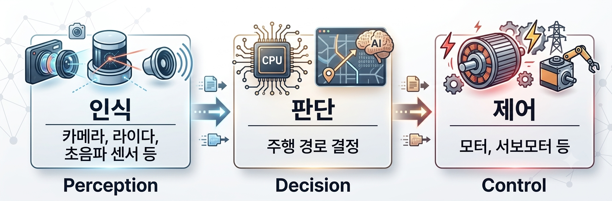
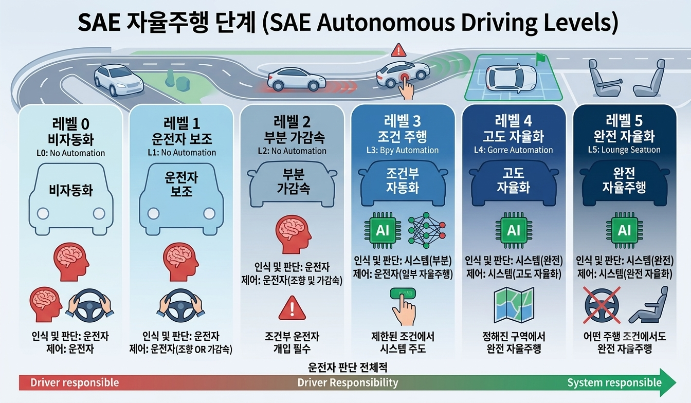
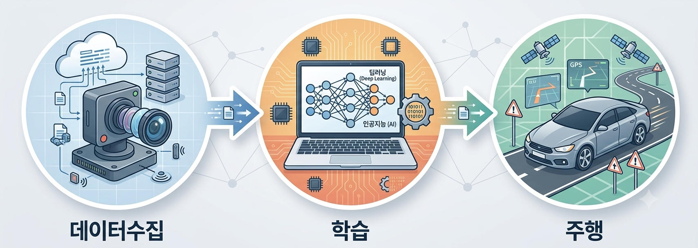

# 1-1 자율주행 개요 및 학습 목표

인공지능 기술은 우리 생활 속에서 빠르게 발전하고 있습니다.

자동차, 의료, 제조, 국방 등 다양한 분야에서 인공지능이 활용되고 있으며, 앞으로도 그 활용 범위는 더욱 확대될 것으로 예상됩니다.

이 중에서도 가장 대표적인 분야가 바로 자율주행입니다.

자율주행(Autonomous Vehicle)은 운전자의 개입 없이 스스로 주변 환경을 인식하고 판단하여 목적지까지 이동하는 기술입니다.

이를 위해서는 다양한 센서와 카메라, 레이더(Radar), 라이다(LiDAR), GPS 등의 정보를 수집하고 이를 분석하는 과정이 필요합니다.

자율주행 시스템은 일반적으로 다음과 같은 세 단계로 구성됩니다.

1. 인지(Perception)
카메라, 레이더, 라이다 등의 센서를 이용하여 주변 환경을 인식합니다.
차선, 차량, 보행자, 신호등, 장애물 등을 검출합니다.
2. 판단(Decision)
인식한 정보를 기반으로 현재 상황을 분석합니다.
차선 변경, 속도 조절, 회전, 정지 등의 주행 계획을 수립합니다.
3. 제어(Control)
조향(Steering)
가속(Acceleration)
제동(Brake)

등의 제어를 수행하여 차량을 안전하게 주행시킵니다.

이러한 과정을 매우 짧은 시간 안에 반복 수행함으로써 차량은 사람처럼 주변 환경을 인식하고 안전하게 주행할 수 있습니다.

