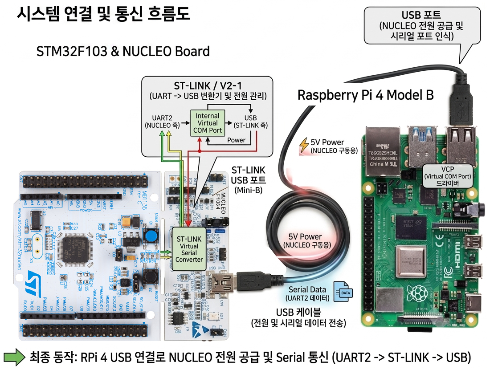

# 1-2 자율주행 자동차 조립하기



<br>

---

## 1. 시스템 개요 (Overall System)
  * 이 시스템은 라즈베리 파이 4의 USB 포트와 NUCLEO 보드의 ST-LINK USB 포트(Mini-B)를 단 하나의 USB 케이블로 연결하여 전원 공급과 시리얼(UART) 데이터 통신을 동시에 해결하는 구성을 보여줍니다.

## 2. 블록별 기능 및 데이터 흐름

### ① STM32F103 MCU 및 내부 내부 연결 (좌측)
   * UART2 설정: STM32F103 칩의 PA2(UART2 TX) 핀을 통해 시리얼 데이터가 출력됩니다.
      * 보드 내부 라우팅: 이 내부 데이터 라인은 외부 핀으로만 나가는 것이 아니라, NUCLEO 보드 상단에 위치한 ST-LINK 가상 시리얼 변환기(ST-LINK Virtual Serial Converter) 칩으로 직접 연결됩니다.

### ② ST-LINK / V2-1 영역 (중앙 상단 블록 diagram)
   * NUCLEO 보드의 상단부는 내장형 디버거/프로그래머인 ST-LINK 영역입니다.
      * MCU에서 보낸 UART2 신호는 ST-LINK 칩 내부의 가상 컴포트(Internal Virtual COM Port) 회로를 거치면서 USB 프로토콜 데이터로 변환됩니다.
      * 동시에 USB 라인으로부터 전원(Power)을 받아 MCU 측으로 분배하는 역할도 수행합니다.

### ③ USB 케이블 인터페이스 (중앙 동축 케이블)
   * 복합 기능 케이블: ST-LINK의 USB 포트와 라즈베리 파이의 USB 포트를 잇는 이 케이블은 두 가지 역할을 동시에 수행합니다.
   * ⚡ 5V Power (적색 라인): 라즈베리 파이에서 NUCLEO 보드로 구동 전원을 공급합니다.
   * 🔵 Serial Data (청색 라인): USB 규격으로 변환된 UART2 통신 데이터를 양방향으로 전송합니다.

### ④ 라즈베리 파이 4 호스트 (우측)
   * USB 호스트: 라즈베리 파이 4의 USB 포트에 케이블이 연결되면, 라즈베리 파이는 시스템에 전원을 공급하는 주체가 됩니다.
   * VCP (Virtual COM Port) 드라이버: 라즈베리 파이 OS 내부에 내장된 VCP 드라이버가 USB 신호를 인식하여, 이를 소프트웨어적으로 시리얼 포트(예: /dev/ttyACM0 등)로 매핑해 줍니다. 덕분에 라즈베리 파이 상에서 일반적인 시리얼 통신 프로그램을 통해 STM32의 데이터를 쉽게 읽고 쓸 수 있습니다.

---

# 통신 연결

# 시뮬레이터 ↔ 컨트롤러 연결 테스트 (com0com 가상 시리얼 포트)

하드웨어 없이 PC에서 시뮬레이터와 컨트롤러를 연결하여 전체 통신 프로토콜을 검증할 수 있습니다.

## com0com 설치

1. https://sourceforge.net/projects/com0com/ 에서 다운로드
2. 설치 후 **"Setup Command Prompt"** 를 관리자 권한으로 실행
3. 가상 COM 페어 생성:
   ```bash
   install portname=COM3 portname=COM4
   ```
4. 장치 관리자에서 COM3, COM4 한 쌍이 보이는지 확인

## ASCII 프로토콜 테스트

**터미널 1 — 시뮬레이터**
```bash
python simulator_stm32.py
```
- COM 포트 목록에서 COM3 선택
- **"연결"** 버튼 클릭 → 상태가 "✅ COM3"로 변경
- 좌측 센서 패널 값이 10Hz로 갱신되는지 확인

**터미널 2 — 컨트롤러**
```bash
python rpi_controller.py          # GUI 모드
# 또는
python rpi_controller_v1.py       # ASCII 전용 모드
```
- COM4 선택 후 **"연결"**
- 좌측 센서 패널에 CDS, HALL, RPM 등 실시간 값 확인
- **"▶ 자동 테스트 실행 (26개)"** 버튼 클릭

## Efficient Binary 프로토콜 테스트

```bash
# 터미널 1
python simulator_stm32.py --efficient --serial-port COM3

# 터미널 2
python rpi_controller.py --efficient --serial-port COM4 --auto-test
```

## 확인 사항

| 항목 | 기대 결과 |
|------|-----------|
| 연결 전 센서 패널 | 모든 값 "---" |
| 연결 후 센서 갱신 | 17개 값 10Hz 실시간 변화 |
| WHEEL 스케일 드래그 | 로그에 `[TX] C,WHEEL1=xxx` |
| CLCD 입력 전송 | 2행 디스플레이에 출력 |
| BUZZER/LASER 토글 | 버튼 텍스트/색상 ON/OFF 전환 |
| IR TX 버튼 클릭 | 로그에 `[TX] C,IR_TX=n` |
| 자동 테스트 | 26/26 통과 |
| 연결 종료 후 재연결 | 정상 재연결 |

## Troubleshooting

| 문제 | 확인 |
|------|------|
| COM 포트 안 보임 | com0com 설치 후 재부팅, 관리자 권한 확인 |
| 연결 실패 | 포트가 이미 열려있지 않은지 확인 |
| 센서 데이터 미표시 | COM3↔COM4 페어가 반대 방향인지 확인 |
| pyserial 오류 | `pip install pyserial` |
| 자동 테스트 FAIL | 시뮬레이터 ↔ 컨트롤러 모드(ASCII/Binary) 일치 여부 |


