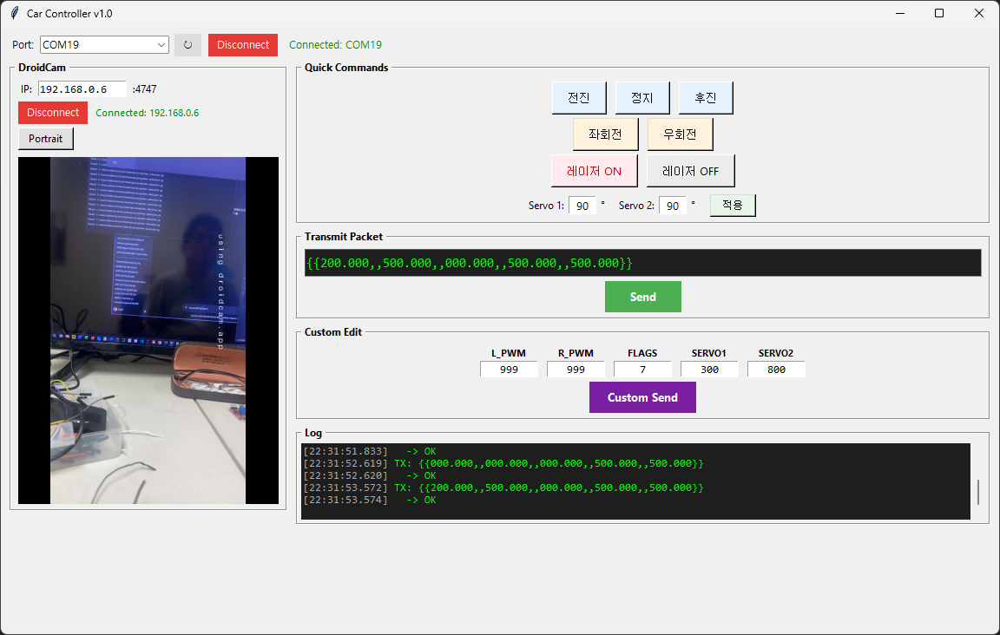
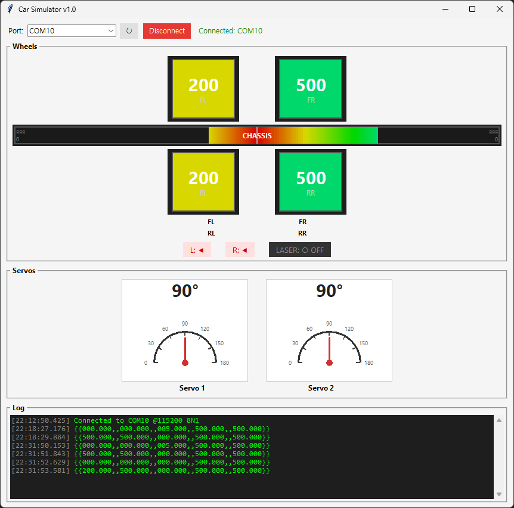

# 1-2 자율주행 자동차 조립하기

---

## 1) 시스템 개요 (Overall System)
  * 이 시스템은 라즈베리 파이 4의 USB 포트와
  * NUCLEO 보드의 ST-LINK USB 포트(Mini-B)를 단 하나의 USB 케이블로 연결하여
  * 전원 공급과 시리얼(UART) 데이터 통신을 동시에 해결하는 구성을 보여줍니다.

 

 

---

## 2) 블록별 기능 및 데이터 흐름

### ① 라즈베리 파이 4 호스트 (우측)
   * USB 호스트: 라즈베리 파이 4의 USB 포트에 케이블이 연결되면, 라즈베리 파이는 시스템에 전원을 공급하는 주체가 됩니다. (5V 3A 이상)
   * NUCLEO-STM32F103 보드의 VCP (Virtual COM Port)와 라즈베리 파이 OS 내부에 내장된 시리얼 드라이버가 USB 신호를 인식하여,  
   이를 소프트웨어적으로 시리얼 포트(예: /dev/ttyACM0 등)로 매핑해 줍니다.
   * 덕분에 라즈베리 파이 상에서 일반적인 시리얼 통신 프로그램을 통해 STM32의 데이터를 쉽게 읽고 쓸 수 있습니다.
   * 최종 프로젝트 에서는 3A@5V 이상의 보조베터리를 라즈베리파이에 연결하여 무선으로 동작시키고
   * 개발 간에는 아답타를 연결하여 세트의 동작을 확인합니다.

### ② USB 케이블 인터페이스 (중앙 동축 케이블)
   * 복합 기능 케이블: ST-LINK의 USB 포트와 라즈베리 파이의 USB 포트를 잇는 이 케이블은 두 가지 역할을 동시에 수행합니다.
   * ⚡ 5V Power (적색 라인): 라즈베리 파이에서 NUCLEO 보드로 구동 전원을 공급합니다.
   * 🔵 Serial Data (청색 라인): USB 규격으로 변환된 UART2 통신 데이터를 양방향으로 전송합니다.

### ③ ST-LINK / V2-1 영역 (중앙 상단 블록 diagram)
   * NUCLEO 보드의 상단부는 내장형 디버거/프로그래머인 ST-LINK 영역입니다.
      * MCU에서 보낸 UART2 신호는 ST-LINK 칩 내부의 가상 컴포트(Internal Virtual COM Port) 회로를 거치면서   USB 프로토콜 데이터로 변환됩니다.
      * 동시에 USB 라인으로부터 전원(Power)을 받아 MCU 측으로 분배하는 역할도 수행합니다.

### ④ STM32F103 MCU 및 내부 내부 연결 (좌측)
   * UART2 설정: STM32F103 칩의 PA2(UART2 TX) 핀을 통해 시리얼 데이터가 출력됩니다.
      * 보드 내부 라우팅: 이 내부 데이터 라인은 외부 핀으로만 나가는 것이 아니라,  
      NUCLEO 보드 상단에 위치한 ST-LINK 가상 시리얼 변환기(ST-LINK Virtual Serial Converter) 칩으로 직접 연결됩니다.

---

## 3) ICD 작성 및 시뮬레이터 파이썬 코드로 만들기

 * 본인들의 인터페이스 프로토콜을 정리하고 아래 링크의 예시를 참고하여 문서를 작성한다.
 * 그림처럼 본인의 자동차를 모사한 시뮬레이터 프로그램을 파이썬 코드 또는 node.js를 이용하여 만든다.
 * [ICD 링크](https://github.com/gotree94/STM32/blob/main/PROJECT/2026-%5BKDT%5D%20ROS%EC%A7%80%EB%8A%A5%EB%A1%9C%EB%B4%87%EB%B6%80%ED%8A%B8%EC%BA%A0%ED%94%84/5%EC%A1%B0/ICD.md)

 

 

