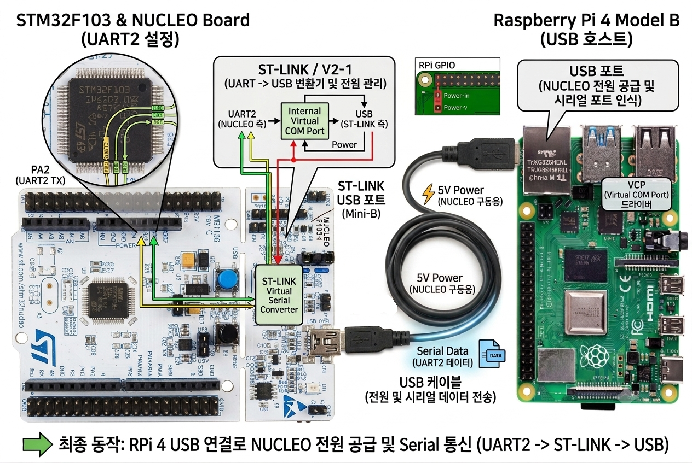

# 1-2 자율주행 자동차 조립하기

  

 

---

## 1. 시스템 개요 (Overall System)
  * 이 시스템은 라즈베리 파이 4의 USB 포트와 NUCLEO 보드의 ST-LINK USB 포트(Mini-B)를 단 하나의 USB 케이블로 연결하여 전원 공급과 시리얼(UART) 데이터 통신을 동시에 해결하는 구성을 보여줍니다.

## 2. 블록별 기능 및 데이터 흐름

### ① STM32F103 MCU 및 내부 내부 연결 (좌측)
   * UART2 설정: STM32F103 칩의 PA2(UART2 TX) 핀을 통해 시리얼 데이터가 출력됩니다.
      * 보드 내부 라우팅: 이 내부 데이터 라인은 외부 핀으로만 나가는 것이 아니라, NUCLEO 보드 상단에 위치한 ST-LINK 가상 시리얼 변환기(ST-LINK Virtual Serial Converter) 칩으로 직접 연결됩니다.

### ② ST-LINK / V2-1 영역 (중앙 상단 블록 diagram)
   * NUCLEO 보드의 상단부는 내장형 디버거/프로그래머인 ST-LINK 영역입니다.
      * MCU에서 보낸 UART2 신호는 ST-LINK 칩 내부의 가상 컴포트(Internal Virtual COM Port) 회로를 거치면서 USB 프로토콜 데이터로 변환됩니다.
      * 동시에 USB 라인으로부터 전원(Power)을 받아 MCU 측으로 분배하는 역할도 수행합니다.

### ③ USB 케이블 인터페이스 (중앙 동축 케이블)
   * 복합 기능 케이블: ST-LINK의 USB 포트와 라즈베리 파이의 USB 포트를 잇는 이 케이블은 두 가지 역할을 동시에 수행합니다.
   * ⚡ 5V Power (적색 라인): 라즈베리 파이에서 NUCLEO 보드로 구동 전원을 공급합니다.
   * 🔵 Serial Data (청색 라인): USB 규격으로 변환된 UART2 통신 데이터를 양방향으로 전송합니다.

### ④ 라즈베리 파이 4 호스트 (우측)
   * USB 호스트: 라즈베리 파이 4의 USB 포트에 케이블이 연결되면, 라즈베리 파이는 시스템에 전원을 공급하는 주체가 됩니다.
   * VCP (Virtual COM Port) 드라이버: 라즈베리 파이 OS 내부에 내장된 VCP 드라이버가 USB 신호를 인식하여, 이를 소프트웨어적으로 시리얼 포트(예: /dev/ttyACM0 등)로 매핑해 줍니다. 덕분에 라즈베리 파이 상에서 일반적인 시리얼 통신 프로그램을 통해 STM32의 데이터를 쉽게 읽고 쓸 수 있습니다.

---

## 1. STM32F103 및 NUCLEO 보드 내부 처리 (왼쪽)MCU 내부 설정 (UART2): STM32F103 칩셋 내부에서 PA2(UART2 TX) 핀을 활성화하여 외부로 보낼 시리얼 데이터를 출력합니다.보드 내부 라우팅: PA2 핀에서 출력된 데이터 신호는 NUCLEO 보드상의 회로 패턴을 따라 상단의 ST-LINK/V2-1 모듈 영역으로 전달됩니다.ST-LINK의 역할: ST-LINK 내부의 가상 컴포트(Internal Virtual COM Port) 변환기가 이 UART2 신호를 받아 USB 프로토콜 데이터로 변환합니다. 동시에 USB 라인을 통해 들어오는 전원(Power)을 관리합니다.

## 2. 물리적 연결 및 케이블 인터페이스 (가운데)ST-LINK USB 포트: NUCLEO 보드 우측 상단에 위치한 Mini-B 타입의 USB 포트를 통해 외부와 연결됩니다.USB 케이블 (단일 라인 통합): 하나의 USB 케이블을 통해 두 가지 핵심 기능이 동시에 수행됩니다.5V Power (적색 라인): Raspberry Pi 4로부터 5V 전원을 공급받아 NUCLEO 보드를 구동합니다.Serial Data (청색 라인): 변환된 UART2 데이터가 시리얼 통신 패킷 형태로 전송됩니다.

## 3. Raspberry Pi 4 Model B의 처리 및 최종 동작 (오른쪽)USB 호스트 역할: Raspberry Pi 4의 USB 포트에 케이블이 연결되면, 라즈베리 파이는 시스템적으로 VCP(Virtual COM Port) 드라이버를 통해 NUCLEO 보드를 하나의 시리얼 장치로 인식합니다.최종 동작 요약: 결과적으로 추가적인 전원 공급 장치나 복잡한 점퍼 와이어 연결 없이, 단 한 개의 USB 케이블 연결만으로 NUCLEO 보드의 전원 숙제와 라즈베리 파이 간의 시리얼 데이터 송수신(UART2 $\rightarrow$ ST-LINK $\rightarrow$ USB)이 완벽하게 해결되는 구조입니다.

---

# 전원 연결

. 전원 레큘레이터(Regulator) 사용 시 고려할 점드롭아웃 전압 (Dropout Voltage): 만약 쉴드 보드에 7805 계열의 일반 선형(Linear) 레큘레이터가 장착되어 있다면, 안정적인 5V 출력을 위해 보통 $7\text{V} \sim 7.5\text{V}$ 이상의 입력 전압이 필요합니다. 18650 배터리가 만충 상태($4.2\text{V} \times 2 = 8.4\text{V}$)일 때는 문제가 없으나, 배터리를 사용하여 전압이 점차 떨어져 각 셀당 $3.5\text{V}$ 이하($7.0\text{V}$ 미만)가 되면 레큘레이터의 5V 출력이 흔들려 NUCLEO 보드가 꺼지거나 리셋될 수 있습니다.Tip: 쉴드 보드가 LDO(Low Dropout) 레큘레이터나 스위칭 레큘레이터(DCDC 버크 컨버터)를 사용하는 구조라면 배터리 전압이 7V 부근까지 떨어져도 효율적이고 안정적인 5V 유지가 가능합니다.발열 문제: 선형 레큘레이터는 입력 전압(7.4V)과 출력 전압(5V)의 차이만큼을 모두 열로 방출합니다. NUCLEO 보드가 소비하는 전류가 커질수록 레큘레이터가 뜨거워지므로, 방열판이 잘 붙어있는지 확인하는 것이 좋습니다.2. 라즈베리 파이 5V와 쉴드 보드 5V의 충돌 방지 (가장 중요)이전 단계에서 분석했듯이, 쉴드 보드의 레큘레이터가 만들어낸 5V와 라즈베리 파이가 외부 전원으로부터 공급받아 USB 포트로 보내는 5V가 물리적으로 충돌하는 구조입니다.가장 깔끔하고 안전한 해결 방법은 NUCLEO 보드의 전원 점퍼(JP5)를 활용하여 전원을 분리하는 것입니다.NUCLEO-F103RB 점퍼(JP5) 설정 가이드:보드 중앙 부근에 있는 JP5 점퍼 캡을 E5V (또는 VIN) 방향으로 옮겨 꽂습니다.이렇게 설정하면 NUCLEO 보드는 USB 케이블을 통해서는 데이터(통신)만 주고받고, 보드 구동에 필요한 전원은 오직 쉴드 보드의 레큘레이터가 주는 5V만 공급받아 사용하게 됩니다.결과적으로 라즈베리 파이의 외부 5V 전원과 쉴드 보드의 레큘레이터 5V 전원이 서로 부딪치지 않아 역전류 위험이 완벽히 사라집니다.3. 모터 동작 시 전압 강하(Brown-out) 대비4개의 DC 모터가 동시에 회로에서 구동을 시작할 때(기동 전류 발생 시), 18650 배터리 순간 전압이 일시적으로 훅 떨어질 수 있습니다.레큘레이터 전단(7.4V 라인) 또는 후단(5V 라인)에 완충 역할을 해줄 대용량 콘덴서(캐패시터)가 쉴드 보드에 충분히 배치되어 있다면 MCU가 리셋되는 현상을 깔끔하게 예방할 수 있습니다.현재 구상하신 하드웨어 전력 다이어그램(18650 2S $\rightarrow$ 쉴드보드 레큘레이터 5V $\rightarrow$ NUCLEO)은 매우 정석적인 구조이므로, NUCLEO 보드의 JP5 점퍼를 E5V로 설정하여 라즈베리 파이 USB 전원과 분리해 주기만 하면 아무런 문제 없이 안전하고 조화롭게 구동할 수 있습니다.

---

# 통신 연결

