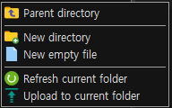
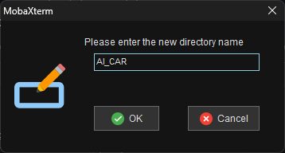
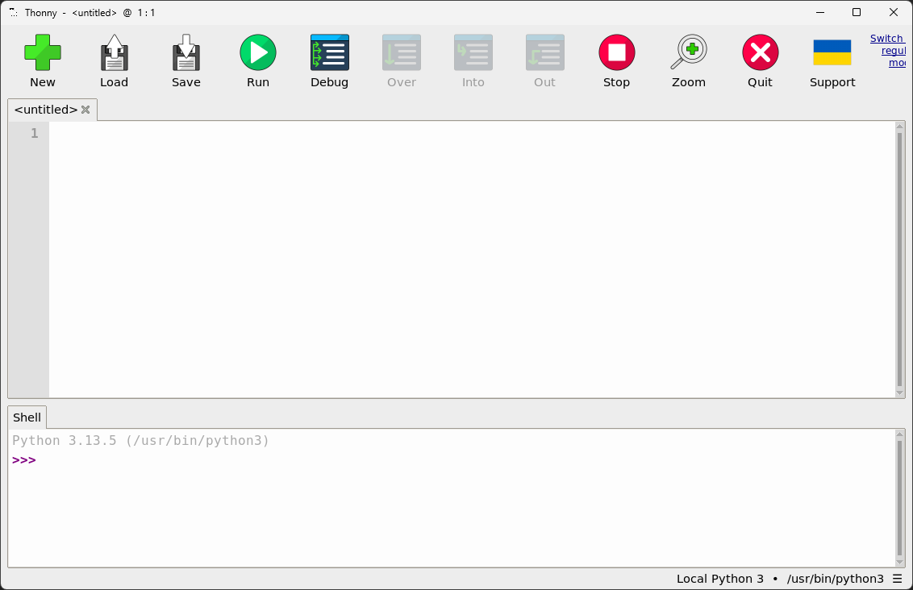

# 1-4 파이썬 가상환경 구성 및 필수 라이브러리 설치

## 1. 학습 목표

   * 파이썬 가상환경을 구성하여 독립적인 개발 공간을 마련하는 방법을 배웁니다.
   * YOLO, OpenCV, PyTorch 등 자율두행 구현에 필요한 필수 라이브러리를 설치하고, 화경 구성이 오라르게 황료되었는지 확인합니다.
   * 이 과정을 통해 학습자를 자율주행 프로그램을 안정적으로 실행할 수 있는 준비를 마치게 됩니다.

<br>

## 2. 가상환경 구성

   * 라스베리파이의 os인 bookworm이후 버전부터는 보안이 강화되어 <br> 기본 설치된 파이썬에 라이브러리 등을 사용자가 추가로 설치하여 사용하지 못하도록 변경되었습니다.
   * 파이썬을 사용하면 가상환경을 구성하여 사용할 것을 bookworm 버전부터는 추천하고 있습니다.

<br>

   * 파이썬 가상환경을 만들어서 사용하는 방법을 알아보도록 합니다.

<br>

   * 우리는 "AI_CAR" 폴더를 만들고 그 안에 프로그램을 작성하여 진행합니다.

   * Mobaxterm을 실행하여 접속하고 왼쪽의 파일관리자 화면을 확인합니다.
   * 홈 위치는 /home/아래에 ID 이름으로 디렉토리가 있습니다. (예 : /home/gotree94/)
   
    <br>
   

<br>

* 아래의 명령어를 입력하여 파이썬 가상환경을 설치합니다.
* venv 폴더에 가상환경을 설치하는 명령어 입니다.
* "--system-site-packages" 명령어를 입력하여 라즈베리파이 OS에 설치된 파이썬의 라이브러리를 함께 설치 합니다.
* 라즈베리파이의 하드웨어 등을 제어하기 위해서 필수로 입력해야 합니다.

```
cd AI_CAR/
python -m venv --system-site-packages venv
```

* "AI_CAR" 폴터 아래 "venv" 폴더가 생성되었고 파이썬 가상환경이 설치됩니다.

<br>

## 4. 가상환경 구성


```
gotree94@rosrp4-nwk:~/AI_CAR $ python -m venv --system-site-packages venv
gotree94@rosrp4-nwk:~/AI_CAR $ ls -al
total 12
drwxrwxr-x  3 gotree94 gotree94 4096 Jul  5 15:00 .
drwx------ 17 gotree94 gotree94 4096 Jul  5 14:55 ..
drwxrwxr-x  5 gotree94 gotree94 4096 Jul  5 15:00 venv
gotree94@rosrp4-nwk:~/AI_CAR $ ls -al venv/
total 28
drwxrwxr-x 5 gotree94 gotree94 4096 Jul  5 15:00 .
drwxrwxr-x 3 gotree94 gotree94 4096 Jul  5 15:00 ..
drwxrwxr-x 2 gotree94 gotree94 4096 Jul  5 15:00 bin
-rw-rw-r-- 1 gotree94 gotree94   69 Jul  5 15:00 .gitignore
drwxrwxr-x 3 gotree94 gotree94 4096 Jul  5 15:00 include
drwxrwxr-x 3 gotree94 gotree94 4096 Jul  5 15:00 lib
lrwxrwxrwx 1 gotree94 gotree94    3 Jul  5 15:00 lib64 -> lib
-rw-rw-r-- 1 gotree94 gotree94  186 Jul  5 15:00 pyvenv.cfg
gotree94@rosrp4-nwk:~/AI_CAR $
```

## 5. Thonny 파이썬 IDE

파이썬을 사용하기 위해서 Thonny 파이썬 IDE를 사용합니다.

* 기본적으로 설치가 되어 있기 째문에 바로 실행하면 됨.

```
thonny
```

* 또는 설치되어 있지 않다면:

```
sudo apt install thonny
thonny
```

   

## 6. jupyter notebook


