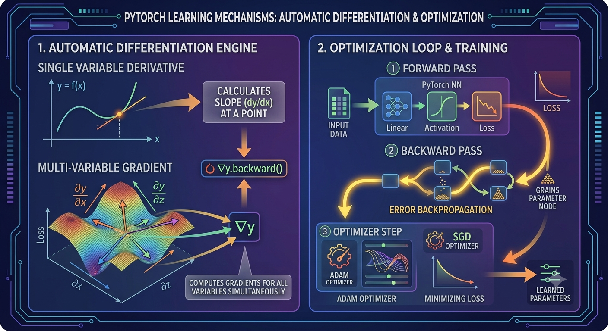
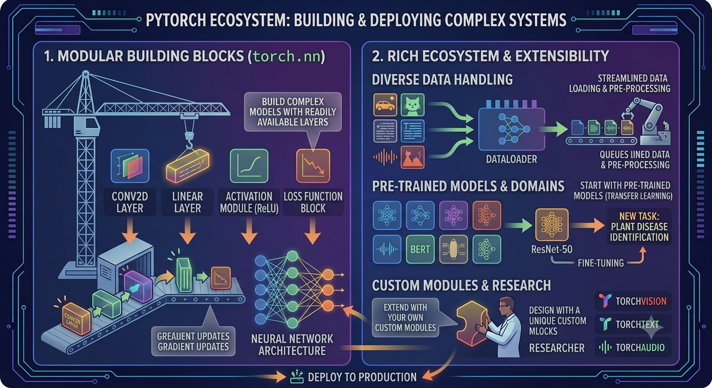

# 5-1 PyTorch란 무엇인가?

딥러닝 프레임워크 PyTorch의 개념과 특징을 이해합니다.<br>
PyTorch가 제공하는 주요 기능과 TensorFlow와의 차이점을 비교하여, <br>
꽤 많은 연구와 산업 분야에서 PyTorch를 사용하는지 살펴봅니다.<br>
또한 PyTorch의 기본 구조를 통해 이후 실습에서 사용할 주요 구성 요소를 미리 익힙니다.<br>

PyTorch(파이토치)는 인공지능과 딥러닝을 쉽게 개발할 수 있도록 도와주는 파이썬 기반 라이브러리입니다.<br>
복잡한 수학 계산(특히 미분)을 자동으로 처리해주기 때문에,<br>
우리는 "모델의 구조"만 정의하고 PyTorch가 알아서 학습(오차 줄이기)을 해줍니다.<br>

OyTorch(파이토치)는 인공지능과 딥러닝을 쉽게 개발할 수 있도록 도와주는 파이썬 기반 라이브러리 입니다.<br>
복합한 수삭 계산(특히 미ㅜㄴ)을 자동으로 처리해 주기 때문에, <br>
우리는 "모델의 구조"만 정의하고  PyTorch가 알아서 학습(오차 줄이기)을 해줍니다.

<br>

---

<br>

## 라이브러리 설치

```Bash
pip install torch torchvision
```

```Bash
(base) C:\Users\Administrator>pip install torch torchvision
Requirement already satisfied: torch in c:\programdata\anaconda3\lib\site-packages (2.6.0+cu124)
Requirement already satisfied: torchvision in c:\programdata\anaconda3\lib\site-packages (0.21.0+cu124)
Requirement already satisfied: filelock in c:\programdata\anaconda3\lib\site-packages (from torch) (3.29.0)
Requirement already satisfied: typing-extensions>=4.10.0 in c:\programdata\anaconda3\lib\site-packages (from torch) (4.15.0)
Requirement already satisfied: networkx in c:\programdata\anaconda3\lib\site-packages (from torch) (3.6.1)
Requirement already satisfied: jinja2 in c:\programdata\anaconda3\lib\site-packages (from torch) (3.1.6)
Requirement already satisfied: fsspec in c:\programdata\anaconda3\lib\site-packages (from torch) (2026.4.0)
Requirement already satisfied: setuptools in c:\programdata\anaconda3\lib\site-packages (from torch) (70.2.0)
Requirement already satisfied: sympy==1.13.1 in c:\programdata\anaconda3\lib\site-packages (from torch) (1.13.1)
Requirement already satisfied: mpmath<1.4,>=1.1.0 in c:\programdata\anaconda3\lib\site-packages (from sympy==1.13.1->torch) (1.3.0)
Requirement already satisfied: numpy in c:\programdata\anaconda3\lib\site-packages (from torchvision) (1.26.4)
Requirement already satisfied: pillow!=8.3.*,>=5.3.0 in c:\programdata\anaconda3\lib\site-packages (from torchvision) (12.2.0)
Requirement already satisfied: MarkupSafe>=2.0 in c:\programdata\anaconda3\lib\site-packages (from jinja2->torch) (3.0.3)
```

<br>

---

<br>

## PyTorch 불러오기 & 버전 확인
  
PyTorch는 딥러닝을 쉽게 구현하기 위한 파이썬 기반 라이브러리입니다.<br>
이 코드에서는 PyTorch가 정상적으로 설치되어 있는지, 그리고 기본적인 Tensor가 작동하는지 확인합니다.

* 5_1_1.py

```Python
import torch

print("PyTorch version: ", torch.__version__)
print("Tensor test: ", torch.tensor([1, 2, 3]))
```

```Bash
PyTorch version:  2.6.0+cu124
Tensor test:  tensor([1, 2, 3])
```

<br>

---

<br>

## 계산기처럼 사용하기

* PyTorch는 단순한 수학 계산도 할 수 있습니다.

* 5_1_2.py

```Python
import torch

a = torch.tensor(3.0)
b = torch.tensor(2.0)
result=a*b+5
print("Result:",  result)
```

```Bash
Result: tensor(11.)
```

<br>

---

<br>

## Tensor는 계산 과정을 기억한다.

* PyTorch의 핵심은 계산 과정을 자동으로 추적한다는 것입니다.
* requies_grad = True로 설정하면 연산 과정이 모두 저장되너, 나중에 자동미분에 활용됩니다.

* 5_1_3.py

```Python
import torch

x = torch.tensor(2.0,  requires_grad=True)
y1 = x*2
y2 = y1+3
y3 = y2 **2

print("x: ", x)
print("y1: ", y1)
print("y2: ", y2)
print("y3: ", y3)

print("y3 grad_fn:", y3.grad_fn)
print("y2 grad_fn:", y2.grad_fn)
print("y1 grad_fn:", y1.grad_fn)
```

```Bash
(base) C:\Users\Administrator>python 5_1_3.py
x:  tensor(2., requires_grad=True)
y1:  tensor(4., grad_fn=<MulBackward0>)
y2:  tensor(7., grad_fn=<AddBackward0>)
y3:  tensor(49., grad_fn=<PowBackward0>)
y3 grad_fn: <PowBackward0 object at 0x0000020782A01000>
y2 grad_fn: <AddBackward0 object at 0x0000020782A01000>
y1 grad_fn: <MulBackward0 object at 0x0000020782A01000>
```

<br>

---

<br>

## 자동미분으로 기울기 구하기

* PyTorch는 수학적으로 미분 값을 자동으로 계산할 수 있습니다.
* 이는 "기울기(gradient)" 계산이며, 학습(오차 수정)의 핵심 개념 입니다.

* 5_1_4.py

```Python
import torch

x = torch.tensor(2.0, requires_grad=True)
y=x**2+3*x+1
y.backward()
print("dy/dx:", x.grad)
```

```Bash
(base) C:\Users\Administrator>python 5_1_4.py
dy/dx: tensor(7.)
```

<br>

---

<br>

## 여러 변수의 자동 미분

* 여러 변수가 동시에 있을 때도 PyTorch는 각각의 미분 값을 자동으로 계산합니다.

* 5_1_5.py

```Python
import torch
x = torch.tensor(1.0, requires_grad=True)
z = torch.tensor(2.0, requires_grad=True)

y =3*x+4*z**2
y.backward()

print("dyldx:", x.grad)
print("dyldz:", z.grad)
```

```Bash
dyldx: tensor(3.)
dyldz: tensor(16.)
```

<br>

---

<br>

## 기울기를 이용해 오차를 줄이는 방향으로 이동

* 이 예제는 "학습의 원리"를 보여줍니다.
* 목표는 y = (x - 3)^2 가 최소(=0)가 되는 x를 찾는 것입니다.
* PyTorch는 기울기를 이용해 오차를 줄이는 방향으로 x를 조정합니다.

* 5_1_6.py

```Python
import torch

x = torch.tensor(1.0, requires_grad=True)

for step in range(3):
    y = (x -3)**2
    y.backward()
    print(f"Step{step+1} | x={x.item():.4f} | y={y.item():.4f} | grad={x.grad.item():.4f}")
    x = x - 0.1*x.grad
    x = x.detach().clone().requires_grad_(True)
```

```Bash
(base) C:\Users\Administrator>python 5_1_6.py
Step1 | x=1.0000 | y=4.0000 | grad=-4.0000
Step2 | x=1.4000 | y=2.5600 | grad=-3.2000
Step3 | x=1.7200 | y=1.6384 | grad=-2.5600
```


---


## 1장: 파이토치 기초 - 텐서와 동적 계산 그래프
첫 번째 이미지는 파이토치의 가장 기초가 되는 텐서(Tensor)의 개념과, 파이토치를 다른 프레임워크와 차별화시키는 '동적 계산 그래프(Dynamic Computational Graph)'의 원리를 설명합니다.

1. 계산기처럼 사용하는 텐서 수학: 코드를 직접 입력하는 것처럼 텐서 $A$, $B$를 정의하고 연산하는 과정을 시각화하여, 파이토치가 얼마나 직관적이고 쉬운지 보여줍니다.
2. 하드웨어 가속: 데이터를 CPU 텐서에서 GPU 텐서로 이동시키는 과정을 직관적으로 표현하여, 대규모 계산을 위한 하드웨어 활용 능력을 강조합니다.
3. 동적 계산 그래프 (Dynamic Graph): requires_grad=True로 설정된 텐서들이 연산을 거치며 어떻게 실시간으로 노드(Tensor)와 엣지(연산, grad_fn)로 이루어진 계산 이력(History)을 구축하는지 보여줍니다. 이 이력은 나중에 자동미분에 활용됩니다.


## 2장: 학습 메커니즘 - 자동미분과 최적화 루프
두 번째 이미지는 파이토치가 구축된 계산 그래프를 어떻게 활용하여 학습(Learning)을 진행하는지 보여줍니다. 자동미분 엔진과 이를 최적화에 연결하는 전체 루프를 시각화했습니다.

1. 자동미분 엔진:단일 변수: 간단한 함수 $y = f(x)$에서 점의 기울기($dy/dx$)를 계산하는 기초적인 자동미분을 시각화합니다.다변수 그래디언트: 여러 변수($x$, $z$)에 대한 손실 함수(Loss function)의 지형도(3D 맵)를 보여주고, 각 변수에 대한 편미분값들이 어떻게 그래디언트 벡터($\nabla y$)로 합쳐져 최적의 방향을 제시하는지 표현합니다.
2. 2. 최적화 루프 및 학습:순방향 패스(Forward Pass)로 데이터를 처리해 손실을 계산합니다.역방향 패스(Backward Pass) - 오차 역전파: 1장에서 구축된 동적 계산 그래프를 따라 빛(Error)이 거꾸로 흐르며 각 파라미터의 기울기를 계산하는 과정을 시각화합니다.최적화 단계(Optimizer Step): Adam, SGD와 같은 다양한 최적화 알고리즘(Optimizers)이 계산된 그래디언트를 이용해 파라미터를 업데이트하여 손실을 최소화하는 과정을 보여줍니다.



## 3장: 파이토치 생태계 - 복잡한 시스템 구축 및 배포
마지막 이미지는 파이토치의 저수준 기능들이 어떻게 고수준 라이브러리와 연결되어 실제적이고 복잡한 딥러닝 시스템을 구축하는지 보여줍니다.
1. 모듈형 빌딩 블록 (torch.nn): Conv2d, Linear와 같이 미리 구현된 다양한 레이어(Module)를 레고 블록처럼 조립하여 복잡한 신경망 아키텍처를 구성하는 과정을 시각화합니다.
2. 풍부한 생태계 및 확장성:
    * 다양한 데이터 처리: 이미지, 텍스트, 오디오 등 다양한 데이터를 DataLoader를 통해 효율적으로 로드하고 처리하는 과정을 보여줍니다.
    * 사전 학습된 모델 및 도메인: TorchVision, TorchText와 같은 라이브러리를 통해 이미 학습된 고성능 모델(ResNet, BERT 등)을 가져와 자신의 작업에 맞게 미세 조정(Transfer Learning)하는 전이 학습 과정을 직관적으로 표현합니다.커스텀 모듈 및 연구: 자신만의 고유한 신경망 블록을 직접 디자인하여 기존 아키텍처에 완벽하게 통합하는 연구 및 확장 과정을 시각화하여, 파이토치가 유연하고 연구 친화적임을 강조합니다.


