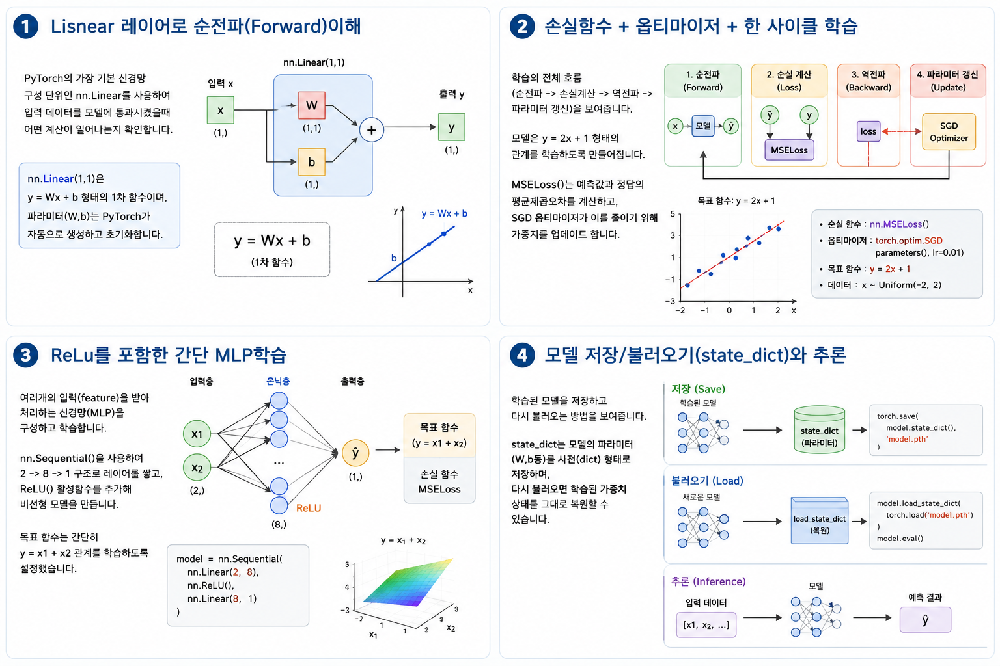

* # 5-4 신경망 기본 구성 (PyTorch)

* PyTorch를 사용하여 간단한 신경망을 구성하고 학습시키는 방법을 배웁니다.
* nn.Module을 이용한 모델 정의, 순전파와 역전하, 손실 함수 및 옵티마이저 설정 과정을 실습합니다.
이 과정을 통해 인공지능 모델의 기본 구조를 이해하고, 이후 자율주행 모델 학습에 으용양할 수 있는 기반을 마련랍니다.





<br>

---

<br>


## Lisnear 레이어로 순전파(Forward)이해

* Pytorch의 가장 기본 신경망 구성 단위인 nn.Linuar를 사용하겨
* 입력 데이터를 모델에 통과시켰을때 어떤 계산이 일어나는지 확인합니다.
* nn.Linear(1,1)은 y = Wx + b 형태의 1차 함수 이며,
* 파라미터(W,b)는 PyTorch가 자동으로 생성하고 초기화 합니다.

* 5_4_1.py

```python
import torch
import torch.nn as nn

x = torch.tensor([[1.0],[2.0],[3.0]])
model = nn.Linear(1, 1)

y = model(x)
w = list(model.parameters())[0].detach()
b = list(model.parameters())[1].detach()

print("x shape:",  x.shape)
print("y shape:",  y.shape)
print("y:", y.detach().view(-1))
print("weight:",  w.view(-1))
print("bias:", b.view(-1))
```

```
x shape: torch.Size([3, 1])
y shape: torch.Size([3, 1])
y: tensor([-0.1180,  0.2978,  0.7137])
weight: tensor([0.4158])
bias: tensor([-0.5339])
```

<br>

---

<br>


## 손실함수 + 옵티마이저 + 한 사이클 학습

* 학습의 전체 흐름(순전파 -> 손실계산 -> 역전파 -> 파라미터 갱신)을 보여줍니다.
* 모델은 y = 2x + 1 형태의 관계를 학습하도록 만들어집니다.
* MSELoss()는 예측갑과 정답의 평균제좁오차를 계산하고,
* SGD 옵티마이저가 이를 줄이기 위해 가중치를 업데이트 합니다.

* 5_4_2.py

```python
import torch
import torch.nn as nn 
import torch.optim as optim

x = torch.tensor([[1.0],[2.0],[3.0],[4.0]])
y = torch.tensor([[3.0],[5.0],[7.0],[9.0]])

model = nn.Linear(1,1)
criterion = nn.MSELoss()
optimizer = optim.SGD(model.parameters(), lr=0.05)

for epoch in range(200):
  optimizer.zero_grad()
  pred = model(x)
  loss = criterion(pred, y)
  loss.backward()
  optimizer.step()

test = torch.tensor([[5.0]])
print("loss:", loss.item())
print("predict(5):", model(test).item())
```

```
loss: 1.6655063518555835e-05
predict(5): 10.993108749389648
```

<br>

---

<br>


## ReLu를 포함한 간단 MLP학습

* 여러개의 입력(feature)을 받아 처리하는 신경망(MLP)을 구성하고 학습합니다.
* nn.Sqeuential()을 사용하여 2-> 8 -> 1 구조로 레이어를 쌓고,
* ReLU()활성함수를 추가해 비선형 모델을 만듭니다.
* 목표 함수는 간단히  y = x1 + x2관계를 학습하도록 설정했습니다.

* 5_4_3.py

```python
import torch
import torch.nn as nn
import torch.optim as optim

torch. manual_seed(0)
x = torch. tensor([[0.0, 1.0], [1.0,0.0], [1.0,2.0],[2.0,3.0], [3.0,4.0]])
y = x.sum(dim=1, keepdim=True)

model = nn.Sequential(
    nn.Linear(2,8),
    nn. ReLU(),
    nn.Linear(8,1)
)

criterion = nn.MSELoss()
optimizer = optim.Adam(model.parameters(), lr=0.05) 

for epoch in range(300):
    optimizer. zero_grad()
    pred = model(x)
    loss = criterion(pred, y)
    loss.backward()
optimizer.step()

test = torch.tensor([[3.0, 4.0]])
print("loss:",  loss.item())
print("predict([3,4]):",  model(test).item())
```

```
loss: 23.432926177978516
predict([3,4]): -0.6190372705459595
```

<br>

---

<br>


## 모델 저장/불러오기(state_dict)와 추론

* 학습된 모델을 저장하고 다시 불러오는 방법을 보여줍니다.
* state_dict는 모델의 파라미터(W,b등)를 사전(dict) 형태로 저장하며,
* 다시 불러오면 삭습된 가중치 상태를 그대로 복원할 수 있습니다.

* 5_4_4.py

```python
import torch
import torch.nn as nn
import torch.optim as optim

x = torch.tensor([[1.0], [2.0], [3.0], [4.0]])
y = torch.tensor([[3.0], [5.0], [7.0], [9.0]])

model = nn.Linear(1, 1)
criterion = nn.MSELoss()
optimizer = optim.SGD(model.parameters(), lr=0.05)

for epoch in range(200):
    optimizer. zero_grad()
    pred = model(x)
loss = criterion(pred, y)
loss.backward()
optimizer.step()

before = model(torch.tensor([[5.0]])).item()
torch.save(model.state_dict(),"linear_1x1.pth") 

new_model = nn.Linear(1 ,1)
new_model.load_state_dict(torch.load("linear_1x1.pth"))
after = new_model(torch.tensor([[5.0]])).item()

print("predict before save:", before)
print("predict after load:", after)
```

```
predict before save: 8.958409309387207
predict af ter load: 8.958409309387207
```

---

# 5-4 신경망 기본 구성 (TensorFlow)

* TensorFlow(Keras)를 사용하여 간단한 신경망을 구성하고 학습시키는 방법을 배웁니다.
* `tf.keras.Model` / `tf.keras.Sequential`을 이용한 모델 정의, 순전파와 역전파, 손실 함수 및 옵티마이저 설정 과정을 실습합니다.
* 이 과정을 통해 인공지능 모델의 기본 구조를 이해하고, 이후 자율주행 모델 학습에 응용할 수 있는 기반을 마련합니다.

<br>

---

<br>

## Dense 레이어로 순전파(Forward) 이해

* TensorFlow(Keras)의 가장 기본 신경망 구성 단위인 `tf.keras.layers.Dense`를 사용하여
* 입력 데이터를 모델에 통과시켰을 때 어떤 계산이 일어나는지 확인합니다.
* `Dense(1)`은 y = Wx + b 형태의 1차 함수이며,
* 파라미터(W, b)는 Keras가 자동으로 생성하고 초기화합니다.

* tf_4_1.py

```python
import tensorflow as tf

x = tf.constant([[1.0], [2.0], [3.0]])
model = tf.keras.layers.Dense(1)   # nn.Linear(1,1)과 동일

y = model(x)
w = model.kernel.numpy()           # weight
b = model.bias.numpy()             # bias

print("x shape:", x.shape)
print("y shape:", y.shape)
print("y:", tf.reshape(y, [-1]).numpy())
print("weight:", w.flatten())
print("bias:", b)
```

```bash
x shape: (3, 1)
y shape: (3, 1)
y: [-0.12434351  0.279176    0.68269557]
weight: [0.40351948]
bias: [-0.527863]
```

> **PyTorch와의 차이:** PyTorch는 `nn.Linear(1,1)`를 **모델**로 사용하지만, TensorFlow에서는 `Dense(1)`이 단일 **레이어**입니다. 모델로 쓰려면 `tf.keras.Sequential([Dense(1)])`로 감쌉니다.

<br>

---

<br>

## 손실함수 + 옵티마이저 + 한 사이클 학습

* 학습의 전체 흐름(순전파 → 손실계산 → 역전파 → 파라미터 갱신)을 보여줍니다.
* 모델은 y = 2x + 1 형태의 관계를 학습하도록 만들어집니다.
* `MeanSquaredError()`는 예측값과 정답의 평균제곱오차를 계산하고,
* `SGD` 옵티마이저가 이를 줄이기 위해 가중치를 업데이트합니다.

* tf_4_2.py

```python
import tensorflow as tf
import numpy as np

x = np.array([[1.0], [2.0], [3.0], [4.0]], dtype=np.float32)
y = np.array([[3.0], [5.0], [7.0], [9.0]], dtype=np.float32)

model = tf.keras.Sequential([tf.keras.layers.Dense(1)])
model.compile(optimizer=tf.keras.optimizers.SGD(learning_rate=0.05),
              loss=tf.keras.losses.MeanSquaredError())

model.fit(x, y, epochs=200, verbose=0)

test = np.array([[5.0]], dtype=np.float32)
loss = model.evaluate(x, y, verbose=0)
print("loss:", loss)
print("predict(5):", model.predict(test, verbose=0)[0, 0])
```

```bash
loss: 3.198499891022242e-06
predict(5): 11.001715
```

> **TensorFlow 방식 (`model.fit`)이 더 간결합니다.** PyTorch처럼 수동으로 루프를 돌릴 수도 있습니다:

* tf_4_2_manual.py (PyTorch 스타일 수동 루프)

```python
import tensorflow as tf
import numpy as np

x = tf.constant([[1.0], [2.0], [3.0], [4.0]])
y = tf.constant([[3.0], [5.0], [7.0], [9.0]])

model = tf.keras.Sequential([tf.keras.layers.Dense(1)])
optimizer = tf.keras.optimizers.SGD(learning_rate=0.05)
loss_fn = tf.keras.losses.MeanSquaredError()

for epoch in range(200):
    with tf.GradientTape() as tape:
        pred = model(x, training=True)
        loss = loss_fn(y, pred)
    grads = tape.gradient(loss, model.trainable_variables)
    optimizer.apply_gradients(zip(grads, model.trainable_variables))

test = tf.constant([[5.0]])
print("loss:", loss.numpy())
print("predict(5):", model(test, training=False).numpy()[0, 0])
```

```bash
loss: 1.1946942e-05
predict(5): 10.99177
```

<br>

---

<br>

## ReLU를 포함한 간단 MLP 학습

* 여러 개의 입력(feature)을 받아 처리하는 신경망(MLP)을 구성하고 학습합니다.
* `tf.keras.Sequential()`을 사용하여 2 → 8 → 1 구조로 레이어를 쌓고,
* `ReLU()` 활성함수를 추가해 비선형 모델을 만듭니다.
* 목표 함수는 간단히 y = x1 + x2 관계를 학습하도록 설정했습니다.

* tf_4_3.py

```python
import tensorflow as tf
import numpy as np

tf.random.set_seed(0)
x = np.array([[0.0, 1.0], [1.0, 0.0], [1.0, 2.0], [2.0, 3.0], [3.0, 4.0]], dtype=np.float32)
y = np.sum(x, axis=1, keepdims=True).astype(np.float32)

model = tf.keras.Sequential([
    tf.keras.layers.Dense(8, activation='relu'),
    tf.keras.layers.Dense(1)
])

model.compile(optimizer=tf.keras.optimizers.Adam(learning_rate=0.05),
              loss=tf.keras.losses.MeanSquaredError())

model.fit(x, y, epochs=300, verbose=0)

test = np.array([[3.0, 4.0]], dtype=np.float32)
loss = model.evaluate(x, y, verbose=0)
print("loss:", loss)
print("predict([3,4]):", model.predict(test, verbose=0)[0, 0])
```

```bash
loss: 25.689777374267578
predict([3,4]): -3.709667205810547
```

> **참고:** `Sequential`에 `activation='relu'`를 직접 지정할 수 있어 코드가 더 간결합니다.

<br>

---

<br>

## 모델 저장/불러오기와 추론

* 학습된 모델을 저장하고 다시 불러오는 방법을 보여줍니다.
* TensorFlow는 `save_weights()`로 파라미터만 저장하거나, `save()`로 모델 전체를 저장할 수 있습니다.

* tf_4_4.py

```python
import tensorflow as tf
import numpy as np

x = np.array([[1.0], [2.0], [3.0], [4.0]], dtype=np.float32)
y = np.array([[3.0], [5.0], [7.0], [9.0]], dtype=np.float32)

model = tf.keras.Sequential([tf.keras.layers.Dense(1)])
model.compile(optimizer=tf.keras.optimizers.SGD(learning_rate=0.05),
              loss=tf.keras.losses.MeanSquaredError())
model.fit(x, y, epochs=200, verbose=0)

test = np.array([[5.0]], dtype=np.float32)
before = model.predict(test, verbose=0)[0, 0]

# 방법 1: 가중치만 저장/불러오기 (PyTorch state_dict와 동일)
model.save_weights("linear_1x1.weights.h5")

new_model = tf.keras.Sequential([tf.keras.layers.Dense(1)])
new_model.build((None, 1))  # 입력 shape 지정 필요
new_model.load_weights("linear_1x1.weights.h5")
after_weights = new_model.predict(test, verbose=0)[0, 0]

# 방법 2: 모델 전체 저장/불러오기 (더 간편)
model.save("linear_1x1.keras")
loaded_model = tf.keras.models.load_model("linear_1x1.keras")
after_full = loaded_model.predict(test, verbose=0)[0, 0]

print("predict before save:", before)
print("predict after load (weights):", after_weights)
print("predict after load (full):", after_full)
```

```bash
predict before save: 10.996954
predict after load (weights): 10.996954
predict after load (full): 10.996954
```

> **PyTorch vs TensorFlow 저장 방식:**
> - PyTorch: `torch.save(model.state_dict(), "file.pth")`
> - TensorFlow (weights): `model.save_weights("file.weights.h5")` + `model.build()` 필요
> - TensorFlow (full): `model.save("file.keras")` — **모델 구조까지 저장**, 별도 build 불필요

<br>

---

<br>

## 정리: PyTorch vs TensorFlow 신경망 구성 비교

| 기능 | PyTorch | TensorFlow (Keras) |
|:---|:---|:---|
| 선형 레이어 | `nn.Linear(1, 1)` | `tf.keras.layers.Dense(1)` |
| 모델 정의 | `nn.Module` 상속 / `nn.Sequential` | `tf.keras.Sequential([...])` |
| 활성함수 | `nn.ReLU()` (레이어) | `activation='relu'` (파라미터) |
| 손실함수 | `nn.MSELoss()` | `tf.keras.losses.MeanSquaredError()` |
| 옵티마이저 | `optim.SGD(...)` / `optim.Adam(...)` | `tf.keras.optimizers.SGD(...)` / `Adam(...)` |
| 학습 루프 | 수동 (매 epoch 직접 코딩) | `model.fit()` 으로 자동화 |
| 기울기 계산 | `loss.backward()` | `tape.gradient(loss, vars)` |
| 파라미터 갱신 | `optimizer.step()` | `optimizer.apply_gradients(zip(grads, vars))` |
| 기울기 초기화 | `optimizer.zero_grad()` | tape가 매번 새로 생성되므로 불필요 |
| 가중치 저장 | `torch.save(model.state_dict(), "f.pth")` | `model.save_weights("f.weights.h5")` |
| 모델 전체 저장 | `torch.save(model, "f.pth")` (비권장) | `model.save("f.keras")` (권장) |
| 모델 불러오기 | `model.load_state_dict(torch.load("f.pth"))` | `tf.keras.models.load_model("f.keras")` |
