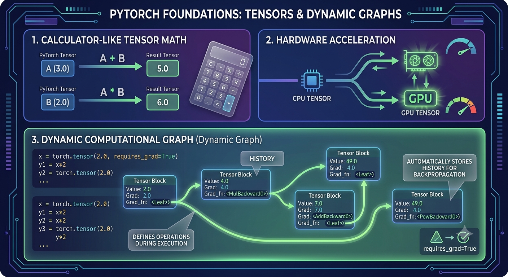
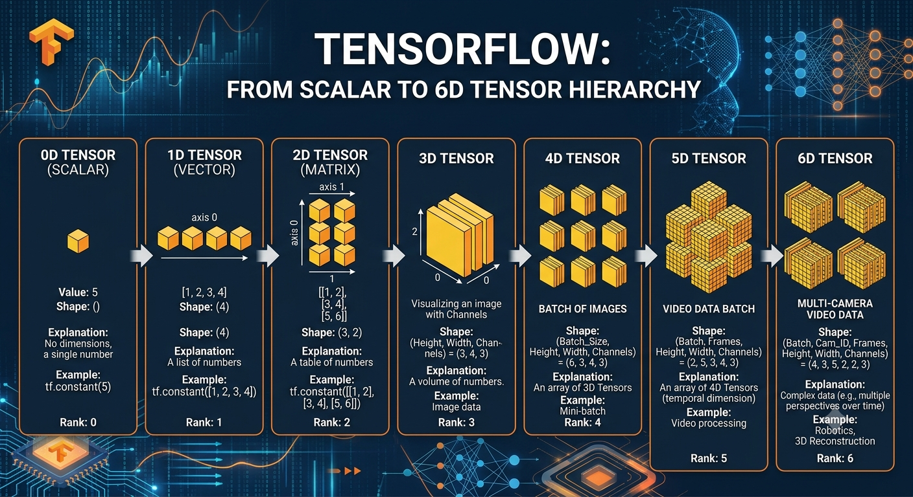
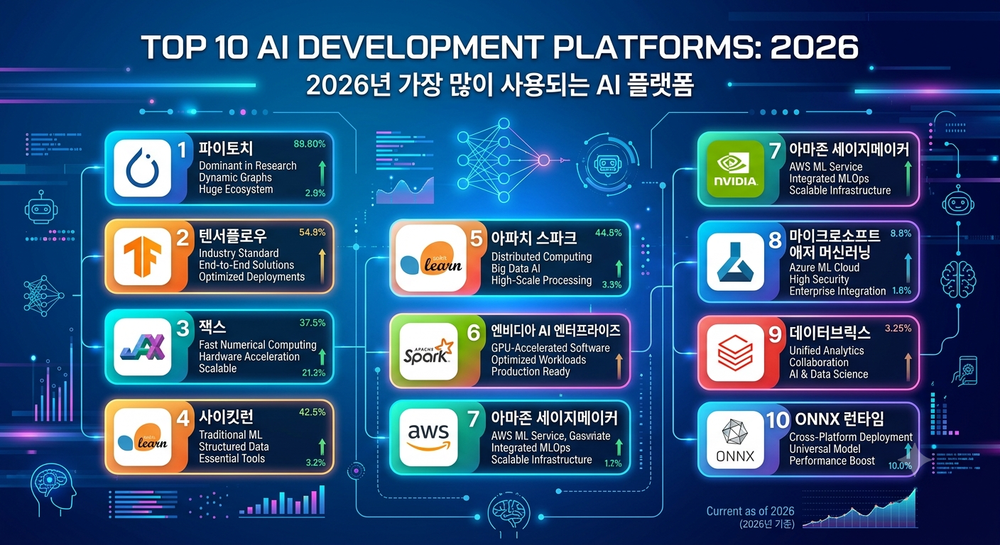

# CHAPTER 05 PyTorch 기초 배우기

* 인공지능 학습모델 구현에 사용되는 대표적인 딥러닝 프레임워크 PyTorch의 기초를 학습합니다.
* PyTorch는 자율주행, 영상 인식, 음성 처리 등 다양한 인공지능 분야에서 활용되는 강력한 도구로, 직관적인 코드 구조와 자동미분 기능을 제공하여 딥러닝 모델을 쉽게 구현할 수 있게 합니다.
* 이 장에서는 Tendor의 개념과 연산, 자동미분의 원리, 그리고 간단한 신경망 구성 방법을 단계별로 실습합니다.
* 이를 통해 학습자는 자율주행 자동차에 적용할 수 있는 인공지능 모델의 기초를 다지게 됩니다.

---

## 1장: 파이토치 기초 - 텐서와 동적 계산 그래프
첫 번째 이미지는 파이토치의 가장 기초가 되는 텐서(Tensor)의 개념과,   
파이토치를 다른 프레임워크와 차별화시키는 '동적 계산 그래프(Dynamic Computational Graph)'의 원리를 설명합니다.

1. 계산기처럼 사용하는 텐서 수학:  
   코드를 직접 입력하는 것처럼 텐서 $A$, $B$를 정의하고 연산하는 과정을 시각화하여,  
   파이토치가 얼마나 직관적이고 쉬운지 보여줍니다.
2. 하드웨어 가속:  
   데이터를 CPU 텐서에서 GPU 텐서로 이동시키는 과정을 직관적으로 표현하여, 대규모 계산을 위한 하드웨어 활용 능력을 강조합니다.
3. 동적 계산 그래프 (Dynamic Graph):  
   requires_grad=True로 설정된 텐서들이 연산을 거치며 어떻게 실시간으로 노드(Tensor)와 엣지(연산, grad_fn)로 이루어진 계산 이력(History)을  
   구축하는지 보여줍니다. 이 이력은 나중에 자동미분에 활용됩니다.

## 2장: 학습 메커니즘 - 자동미분과 최적화 루프

두 번째 이미지는 파이토치가 구축된 계산 그래프를 어떻게 활용하여 학습(Learning)을 진행하는지 보여줍니다.   
자동미분 엔진과 이를 최적화에 연결하는 전체 루프를 시각화했습니다.

1. 자동미분 엔진:
   * 단일 변수: 간단한 함수 $y = f(x)$에서 점의 기울기($dy/dx$)를 계산하는 기초적인 자동미분을 시각화합니다.
   * 다변수 그래디언트: 여러 변수($x$, $z$)에 대한 손실 함수(Loss function)의 지형도(3D 맵)를 보여주고,  
     각 변수에 대한 편미분값들이 어떻게 그래디언트 벡터($\nabla y$)로 합쳐져 최적의 방향을 제시하는지 표현합니다.
3. 최적화 루프 및 학습:
   * 순방향 패스(Forward Pass)로 데이터를 처리해 손실을 계산합니다.
   * 역방향 패스(Backward Pass) - 오차 역전파: 1장에서 구축된 동적 계산 그래프를 따라 빛(Error)이 거꾸로 흐르며 각 파라미터의 기울기를 계산하는 과정을 시각화합니다.
   * 최적화 단계(Optimizer Step): Adam, SGD와 같은 다양한 최적화 알고리즘(Optimizers)이 계산된 그래디언트를 이용해 파라미터를 업데이트하여 손실을 최소화하는 과정을 보여줍니다.

## 3장: 파이토치 생태계 - 복잡한 시스템 구축 및 배포
마지막 이미지는 파이토치의 저수준 기능들이 어떻게 고수준 라이브러리와 연결되어 실제적이고 복잡한 딥러닝 시스템을 구축하는지 보여줍니다.

1. 모듈형 빌딩 블록 (torch.nn): Conv2d, Linear와 같이 미리 구현된 다양한 레이어(Module)를 레고 블록처럼 조립하여 복잡한 신경망 아키텍처를 구성하는 과정을 시각화합니다.
2. 풍부한 생태계 및 확장성:
    * 다양한 데이터 처리: 이미지, 텍스트, 오디오 등 다양한 데이터를 DataLoader를 통해 효율적으로 로드하고 처리하는 과정을 보여줍니다.
    * 사전 학습된 모델 및 도메인: TorchVision, TorchText와 같은 라이브러리를 통해 이미 학습된 고성능 모델(ResNet, BERT 등)을 가져와  
      자신의 작업에 맞게 미세 조정(Transfer Learning)하는 전이 학습 과정을 직관적으로 표현합니다.
    * 커스텀 모듈 및 연구: 자신만의 고유한 신경망 블록을 직접 디자인하여 기존 아키텍처에 완벽하게 통합하는 연구 및 확장 과정을 시각화하여, 파이토치가 유연하고 연구 친화적임을 강조합니다.

### 1. AI 모델 개발/배포 플랫폼 (PeerSpot 기준, 2026년 6월)
| 순위	| 플랫폼	| 마인드쉐어	| 평점	| 설명 | 
|:------:|:------:|:---------:|:------:|:-----:|
| 1 |	Gemini Enterprise Agent Platform (Google)	 | 8.1%	 | 8.1	 | 엔터프라이즈 AI 에이전트 개발  |
| 2 |	Azure OpenAI (Microsoft)	 | 7.1%	 | 7.4	 | GPT 모델 기반 AI 앱 개발  |
| 3 |	Hugging Face	 | 4.7%	 | 7.9	 | 오픈소스 모델 허브 & ML 플랫폼  |
| 4 |	Amazon SageMaker (AWS)	 |-	 | 8.2	 | ML 모델 학습/배포  |
| 5 |	Azure AI Foundry (Microsoft)	 |-	 | 8.0	| 통합 AI 개발 스튜디오  |
| 6 |	TensorFlow (Google)	 |-	 | 7.8	 | 오픈소스 ML 프레임워크  |
| 7 |	Microsoft Azure ML Studio	 |-	 | 7.8	 | 노코드/로우코드 ML  |
| 8 |	PyTorch (Meta)	 |-	 | 8.7	 | 오픈소스 딥러닝 프레임워크  |
| 9 |	IBM Watson Studio	 |-	 | 7.5	 | 엔드투엔드 ML 플랫폼  |
| 10 | Google Cloud AI Platform	 |-	| 8.0 |	GCP 기반 AI/ML 플랫폼  |

### 2. AI 코딩 도구 (Vibe Coding, 웹 방문수 기준, 2026년 6월)
| 순위	 |플랫폼	 |월간 방문수 |	설명 |
|:-----------:|:-----------:|:-----------:|:-----------:|
| 1	GitHub Copilot	3.71억 (371M)	AI 페어 프로그래머 (VS Code, JetBrains)
| 2	Hostinger	5,026만 (50.26M)	AI 웹사이트 빌더
| 3	Lovable.dev	3,483만 (34.83M)	AI 앱 빌더 (React + Tailwind + Supabase)
| 4	Supabase	2,973만 (29.73M)	오픈소스 Firebase 대안 (AI 백엔드)
| 5	Vercel	2,968만 (29.68M)	AI 프론트엔드 배포 플랫폼 (v0)
| 6	Airtable	2,769만 (27.69M)	AI 기반 데이터베이스/스프레드시트
| 7	Cursor	2,318만 (23.18M)	AI 네이티브 코드 에디터 ▲7.22%
| 8	BASE44 2.0	1,716만 (17.16M)	노코드 AI 앱 빌더
| 9	Replit	1,328만 (13.28M)	AI 온라인 IDE
| 10	Ollama	1,207만 (12.07M)	로컬 LLM 실행 도구 ▲4.77%

### AI Cloud 플랫폼 (웹 방문수, 2026년 6월)
| 순위| 	| 플랫폼	| 월간 방문수 | 
|:-----------:|:-----------:|:-----------:|
| 1	| 阿里云 (Alibaba Cloud)	| 2,848만 (28.48M)| 
| 2	| 腾讯云 (Tencent Cloud)	| 1,748만 (17.48M)| 
| 3	| 火山引擎 (Volcengine/ByteDance)	| 838만 (8.38M)| 
| 4	| 讯飞开放平台 (iFlytek)	| 182만 (1.82M)| 
| 5	| 硅基流动 (SiliconFlow)	| 157만 (1.57M)| 
| 6	| 百度智能云 (Baidu AI Cloud)	| 142만 (1.42M)| 
