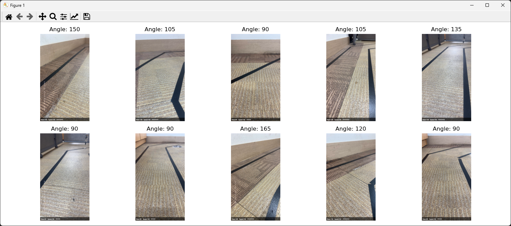
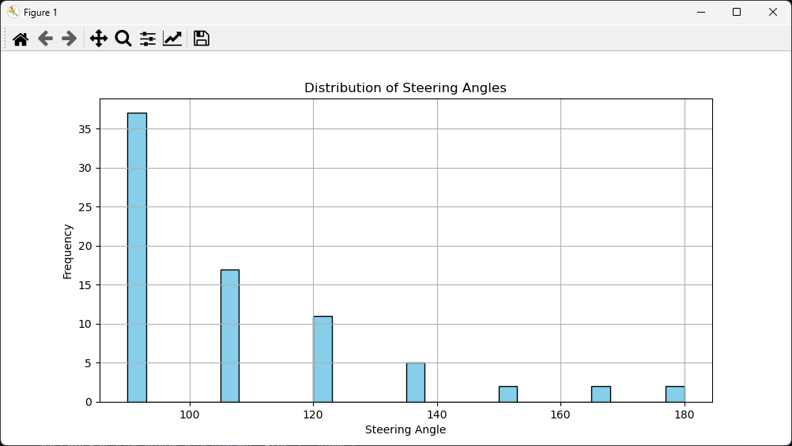
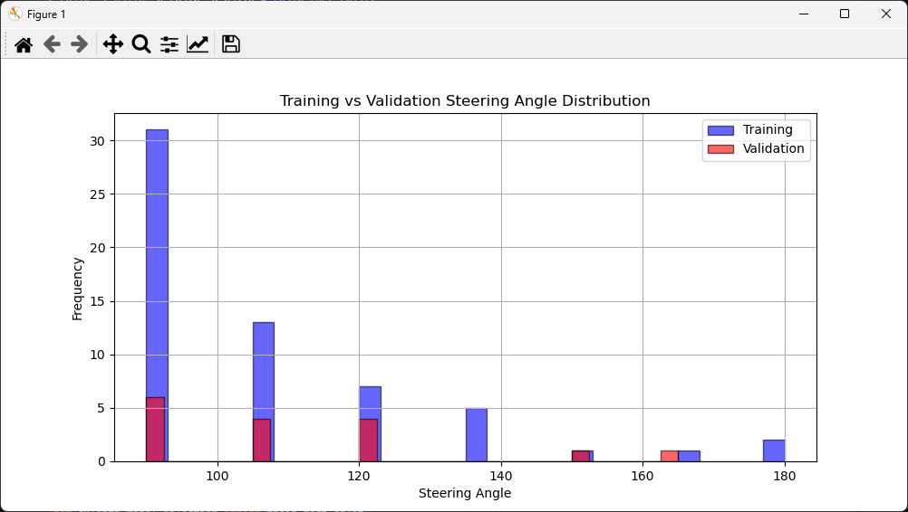
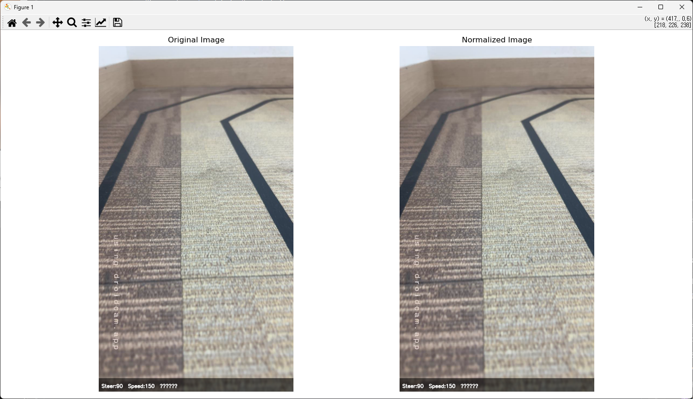
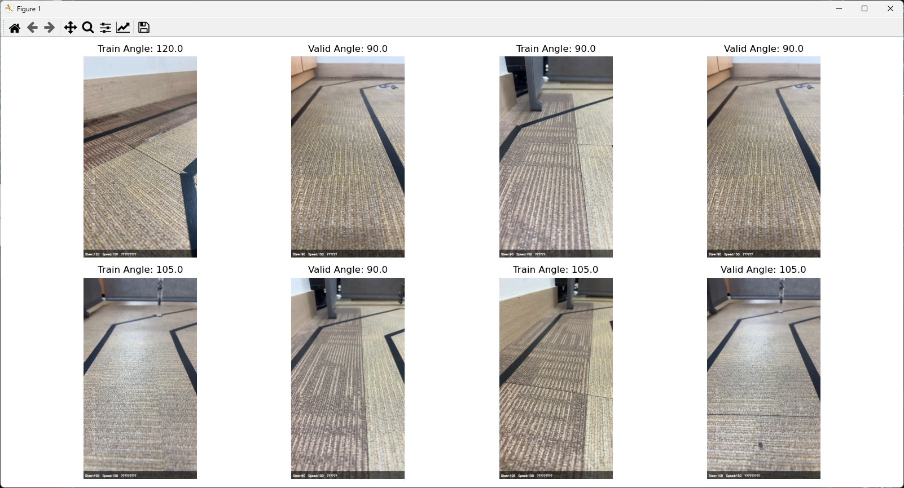
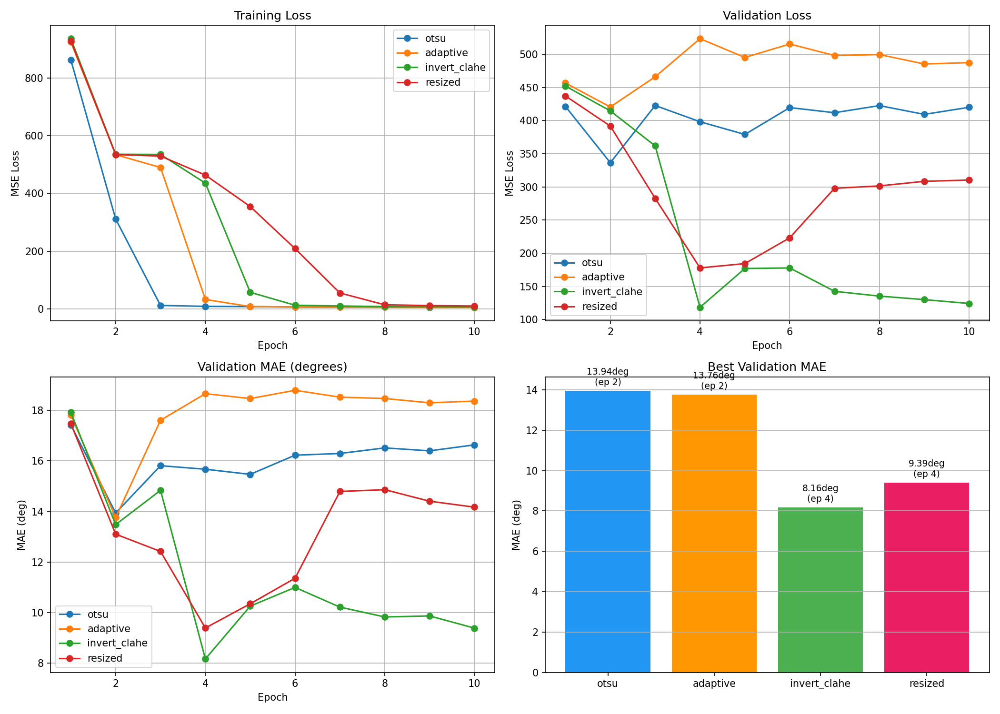
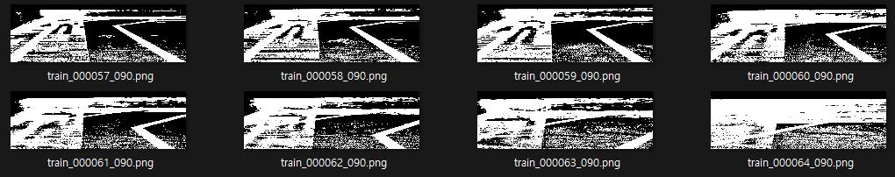
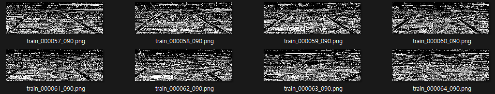
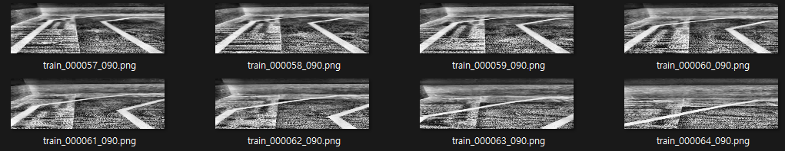
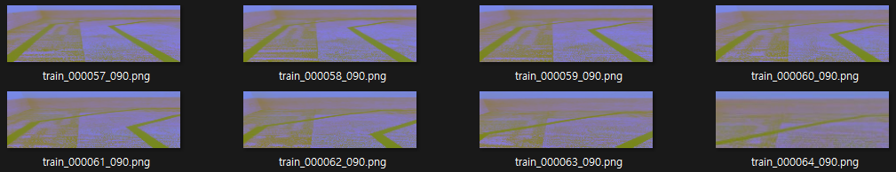

# 7-3 자율주행 자동차 학습모델 생성하기

* 수집된 주행 데이터를 이용해 자율주행 자동차의 인공지능 모델을 학습하는 과정을 실습합니다.
* PyTorch를 사용하여 신경망을 구성하고, 입력 영상과 조향각도 데이터를 바탕으로 모델을 학습시킵니다.
* 훈련이 완료된 모델은 자동차의 판단 알고리즘으로 활용되며, 이후 라즈베리파이에 배포 하여 실제 주행제어에 적용할 수 있습니다.
* 이를 통해 학습자는 인공디능 모델 학습의 전 과정을 이애하고, 자율주행의 핵심 기술을 직접 구현 할 수 있습니다.


## 1. video.zip 파일 압축 풀기

* 1_unzip_video.py

* 6장에서 라즈베리파이에서 학습한 데이터인 [video.zip]파일을 준비합니다.
* Document 폴더로 복사하였기 때문에 문서 폴더에서 확인 할 수 있습니다.

```python
import zipfile
import os
import shutil

current_dir = os.path.dirname(os.path.abspath(__file__))
zip_path = os.path.join(current_dir, 'video.zip')
extract_folder = os.path.join(current_dir, 'video')

if os.path.exists(extract_folder):
    shutil.rmtree(extract_folder)

with zipfile.ZipFile(zip_path, 'r') as zip_ref:
    zip_ref.extractall(current_dir)

print("done")
```


## 2. 라이브터리 설치 확인

* 모델을 만들기 위해 다양한 라이브러리가 필요로 합니다.
* 라이브러리가 잘 설치되었는지 확인하는 코드를 작성해 봅니다.
* 코드 작성 후 [2_library_check.py] 이름으로 저장합니다.

* 2_library_check.py

```python
import os
import random
import pickle
import fnmatch
from datetime import datetime
import numpy as np
import cv2
import torch
import torch.nn as nn
import torch.optim as optim
from sklearn.model_selection import train_test_split
import matplotlib
import matplotlib.pyplot as plt
import PIL
from PIL import Image
import pandas as pd

def safe_ver(module, attr="__version__"):
    return getattr(module, attr, "N/A")

import sys
print("=== Python Environment ===")
print(f"python: {sys.version.split()[0]}")
print()
print("=== Library Versions ===")
print(f"torch: {safe_ver(torch)}")
print(f"numpy: {safe_ver(np)}")
print(f"opencv-python (cv2): {safe_ver(cv2)}")
print(f"matplotlib: {safe_ver(matplotlib)}")
print(f"pandas: {safe_ver(pd)}")
print(f"scikit-learn: {safe_ver(__import__('sklearn'))}")
print(f"Pillow (PIL): {safe_ver(PIL)}")
print()
print("=== PyTorch System Info ===")
cuda_available = torch.cuda.is_available()
print(f"CUDA available: {cuda_available}")
print(f"torch.version.cuda: {getattr(torch.version, 'cuda', None)}")
try:
    cudnn_ver = torch.backends.cudnn.version()
except Exception:
    cudnn_ver = None
print(f"cuDNN version: {cudnn_ver}")
if cuda_available:
    device = torch.device("cuda")
    print(f"GPU count: {torch.cuda.device_count()}")
    print(f"GPU name[0]: {torch.cuda.get_device_name(0)}")
else:
    device = torch.device('cpu')
    print('Using CPU')
print()
try:
    x = torch.randn(2, 3, device=device)
    y = torch.randn(2, 3, device=device)
    z = (x + y).mean().item()
    print("PyTorch test: OK")
except Exception as e:
    print('PyTorch test: FAIL')
    print(e)
```

* 결과

```
python 2_library_check.py
=== Python Environment ===
python: 3.12.7

=== Library Versions ===
torch: 2.6.0+cu124
numpy: 1.26.4
opencv-python (cv2): 4.11.0
matplotlib: 3.9.2
pandas: 2.2.2
scikit-learn: 1.5.1
Pillow (PIL): 12.2.0

=== PyTorch System Info ===
CUDA available: True
torch.version.cuda: 12.4
cuDNN version: 90100
GPU count: 1
GPU name[0]: NVIDIA GeForce RTX 3070 Laptop GPU

PyTorch test: OK
```


## 3. 데이터 불러오기

* 데이터를 불러와 이미지로 확인해보도록 합니다.
* 너무 터무니 없는 데이터가 들어가 있는지 확인하는 과정으로 이때 이상한 데이터가 있다면 다시 학습 하도록 합니다.
* 코드 작성 후 [3_data_shck.py] 이름으로 저장합니다.
* 이미지는 "video" 폴더 아래로 이동합니다.



* 3_data_chck.py

```python
import os
import random
import fnmatch
import numpy as np
import torch
from PIL import Image
import matplotlib.pyplot as plt

data_dir = os.path.join(os.path.dirname(__file__), "video")
image_paths = []
steering_angles = []

for filename in os.listdir(data_dir):
    if fnmatch.fnmatch(filename, "*.png"):
        image_paths.append(os.path.join(data_dir, filename))
        angle = int(filename[-7:-4])
        steering_angles.append(angle)

random_indices = random.sample(range(len(image_paths)), 10)
fig, axes = plt.subplots(2, 5, figsize=(15, 6))

for i, ax in enumerate(axes.flat):
    idx = random_indices[i]
    img = Image.open(image_paths[idx]).convert("RGB")
    ax.imshow(img)
    ax.set_title(f"Angle: {steering_angles[idx]}")
    ax.axis('off')

plt.tight_layout()
plt.show()
```


## 4. 조향각의 분포를 확인

* 저장된 이미지 파일 이름으로 조향각 데이터를 추출한고,
* 조향각이 어떤 분포를 가젺는지 히스토그램으로 시작화하는 코드를 작성합니다.
* 코드 작성 후[4_Street_angle_histogram.py] 이름으로 저장합니다.



* 4_Steering_angle_histogram.py

```python
import os
import fnmatch
import random
import numpy as np
import pandas as pd
import matplotlib.pyplot as plt
import torch

data_dir = os.path.join(os.path.dirname(__file__), "video")
image_paths = []
steering_angles = []

for filename in os.listdir(data_dir):
    if fnmatch.fnmatch(filename, "*.png"):
        image_paths.append(os.path.join(data_dir, filename))
        angle = int(filename[-7:-4])
        steering_angles.append(angle)

df = pd.DataFrame({"SteeringAngle": steering_angles})

plt.figure(figsize=(10, 5))
plt.hist(df['SteeringAngle'], bins=30, color="skyblue", edgecolor="black")
plt.title("Distribution of Steering Angles")
plt.xlabel('Steering Angle')
plt.ylabel("Frequency")
plt.grid(True)
plt.show()
```

## 5.학습 데이터와 검증 데이터를 분리

* 이미지 파일 이름에서 조향각 데이터를 추축한 위
* 학습용(train)과 검증용(validation)  epdlxjfh skdnrh,
* 두 데이터의 조향각 분포를 히스토그램으로 비교하는 코드입니다.
* 증, 데이터가 균등하게 분리되었는지 시각적으로 확인하는 역할을 합니다.



* 5_Train_validation_split.py

```python
import os
import fnmatch
import random
import numpy as np
import matplotlib.pyplot as plt
from sklearn.model_selection import train_test_split
import torch

data_dir = os.path.join(os.path.dirname(__file__), "video")
image_paths = []
steering_angles = []

for filename in os.listdir(data_dir):
    if fnmatch.fnmatch(filename, "*.png"):
        image_paths.append(os.path.join(data_dir, filename))
        angle = int(filename[-7:-4])
        steering_angles.append(angle)

X_train, X_valid, y_train, y_valid = train_test_split(
    image_paths, steering_angles, test_size=0.2, random_state=42
)

plt.figure(figsize=(10, 5))
plt.hist(y_train, bins=30, alpha=0.6, label="Training", color="blue", edgecolor="black")
plt.hist(y_valid, bins=30, alpha=0.6, label="Validation", color="red", edgecolor="black")
plt.title('Training vs Validation Steering Angle Distribution')
plt.xlabel("Steering Angle")
plt.ylabel("Frequency")
plt.legend()
plt.grid(True)
plt.show()
```

## 6. 이미지 읽어오기 및 정규화

* 이미지를 정규화하여 학습 효과를 높여보도록 합니다.
* 정규화 과정은 쉽게 말해 데이터의 스케일을 일정하게 맞추는 작업으로, <br>
  픽셀값의 범위를 조정하여 모델이 이미지의특징을 더 안정적으로 학습할 수 있도록 도와줍니다.




* 6_Image_input_and_normalization_functions.py

```python
import os
import random
import fnmatch
import numpy as np
import cv2
import matplotlib.pyplot as plt
from sklearn.model_selection import train_test_split
import torch

data_dir = os.path.join(os.path.dirname(__file__), "video")
image_paths = []
steering_angles = []

for filename in os.listdir(data_dir):
    if fnmatch.fnmatch(filename, "*.png"):
        image_paths.append(os.path.join(data_dir, filename))
        angle = int(filename[-7:-4])
        steering_angles.append(angle)

X_train, X_valid, y_train, y_valid = train_test_split(
    image_paths, steering_angles, test_size=0.2, random_state=42
)

def my_imread(image_path):
    image = cv2.imread(image_path)
    image = cv2.cvtColor(image, cv2.COLOR_BGR2RGB)
    return image

def img_preprocess(image):
    image = image.astype(np.float32) / 255.0
    return image

image_index = random.randint(0, len(image_paths) - 1)
fig, axes = plt.subplots(1, 2, figsize=(15, 8))

image_orig = my_imread(image_paths[image_index])
image_processed = img_preprocess(image_orig)

axes[0].imshow(image_orig)
axes[0].set_title("Original Image")
axes[0].axis("off")

axes[1].imshow(image_processed)
axes[1].set_title("Normalized Image")
axes[1].axis('off')

plt.tight_layout()
plt.show()
```


## 7.nvidia 모델 구성

* 그래픽카드 제조회사인 NVIDIA에서 차선 인식을 위한 논문에서 제공된 모델을 이용하여 학습모델을 구성합니다.
* NVIDIA 자율주행 구조를 따른 딥러닝 모델을 구성하고 모델의 전체 구조를 출력하는기능을 코드를 작성합니다.



* 7_NVIDIA_model_configuration.py

```python
import os
import fnmatch
from sklearn.model_selection import train_test_split
import cv2
import numpy as np
import torch
import torch.nn as nn
import torch.optim as optim

data_dir = os.path.join(os.path.dirname(__file__), "video")
image_paths = []
steering_angles = []

for filename in os.listdir(data_dir):
    if fnmatch.fnmatch(filename, "*.png"):
        image_paths.append(os.path.join(data_dir, filename))
        angle = int(filename[-7:-4])
        steering_angles.append(angle)

X_train, X_valid, y_train, y_valid = train_test_split(
    image_paths, steering_angles, test_size=0.2, random_state=42
)

def my_imread(image_path):
    image = cv2.imread(image_path)
    image = cv2.cvtColor(image, cv2.COLOR_BGR2RGB)
    return image

def img_preprocess(image):
    image = image.astype(np.float32) / 255.0
    image = np.transpose(image, (2, 0, 1))
    return image

class NvidiaModel(nn.Module):
    def __init__(self):
        super().__init__()
        self.features = nn.Sequential(
            nn.Conv2d(3, 24, kernel_size=5, stride=2),
            nn.ELU(inplace=True),
            nn.Conv2d(24, 36, kernel_size=5, stride=2),
            nn.ELU(inplace=True),
            nn.Conv2d(36, 48, kernel_size=5, stride=2),
            nn.ELU(inplace=True),
            nn.Conv2d(48, 64, kernel_size=3, stride=1),
            nn.ELU(inplace=True),
            nn.Dropout(p=0.2),
            nn.Conv2d(64, 64, kernel_size=3, stride=1),
            nn.ELU(inplace=True),
        )
        self.flatten = nn.Flatten()

        with torch.no_grad():
            tmp = torch.zeros(1, 3, 66, 200)
            f = self.features(tmp)
            flat_dim = f.numel()

        self.mlp = nn.Sequential(
            nn.Dropout(p=0.2),
            nn.Linear(flat_dim, 100),
            nn.ELU(inplace=True),
            nn.Linear(100, 50),
            nn.ELU(inplace=True),
            nn.Linear(50, 10),
            nn.ELU(inplace=True),
            nn.Linear(10, 1),
        )

    def forward(self, x):
        x = self.features(x)
        x = self.flatten(x)
        x = self.mlp(x)
        return x

model = NvidiaModel()
criterion = nn.MSELoss()
optimizer = optim.Adam(model.parameters(), lr=1e-3)

print(model)
total_params = sum(p.numel() for p in model.parameters())
trainable_params = sum(p.numel() for p in model.parameters() if p.requires_grad)
print(f"total_params: {total_params}")
print(f"trainable_params: {trainable_params}")
```


* 실행결과

```
python 7_NVIDIA_model_configuration.py
NvidiaModel(
  (features): Sequential(
    (0): Conv2d(3, 24, kernel_size=(5, 5), stride=(2, 2))
    (1): ELU(alpha=1.0, inplace=True)
    (2): Conv2d(24, 36, kernel_size=(5, 5), stride=(2, 2))
    (3): ELU(alpha=1.0, inplace=True)
    (4): Conv2d(36, 48, kernel_size=(5, 5), stride=(2, 2))
    (5): ELU(alpha=1.0, inplace=True)
    (6): Conv2d(48, 64, kernel_size=(3, 3), stride=(1, 1))
    (7): ELU(alpha=1.0, inplace=True)
    (8): Dropout(p=0.2, inplace=False)
    (9): Conv2d(64, 64, kernel_size=(3, 3), stride=(1, 1))
    (10): ELU(alpha=1.0, inplace=True)
  )
  (flatten): Flatten(start_dim=1, end_dim=-1)
  (mlp): Sequential(
    (0): Dropout(p=0.2, inplace=False)
    (1): Linear(in_features=1152, out_features=100, bias=True)
    (2): ELU(alpha=1.0, inplace=True)
    (3): Linear(in_features=100, out_features=50, bias=True)
    (4): ELU(alpha=1.0, inplace=True)
    (5): Linear(in_features=50, out_features=10, bias=True)
    (6): ELU(alpha=1.0, inplace=True)
    (7): Linear(in_features=10, out_features=1, bias=True)
  )
)
total_params: 252219
trainable_params: 252219
```

## 8.학습 데이터와 검증 데이터를 분리

* 모든 이미지를 이용하여 삭습하기에는 너무 많은 시간이 소요되므로 학습, <br>
  검증으로 분리된 데이터에서 랜덤하게 추출하여 학습 데이터와 검증데이터를 생겅하는 코드를 작성해봅니다.

* 8_Generating_traing_data.py

```python
import os
import random
import fnmatch
import numpy as np
import cv2
import matplotlib.pyplot as plt
from sklearn.model_selection import train_test_split
import torch

data_dir = os.path.join(os.path.dirname(__file__), "video")
image_paths = []
steering_angles = []

for filename in os.listdir(data_dir):
    if fnmatch.fnmatch(filename, "*.png"):
        image_paths.append(os.path.join(data_dir, filename))
        angle = int(filename[-7:-4])
        steering_angles.append(angle)

X_train, X_valid, y_train, y_valid = train_test_split(
    image_paths, steering_angles, test_size=0.2, random_state=42
)

def my_imread(image_path):
    image = cv2.imread(image_path)
    image = cv2.cvtColor(image, cv2.COLOR_BGR2RGB)
    return image

def img_preprocess(image):
    image = image.astype(np.float32) / 255.0
    return image

def image_data_generator(image_paths, steering_angles, batch_size):
    n = len(image_paths)
    while True:
        batch_images = []
        batch_angles = []
        for _ in range(batch_size):
            idx = random.randint(0, n - 1)
            image = my_imread(image_paths[idx])
            angle = steering_angles[idx]
            image = img_preprocess(image)
            batch_images.append(image)
            batch_angles.append(angle)
        yield np.asarray(batch_images), np.asarray(batch_angles, dtype=np.float32)

nrow = 2
ncol = 2
batch_size = nrow * ncol

X_train_batch, y_train_batch = next(image_data_generator(X_train, y_train, batch_size))
X_valid_batch, y_valid_batch = next(image_data_generator(X_valid, y_valid, batch_size))

fig, axes = plt.subplots(nrow, ncol * 2, figsize=(16, 8))

for i in range(nrow):
    for j in range(ncol):
        idx = i * ncol + j
        axes[i][j * 2].imshow(X_train_batch[idx])
        axes[i][j * 2].set_title(f"Train Angle: {y_train_batch[idx]}")
        axes[i][j * 2].axis("off")

        axes[i][j * 2 + 1].imshow(X_valid_batch[idx])
        axes[i][j * 2 + 1].set_title(f"Valid Angle: {y_valid_batch[idx]}")
        axes[i][j * 2 + 1].axis("off")

plt.tight_layout()
plt.show()
```


## 9. 모델 학습(10분가량 소요)

* 데이터를 이용하여 실제 학습하는 과정으로 컴퓨터의 성능에 따라서 5~20분가량 소요됩니다.
* 학습이 끝나면 모델데이터가 생성됩니다.

* 9_make_model.py

```python
import os
import fnmatch
import random
import pickle
from datetime import datetime
import cv2
import numpy as np
import torch
import torch.nn as nn
import torch.optim as optim

SEED = 42
random.seed(SEED)
np.random.seed(SEED)
torch.manual_seed(SEED)

base_dir = os.path.dirname(__file__)
data_dir = os.path.join(base_dir, "video")
batch_size = 100
epochs = 10
lr = 1e-3
steps_per_epoch = 300
validation_steps = 200
device = torch.device("cuda" if torch.cuda.is_available() else "cpu")

def list_image_paths_and_angles(folder):
    paths, angles = [], []
    for filename in os.listdir(folder):
        if fnmatch.fnmatch(filename, "*.png"):
            paths.append(os.path.join(folder, filename))
            angle = int(filename[-7:-4])
            angles.append(float(angle))
    return paths, angles

def train_valid_split(paths, angles, valid_ratio=0.2):
    idxs = list(range(len(paths)))
    random.shuffle(idxs)
    n = len(idxs)
    n_valid = int(n * valid_ratio)
    valid_idx = idxs[:n_valid]
    train_idx = idxs[n_valid:]
    X_train = [paths[i] for i in train_idx]
    y_train = [angles[i] for i in train_idx]
    X_valid = [paths[i] for i in valid_idx]
    y_valid = [angles[i] for i in valid_idx]
    return X_train, X_valid, y_train, y_valid

def preprocess_for_training(bgr):
    img = bgr.astype(np.float32) / 255.0
    img = np.transpose(img, (2, 0, 1))
    return img

def infinite_batch(image_paths, steering_angles, batch_size):
    n = len(image_paths)
    assert n > 0
    while True:
        idxs = np.random.randint(0, n, size=batch_size)
        xs, ys = [], []
        for i in idxs:
            img = cv2.imread(image_paths[i], cv2.IMREAD_COLOR)
            if img is None:
                raise FileNotFoundError(image_paths[i])
            x = preprocess_for_training(img)
            xs.append(x)
            ys.append([steering_angles[i]])
        x_batch = torch.from_numpy(np.stack(xs)).float()
        y_batch = torch.from_numpy(np.array(ys, dtype=np.float32))
        yield x_batch, y_batch

class NvidiaModel(nn.Module):
    def __init__(self):
        super().__init__()
        self.features = nn.Sequential(
            nn.Conv2d(3, 24, kernel_size=5, stride=2),
            nn.ELU(inplace=True),
            nn.Conv2d(24, 36, kernel_size=5, stride=2),
            nn.ELU(inplace=True),
            nn.Conv2d(36, 48, kernel_size=5, stride=2),
            nn.ELU(inplace=True),
            nn.Conv2d(48, 64, kernel_size=3, stride=1),
            nn.ELU(inplace=True),
            nn.Dropout(p=0.2),
            nn.Conv2d(64, 64, kernel_size=3, stride=1),
            nn.ELU(inplace=True),
        )
        self.flatten = nn.Flatten()

        with torch.no_grad():
            tmp = torch.zeros(1, 3, 66, 200)
            f = self.features(tmp)
            flat_dim = f.numel()

        self.mlp = nn.Sequential(
            nn.Dropout(p=0.2),
            nn.Linear(flat_dim, 100),
            nn.ELU(inplace=True),
            nn.Linear(100, 50),
            nn.ELU(inplace=True),
            nn.Linear(50, 10),
            nn.ELU(inplace=True),
            nn.Linear(10, 1),
        )

    def forward(self, x):
        x = self.features(x)
        x = self.flatten(x)
        x = self.mlp(x)
        return x

def train_one_epoch(model, optimizer, criterion, train_gen, steps_per_epoch):
    model.train()
    run_loss = 0.0
    seen = 0
    for _ in range(steps_per_epoch):
        x, y = next(train_gen)
        x, y = x.to(device), y.to(device)
        optimizer.zero_grad(set_to_none=True)
        pred = model(x)
        loss = criterion(pred, y)
        loss.backward()
        optimizer.step()
        bs = x.size(0)
        run_loss += loss.item() * bs
        seen += bs
    return run_loss / max(seen, 1)

@torch.no_grad()
def evaluate(model, criterion, valid_gen, validation_steps):
    model.eval()
    total_loss, total_mae = 0.0, 0.0
    seen = 0
    for _ in range(validation_steps):
        x, y = next(valid_gen)
        x, y = x.to(device), y.to(device)
        pred = model(x)
        loss = criterion(pred, y)
        mae = torch.mean(torch.abs(pred - y))
        bs = x.size(0)
        total_loss += loss.item() * bs
        total_mae += mae.item() * bs
        seen += bs
    if seen == 0:
        return float('inf'), float('inf')
    return total_loss / seen, total_mae / seen

def main():
    paths, angles = list_image_paths_and_angles(data_dir)
    if len(paths) == 0:
        raise RuntimeError(f'No PNG images found in: {data_dir}')

    X_train, X_valid, y_train, y_valid = train_valid_split(paths, angles, valid_ratio=0.2)
    model = NvidiaModel().to(device)
    criterion = nn.MSELoss()
    optimizer = optim.Adam(model.parameters(), lr=lr)
    scheduler = optim.lr_scheduler.ReduceLROnPlateau(optimizer, mode="min", factor=0.5, patience=2)

    timestamp = datetime.now().strftime("%Y%m%d_%H%M%S")
    save_dir = os.path.join(base_dir, f"model-{timestamp}")
    os.makedirs(save_dir, exist_ok=True)

    best_val = float("inf")
    history = {"train_loss": [], "val_loss": [], "val_mae": []}

    train_gen = infinite_batch(X_train, y_train, batch_size)
    valid_gen = infinite_batch(X_valid, y_valid, batch_size)

    for ep in range(1, epochs + 1):
        tr_loss = train_one_epoch(model, optimizer, criterion, train_gen, steps_per_epoch)
        val_loss, val_mae = evaluate(model, criterion, valid_gen, validation_steps)

        old_lr = optimizer.param_groups[0]["lr"]
        scheduler.step(val_loss)
        new_lr = optimizer.param_groups[0]["lr"]
        if new_lr != old_lr:
            print(f"[scheduler] LR reduced: {old_lr:.6f} -> {new_lr:.6f}")

        history["train_loss"].append(tr_loss)
        history["val_loss"].append(val_loss)
        history["val_mae"].append(val_mae)

        print(f"Epoch {ep:02d}/{epochs} | train_loss={tr_loss:.5f} | val_loss={val_loss:.5f} | val_MAE(deg)={val_mae:.3f}")

        if val_loss < best_val:
            best_val = val_loss
            best_pt = os.path.join(save_dir, "lane_navigation_best.pt")
            torch.save({"model_state": model.state_dict(), "val_loss": val_loss}, best_pt)
            print(f"Saved BEST checkpoint -> {best_pt}")

    final_pt = os.path.join(save_dir, "lane_navigation_final.pt")
    torch.save({"model_state": model.state_dict()}, final_pt)
    print(f"Saved final weights -> {final_pt}")

    model.eval()
    example = torch.zeros(1, 3, 66, 200, device=device)
    traced = torch.jit.trace(model, example)
    ts_path = os.path.join(save_dir, "lane_navigation_final.torchscript")
    traced.save(ts_path)
    print(f"Saved TorchScript -> {ts_path}")

    hist_path = os.path.join(save_dir, "history.pickle")
    with open(hist_path, "wb") as f:
        pickle.dump(history, f, pickle.HIGHEST_PROTOCOL)
    print(f"Saved history -> {hist_path}")

    print(f"Training complete. Model saved to: {save_dir}")

if __name__ == "__main__":
    main()
```


## 10.결과확인

* history.pickle 파일을 이용하여 모델 학습 과정 중 저장된 손실값(loss, val_loss)을 불러와서 에폭별로 학습 손실과 검증 손실이 어떻게 변했는지 그래프로 시각화하는 기능을 수행하는 코드를 작성해 봅니다.
* 모델의 생성 시점에 따랄 모델이 저장된 폴더의 이름이 변경되므로 6줄의 폴더는 생성된 시간의 폴터 이름으로 변경합니다.

* 10_Result_analysis.py

```python
import os
import pickle
import matplotlib.pyplot as plt

model_folder = "."

history_path = os.path.join(model_folder, "history.pickle")
with open(history_path, "rb") as f:
    history = pickle.load(f)

print('History keys:', history.keys())

train_loss = history.get("train_loss", history.get("loss"))
val_loss = history.get("val_loss")
val_mae = history.get("val_mae")

plt.figure(figsize=(10, 5))
if train_loss is not None:
    plt.plot(train_loss, label="Training Loss")
if val_loss is not None:
    plt.plot(val_loss, label="Validation Loss")
plt.title("Model Training History - Loss")
plt.xlabel("Epoch")
plt.ylabel("Loss")
plt.legend()
plt.grid(True)
plt.show()

if val_mae is not None:
    plt.figure(figsize=(10, 5))
    plt.plot(val_mae, label="Validation MAE")
    plt.title("Model Training History - MAE")
    plt.xlabel("Epoch")
    plt.ylabel("MAE (deg)")
    plt.legend()
    plt.grid(True)
    plt.show()
```

---

| 옵션	| 설명 | 
|:-------:|:-------:|
| video	| 원본 이미지 (200x66으로 리사이즈 후 학습) | 
| cropped	| 크롭만 된 이미지 (200x66으로 리사이즈 후 학습) | 
| invert	| 반전 resized 이미지 | 
| otsu	| Otsu 이진화 resized 이미지 | 
| adaptive	| 적응형 이진화 resized 이미지 | 
| invert_clahe	| 반전+CLAHE resized 이미지 | 
| resized	| 기존 BGR resized 이미지 | 

* 예시: python 9_make_model.py otsu



* 주요 관찰:
   * otsu, adaptive: 2epoch 이후 과적합 (train_loss는 떨어지지만 val_loss/MAE 악화)
   * invert_clahe: 가장 안정적. val_loss가 지속적으로 감소하고 최종 MAE도 9.384deg로 양호
   * resized: 중간 성능. 4epoch 이후 과적합 경향
* 추천:
   * 학습 데이터가 더 필요함 (76장으로는 부족)
   * invert_clahe 방식으로 학습하는 것이 가장 효과적
   * 추가 학습 시 epochs를 늘리고 early stopping을 적용하면 더 좋음


### otsu : 히스토그램을 분석하여 최적의 임계값을 자동으로 찾는 이진화 기법

```
원본 이미지 → Grayscale → CLAHE(대비강화) → Otsu 이진화 → 흰색(라인) / 검정(배경)
밝기 분포:  [0___100___200___255]
             검정   중간    흰색

Otsu가 찾은 임계값: 128 (예시)

결과: 0~127 → 검정(0), 128~255 → 흰색(255)
```




### adaptive

```
지역별로 다른 임계값을 적용하는 이진화 기법입니다.

원본 이미지 → Grayscale → CLAHE → Adaptive Threshold → 흰색(라인) / 검정(배경)

```




### invert_clahe

```
반전 후 대비를 극대화하는 기법입니다.

원본 → Grayscale → CLAHE → 반전(255-gray) → CLAHE → GaussianBlur

Contrast Limited Adaptive Histogram Equalization

일반 히스토그램 평활화:
- 전체 이미지에 동일한 변환 적용
- 과도한 대비 증강 가능

CLAHE:
- 이미지를 8x8 블록으로 분할
- 각 블록별로 독립적 평활화
- clipLimit(2.0)로 과도한 대비 증강 방지

반전	라인(검정)→흰색으로 변환하여 CNN이 쉽게 학습
CLAHE 2회	원본 대비 + 반전 후 대비 = 라인이 극도로 도드라짐
GaussianBlur	적절한 노이즈 제거
```




### resized

```
원본(1280x720) → Crop(상단 절반) → YUV 변환 → CLAHE(Y채널) → GaussianBlur → Resize(200x66)
```




```
(base) C:\Users\Administrator\Desktop\recordings>python 9_make_model.py otsu
Data source : otsu
Directory   : C:\Users\Administrator\Desktop\recordings\processed\filter_otsu_resized
Resize      : False
Device      : cuda
Epoch 01/10 | train_loss=863.36552 | val_loss=421.29677 | val_MAE(deg)=17.427
Saved BEST checkpoint -> C:\Users\Administrator\Desktop\recordings\model-20260714_225933\lane_navigation_best.pt
Epoch 02/10 | train_loss=311.09979 | val_loss=336.49566 | val_MAE(deg)=13.942
Saved BEST checkpoint -> C:\Users\Administrator\Desktop\recordings\model-20260714_225933\lane_navigation_best.pt
Epoch 03/10 | train_loss=11.58982 | val_loss=422.78779 | val_MAE(deg)=15.815
Epoch 04/10 | train_loss=8.47696 | val_loss=398.29645 | val_MAE(deg)=15.674
[scheduler] LR reduced: 0.001000 -> 0.000500
Epoch 05/10 | train_loss=7.51582 | val_loss=379.09842 | val_MAE(deg)=15.472
Epoch 06/10 | train_loss=6.30847 | val_loss=419.61799 | val_MAE(deg)=16.230
Epoch 07/10 | train_loss=6.17069 | val_loss=411.89536 | val_MAE(deg)=16.298
[scheduler] LR reduced: 0.000500 -> 0.000250
Epoch 08/10 | train_loss=5.86469 | val_loss=422.63263 | val_MAE(deg)=16.519
Epoch 09/10 | train_loss=5.32162 | val_loss=409.38526 | val_MAE(deg)=16.402
Epoch 10/10 | train_loss=5.14254 | val_loss=420.05490 | val_MAE(deg)=16.639
Saved final weights -> C:\Users\Administrator\Desktop\recordings\model-20260714_225933\lane_navigation_final.pt
Saved TorchScript -> C:\Users\Administrator\Desktop\recordings\model-20260714_225933\lane_navigation_final.torchscript
Saved history -> C:\Users\Administrator\Desktop\recordings\model-20260714_225933\history.pickle
Training complete. Model saved to: C:\Users\Administrator\Desktop\recordings\model-20260714_225933

(base) C:\Users\Administrator\Desktop\recordings>python 9_make_model.py adaptive
Data source : adaptive
Directory   : C:\Users\Administrator\Desktop\recordings\processed\filter_adaptive_resized
Resize      : False
Device      : cuda
Epoch 01/10 | train_loss=925.41358 | val_loss=456.64700 | val_MAE(deg)=17.817
Saved BEST checkpoint -> C:\Users\Administrator\Desktop\recordings\model-20260714_230654\lane_navigation_best.pt
Epoch 02/10 | train_loss=534.52463 | val_loss=420.56408 | val_MAE(deg)=13.759
Saved BEST checkpoint -> C:\Users\Administrator\Desktop\recordings\model-20260714_230654\lane_navigation_best.pt
Epoch 03/10 | train_loss=490.11325 | val_loss=466.07512 | val_MAE(deg)=17.613
Epoch 04/10 | train_loss=32.46892 | val_loss=523.56925 | val_MAE(deg)=18.666
[scheduler] LR reduced: 0.001000 -> 0.000500
Epoch 05/10 | train_loss=7.65656 | val_loss=495.20087 | val_MAE(deg)=18.472
Epoch 06/10 | train_loss=6.23273 | val_loss=515.51006 | val_MAE(deg)=18.799
Epoch 07/10 | train_loss=6.00619 | val_loss=498.15295 | val_MAE(deg)=18.527
[scheduler] LR reduced: 0.000500 -> 0.000250
Epoch 08/10 | train_loss=5.83031 | val_loss=499.60054 | val_MAE(deg)=18.475
Epoch 09/10 | train_loss=5.34607 | val_loss=485.40133 | val_MAE(deg)=18.304
Epoch 10/10 | train_loss=5.23970 | val_loss=487.39607 | val_MAE(deg)=18.371
Saved final weights -> C:\Users\Administrator\Desktop\recordings\model-20260714_230654\lane_navigation_final.pt
Saved TorchScript -> C:\Users\Administrator\Desktop\recordings\model-20260714_230654\lane_navigation_final.torchscript
Saved history -> C:\Users\Administrator\Desktop\recordings\model-20260714_230654\history.pickle
Training complete. Model saved to: C:\Users\Administrator\Desktop\recordings\model-20260714_230654

(base) C:\Users\Administrator\Desktop\recordings>python 9_make_model.py invert_clahe
Data source : invert_clahe
Directory   : C:\Users\Administrator\Desktop\recordings\processed\filter_invert_clahe_resized
Resize      : False
Device      : cuda
Epoch 01/10 | train_loss=936.88717 | val_loss=452.02532 | val_MAE(deg)=17.924
Saved BEST checkpoint -> C:\Users\Administrator\Desktop\recordings\model-20260714_231443\lane_navigation_best.pt
Epoch 02/10 | train_loss=535.92299 | val_loss=414.64728 | val_MAE(deg)=13.483
Saved BEST checkpoint -> C:\Users\Administrator\Desktop\recordings\model-20260714_231443\lane_navigation_best.pt
Epoch 03/10 | train_loss=535.38634 | val_loss=361.89327 | val_MAE(deg)=14.838
Saved BEST checkpoint -> C:\Users\Administrator\Desktop\recordings\model-20260714_231443\lane_navigation_best.pt
Epoch 04/10 | train_loss=435.76399 | val_loss=118.43836 | val_MAE(deg)=8.163
Saved BEST checkpoint -> C:\Users\Administrator\Desktop\recordings\model-20260714_231443\lane_navigation_best.pt
Epoch 05/10 | train_loss=57.17896 | val_loss=176.96192 | val_MAE(deg)=10.254
Epoch 06/10 | train_loss=12.35316 | val_loss=177.80597 | val_MAE(deg)=10.996
[scheduler] LR reduced: 0.001000 -> 0.000500
Epoch 07/10 | train_loss=9.68888 | val_loss=142.55496 | val_MAE(deg)=10.216
Epoch 08/10 | train_loss=7.78469 | val_loss=135.34273 | val_MAE(deg)=9.826
Epoch 09/10 | train_loss=7.11782 | val_loss=130.05678 | val_MAE(deg)=9.866
[scheduler] LR reduced: 0.000500 -> 0.000250
Epoch 10/10 | train_loss=6.55198 | val_loss=124.21238 | val_MAE(deg)=9.384
Saved final weights -> C:\Users\Administrator\Desktop\recordings\model-20260714_231443\lane_navigation_final.pt
Saved TorchScript -> C:\Users\Administrator\Desktop\recordings\model-20260714_231443\lane_navigation_final.torchscript
Saved history -> C:\Users\Administrator\Desktop\recordings\model-20260714_231443\history.pickle
Training complete. Model saved to: C:\Users\Administrator\Desktop\recordings\model-20260714_231443

(base) C:\Users\Administrator\Desktop\recordings>python 9_make_model.py resized
Data source : resized
Directory   : C:\Users\Administrator\Desktop\recordings\processed\resized
Resize      : False
Device      : cuda
Epoch 01/10 | train_loss=929.32751 | val_loss=437.17662 | val_MAE(deg)=17.480
Saved BEST checkpoint -> C:\Users\Administrator\Desktop\recordings\model-20260714_232204\lane_navigation_best.pt
Epoch 02/10 | train_loss=534.88974 | val_loss=391.72679 | val_MAE(deg)=13.103
Saved BEST checkpoint -> C:\Users\Administrator\Desktop\recordings\model-20260714_232204\lane_navigation_best.pt
Epoch 03/10 | train_loss=529.66051 | val_loss=282.73683 | val_MAE(deg)=12.421
Saved BEST checkpoint -> C:\Users\Administrator\Desktop\recordings\model-20260714_232204\lane_navigation_best.pt
Epoch 04/10 | train_loss=463.73790 | val_loss=177.86579 | val_MAE(deg)=9.389
Saved BEST checkpoint -> C:\Users\Administrator\Desktop\recordings\model-20260714_232204\lane_navigation_best.pt
Epoch 05/10 | train_loss=354.63220 | val_loss=184.35933 | val_MAE(deg)=10.348
Epoch 06/10 | train_loss=208.61509 | val_loss=223.24591 | val_MAE(deg)=11.358
[scheduler] LR reduced: 0.001000 -> 0.000500
Epoch 07/10 | train_loss=54.75690 | val_loss=297.95400 | val_MAE(deg)=14.794
Epoch 08/10 | train_loss=13.87884 | val_loss=301.51042 | val_MAE(deg)=14.864
Epoch 09/10 | train_loss=11.15753 | val_loss=308.43822 | val_MAE(deg)=14.409
[scheduler] LR reduced: 0.000500 -> 0.000250
Epoch 10/10 | train_loss=9.58223 | val_loss=310.37008 | val_MAE(deg)=14.172
Saved final weights -> C:\Users\Administrator\Desktop\recordings\model-20260714_232204\lane_navigation_final.pt
Saved TorchScript -> C:\Users\Administrator\Desktop\recordings\model-20260714_232204\lane_navigation_final.torchscript
Saved history -> C:\Users\Administrator\Desktop\recordings\model-20260714_232204\history.pickle
Training complete. Model saved to: C:\Users\Administrator\Desktop\recordings\model-20260714_232204

(base) C:\Users\Administrator\Desktop\recordings>
```


