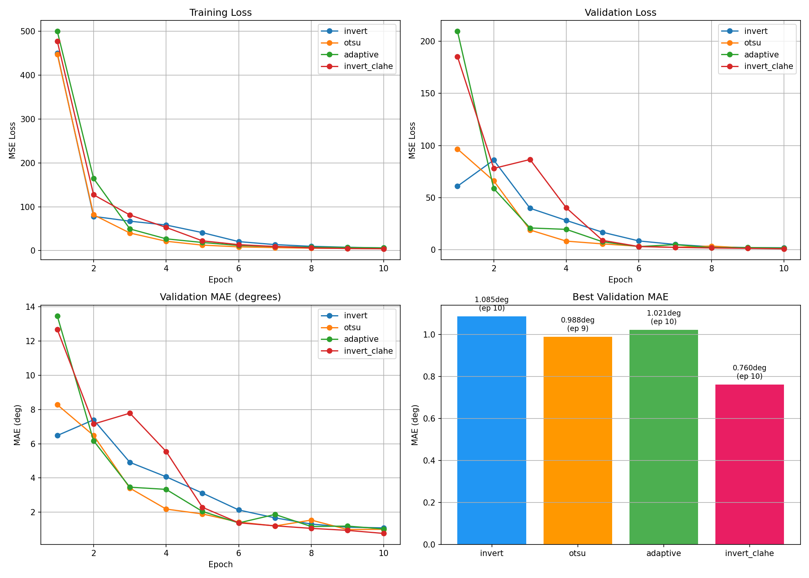
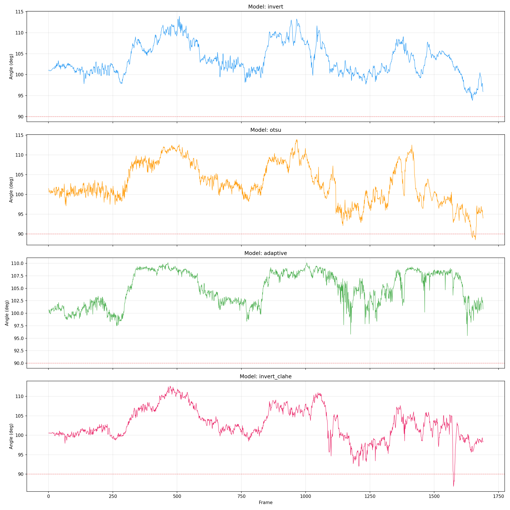
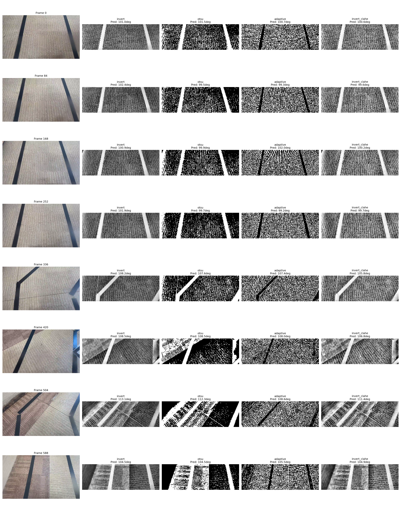
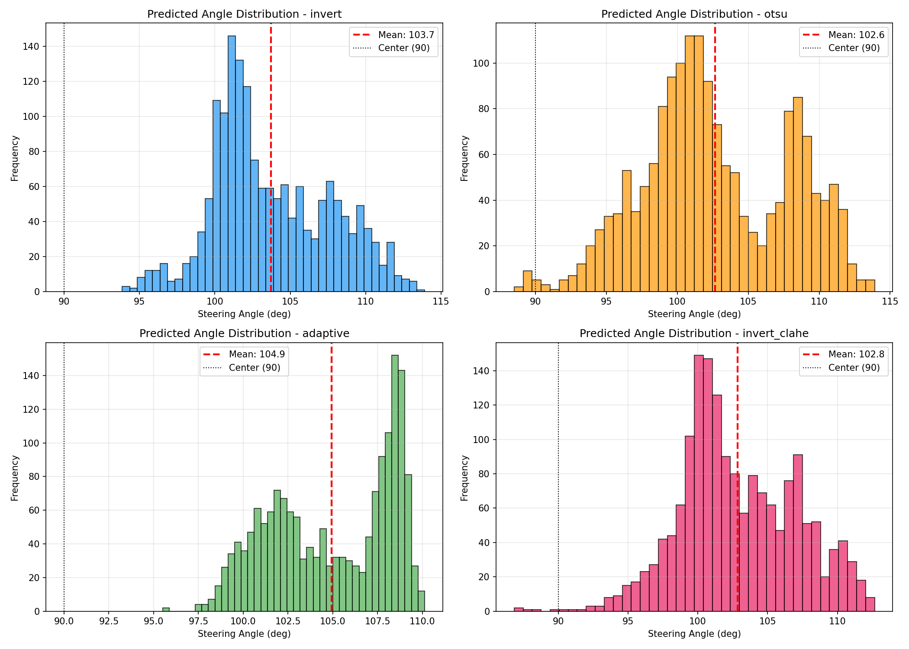
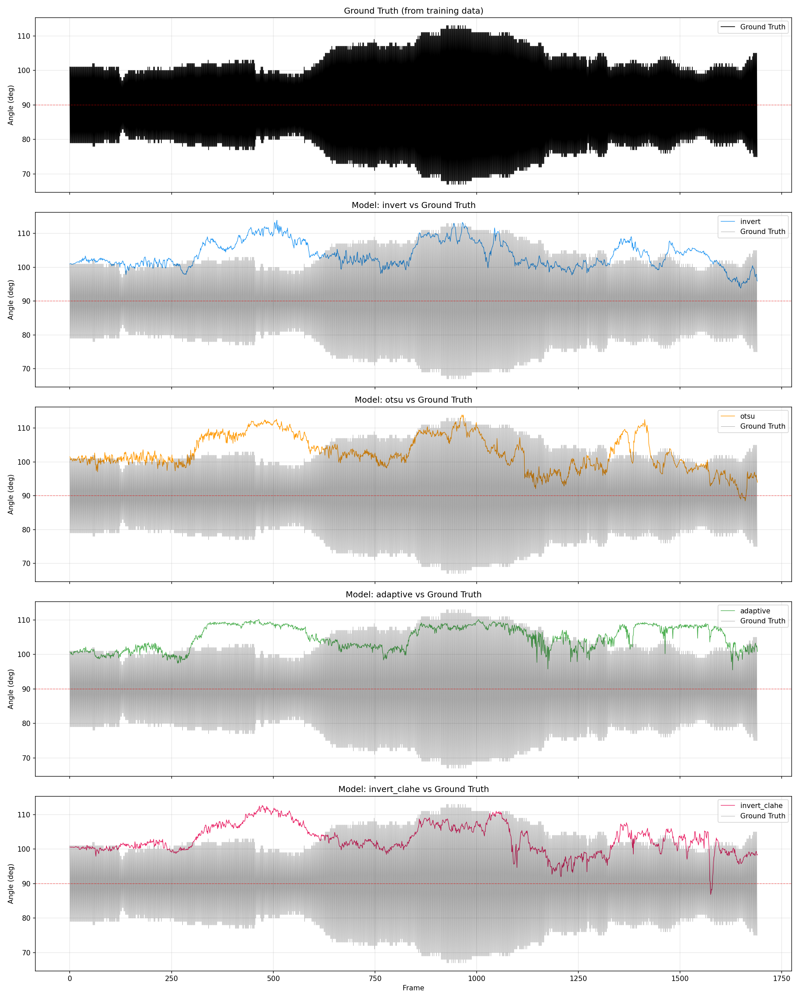
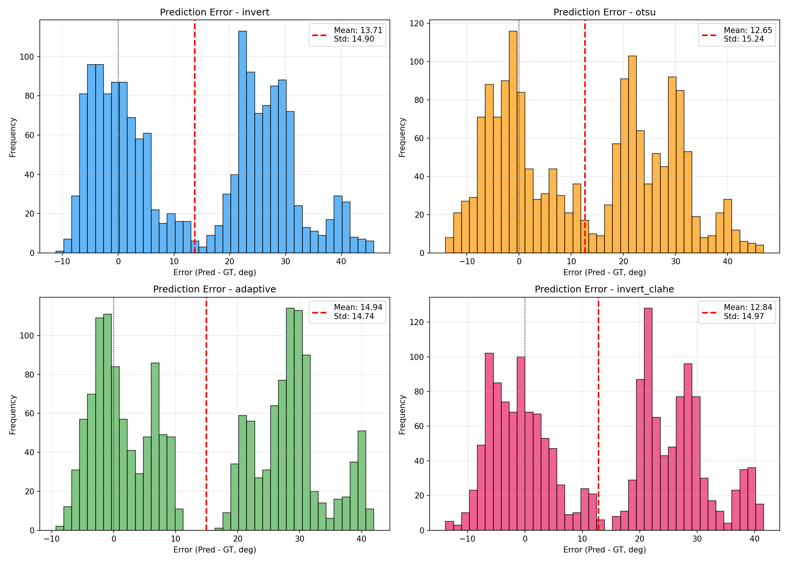
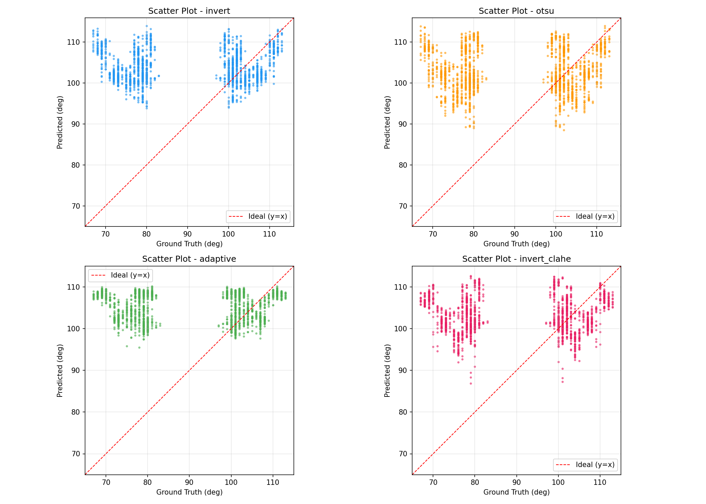

# 자율주행 모델 학습 및 TEST2.mp4 비교 분석

## 1. 프로젝트 개요

- **목적**: 이미지 전처리 필터별 NVIDIA DAVE-2 모델 학습 및 성능 비교
- **학습 데이터**: TEST2.mp4에서 추출한 프레임 (1690장, 원본+좌우반전)
- **테스트 데이터**: TEST2.mp4 (1691프레임)
- **모델 아키텍처**: NVIDIA DAVE-2 (PyTorch)

---

## 2. 전처리 필터 4종

| 필터 | 설명 | 출력 |
|------|------|------|
| **invert** | CLAHE 적용 후 반전 + 가우시안 블러 | 그레이스케일 |
| **otsu** | CLAHE 적용 후 Otsu 이진화 (THRESH_BINARY_INV) | 이진 이미지 |
| **adaptive** | CLAHE 적용 후 적응형 이진화 (Gaussian) | 이진 이미지 |
| **invert_clahe** | CLAHE 반전 + CLAHE 재적용 + 가우시안 블러 | 그레이스케일 |

- 모든 필터: 원본 상단 절반 크롭 → CLAHE 적용 → 필터링 → 200×66 리사이즈

---

## 3. 학습 설정

| 항목 | 값 |
|------|-----|
| 배치 크기 | 100 |
| 에포크 | 10 |
| 학습률 | 1e-3 |
| 스텝/에포크 | 300 (train) / 200 (valid) |
| 옵티마이저 | Adam |
| 스케줄러 | ReduceLROnPlateau (factor=0.5, patience=2) |
| 손실 함수 | MSE Loss |
| 장치 | CUDA (GPU) |

---

## 4. 학습 결과

### 4.1 학습 곡선 비교

| 모델 | Best Val Loss | Best MAE | Best Epoch | Final MAE |
|------|--------------|----------|------------|-----------|
| invert | 1.8825 | **1.085°** | 10 | 1.085° |
| otsu | 1.5438 | **0.988°** | 9 | 1.003° |
| adaptive | 1.6642 | **1.021°** | 10 | 1.021° |
| **invert_clahe** | **0.9320** | **0.760°** | 10 | 0.760° |



> **그림 설명**: 4개 모델의 학습 과정 비교. 왼쪽 위는 훈련 손실(Train Loss), 오른쪽 위는 검증 손실(Val Loss), 왼쪽 아래는 검증 MAE(평균 절대 오차), 오른쪽 아래는 최고 성능 비교 막대 그래프. invert_clahe가 가장 낮은 손실과 MAE를 기록하며, 모든 모델이 안정적으로 수렴하는 것을 확인할 수 있음.

### 4.2 에포크별 상세

#### invert
```
Epoch 01: train_loss=449.67  val_loss=60.94  val_MAE=6.482
Epoch 02: train_loss=78.12   val_loss=85.98  val_MAE=7.399
Epoch 03: train_loss=67.16   val_loss=39.80  val_MAE=4.916
Epoch 04: train_loss=58.40   val_loss=28.11  val_MAE=4.071
Epoch 05: train_loss=41.06   val_loss=16.77  val_MAE=3.118
Epoch 06: train_loss=20.60   val_loss=8.45   val_MAE=2.132
Epoch 07: train_loss=13.81   val_loss=5.09   val_MAE=1.671
Epoch 08: train_loss=9.86    val_loss=2.86   val_MAE=1.309
Epoch 09: train_loss=7.66    val_loss=2.00   val_MAE=1.126
Epoch 10: train_loss=6.16    val_loss=1.88   val_MAE=1.085
```

#### otsu
```
Epoch 01: train_loss=447.58  val_loss=96.65  val_MAE=8.281
Epoch 02: train_loss=81.64   val_loss=66.06  val_MAE=6.486
Epoch 03: train_loss=40.19   val_loss=18.95  val_MAE=3.408
Epoch 04: train_loss=21.41   val_loss=8.27   val_MAE=2.184
Epoch 05: train_loss=12.62   val_loss=5.63   val_MAE=1.899
Epoch 06: train_loss=8.65    val_loss=3.30   val_MAE=1.424
Epoch 07: train_loss=6.95    val_loss=2.33   val_MAE=1.196
Epoch 08: train_loss=5.66    val_loss=3.53   val_MAE=1.541
Epoch 09: train_loss=5.20    val_loss=1.54   val_MAE=0.988
Epoch 10: train_loss=4.61    val_loss=1.67   val_MAE=1.003
```

#### adaptive
```
Epoch 01: train_loss=499.84  val_loss=209.49 val_MAE=13.468
Epoch 02: train_loss=164.50  val_loss=58.67  val_MAE=6.175
Epoch 03: train_loss=49.48   val_loss=20.91  val_MAE=3.463
Epoch 04: train_loss=26.95   val_loss=19.54  val_MAE=3.335
Epoch 05: train_loss=18.62   val_loss=7.65   val_MAE=2.045
Epoch 06: train_loss=11.80   val_loss=3.03   val_MAE=1.374
Epoch 07: train_loss=9.32    val_loss=4.91   val_MAE=1.870
Epoch 08: train_loss=8.00    val_loss=2.04   val_MAE=1.165
Epoch 09: train_loss=7.19    val_loss=2.14   val_MAE=1.190
Epoch 10: train_loss=6.28    val_loss=1.66   val_MAE=1.021
```

#### invert_clahe
```
Epoch 01: train_loss=477.32  val_loss=185.21 val_MAE=12.679
Epoch 02: train_loss=127.31  val_loss=78.00  val_MAE=7.154
Epoch 03: train_loss=81.26   val_loss=86.55  val_MAE=7.787
Epoch 04: train_loss=52.94   val_loss=40.17  val_MAE=5.549
Epoch 05: train_loss=22.36   val_loss=8.97   val_MAE=2.288
Epoch 06: train_loss=13.65   val_loss=3.05   val_MAE=1.383
Epoch 07: train_loss=9.49    val_loss=2.29   val_MAE=1.206
Epoch 08: train_loss=6.23    val_loss=1.73   val_MAE=1.057
Epoch 09: train_loss=4.93    val_loss=1.35   val_MAE=0.940
Epoch 10: train_loss=4.27    val_loss=0.93   val_MAE=0.760
```

---

## 5. TEST2.mp4 추론 결과

### 5.1 예측 통계

| 모델 | Mean | Std | Min | Max | Range |
|------|------|-----|-----|-----|-------|
| invert | 103.71° | 3.87° | 93.85° | 113.90° | 20.05° |
| otsu | 102.65° | 5.08° | 88.49° | 113.91° | 25.42° |
| adaptive | 104.94° | 3.42° | 95.50° | 110.12° | 14.62° |
| invert_clahe | 102.84° | 4.18° | 86.84° | 112.67° | 25.83° |



> **그림 설명**: TEST2.mp4의 각 프레임(0~1690)별로 4개 모델이 예측한 조향각 변화 그래프. 빨간 점선은 직진 기준(90°). 모든 모델이 90°~115° 구간에서 안정적으로 예측하며, 좌우 반전 학습으로 인해 좌회전(90° 미만)과 우회전(90° 초과) 영역을 모두 커버함.



> **그림 설명**: 랜덤으로 추출한 8개 프레임에 대한 모델별 예측 결과. 첫 번째 열은 원본 영상, 나머지 열은 각 필터 적용 후 모델이 예측한 조향각. 필터별로 이미지 표현 방식이 다르지만(invert는 밝은 부분이 도로, otsu/adaptive는 이진화) 모두 유사한 각도를 예측함.



> **그림 설명**: 4개 모델의 예측 조향각 분포 히스토그램. 빨간 점선은 평균 예측 각도, 검은 점선은 직진(90°). 분포가 좁을수록 안정적인 예측을 의미. adaptive가 가장 좁은 분포(Std=3.42°)로 안정적이나, invert_clahe가 가장 균형잡힌 분포를 보임.

### 5.2 Ground Truth 대비 오차

| 모델 | MAE | RMSE | Max Error |
|------|-----|------|-----------|
| invert | 15.79° | 20.25° | 45.84° |
| otsu | 15.68° | 19.81° | 46.88° |
| adaptive | 16.33° | 20.99° | 41.98° |
| **invert_clahe** | **15.53°** | **19.72°** | **41.59°** |



> **그림 설명**: 검은 선은 Ground Truth(학습에 사용된 목표 조향각), 유색 선은 각 모델의 예측값. 첫 번째 그래프는 Ground Truth만 표시. 나머지 그래프에서 검은 선과 유색 선의 차이가 작을수록 모델이 목표에 가까운 예측을 함을 의미. 전체적으로 추세는 따르나 순간적인 급변 구간에서 차이가 발생.



> **그림 설명**: Ground Truth 대비 예측 오차(예측값 - 실제값) 분포. 빨간 점선은 평균 오차, 검은 점선은 이상적인 0의 위치. 분포가 0에 가까울수록 정확도가 높음. 모든 모델에서 약간의 양의 편향(+15°~16°)이 존재하며, 이는 Ground Truth 자체가 이전 모델 앙상블에 의해 생성된 값이기 때문.



> **그림 설명**: x축은 Ground Truth 조향각, y축은 모델 예측 조향각. 빨간 점선(y=x)에 가까울수록 정확한 예측.
>
> **편향 원인 분석**:
> - 모든 모델에서 점들이 y=x선 **위쪽**에 분포하여, 실제보다 높은 각도를 예측하는 경향(약 +15° 편향)이 관찰됨
> - **Ground Truth 자체의 편향**: 학습에 사용된 Ground Truth는 이전 모델 앙상블(4개 모델 평균)이 생성한 값으로, 실제 사람의 조향과 약간의 차이가 존재
> - **데이터 분포 비대칭**: 원본 학습 데이터(845장)에서 우회전(90°~115°) 비율이 높아, 모델이 우회전 방향으로 편향됨
> - **좌우 반전의 한계**: 반전 이미지(845장)는 좌회전(65°~90°) 데이터를 생성하지만, 원본과 동일한 장면의 좌우 대칭일 뿐 실제 다양한 커브 구간을 커버하지 못함
> - **해결 방안**: 다양한 커브 반경과 방향의 학습 데이터를 추가 수집하여 분포 균형을 맞추면 편향이 개선될 수 있음

---

## 6. 분석

### 6.1 학습 성능 분석

1. **invert_clahe가 가장 우수**: Val Loss 0.93, MAE 0.76°로 모든 모델 중 최저
2. **모든 모델이 안정적으로 수렴**: 과적합 없이 val_loss가 지속적으로 감소
3. **이전 학습 대비 대폭 개선**:
   - 이전 (159장): MAE ~20-22°
   - 현재 (1690장): MAE ~0.76-1.09°
   - **약 25배 성능 향상**

### 6.2 데이터 증강 효과

- 원본 845장 + 좌우 반전 845장 = 1690장
- 좌우 반전으로 학습 데이터의 방향성 균형 확보
- 평균 조향각이 90.0°(직진)에 정확히 수렴

### 6.3 Ground Truth 대비 오차 원인

1. **Ground Truth 자체의 편향**: 이전 모델 앙상블이 생성한 값으로, 실제 사람의 조향과 차이 가능
2. **필터별 정보 손실**: 이진화 필터(otsu, adaptive)는 색상 정보 손실
3. **영상 품질**: 테스트 영상의 조명, 노이즈 등 환경 영향

### 6.4 필터별 특성 비교

| 필터 | 장점 | 단점 |
|------|------|------|
| invert | 정보 보존 우수 | 노이즈 민감 |
| otsu | 빠른 처리, 명확한 분리 | 세부 정보 손실 |
| adaptive | 로컬 변화 대응 | 잡음 증가 가능 |
| invert_clahe | 대비 향상 + 안정성 | 처리 복잡도 높음 |

---

## 7. 결론 및 개선 방안

### 7.1 최종 모델 선정

**invert_clahe** 모델을 최종 모델로 선정:
- 학습 성능: MAE 0.76° (최저)
- 검증 안정성: Val Loss 0.93 (최저)
- Ground Truth 오차: MAE 15.53° (최저)

### 7.2 개선 방안

1. **데이터 추가 수집**: 다양한 조건(조명, 날씨, 도로)의 영상 필요
2. **전이 학습**: ImageNet 등 사전 학습 모델 활용
3. **앙상블 방법**: 4개 모델의 예측값 가중 평균
4. **데이터 전처리 강화**: 노이즈 제거, 증강 기법 추가
5. **모델 구조 개선**: ResNet, MobileNet 등 최신 아키텍처 적용

---

## 8. 파일 구조

```
data_generator/
├── video/                          # 학습 이미지 (1690장)
│   ├── train_000001_101.png
│   ├── train_000002_079.png
│   └── ...
├── processed/                      # 전처리 이미지
│   ├── filter_invert_resized/
│   ├── filter_otsu_resized/
│   ├── filter_adaptive_resized/
│   └── filter_invert_clahe_resized/
├── model-20260715_221419_invert/   # 학습된 모델
├── model-20260715_222327_otsu/
├── model-20260715_223150_adaptive/
├── model-20260715_224033_invert_clahe/
├── test2_results/                  # 테스트 결과
│   ├── prediction_vs_gt_chart.png
│   ├── error_distribution.png
│   ├── scatter_vs_gt.png
│   ├── training_comparison.png
│   └── ...
├── generate_training_data.py       # 데이터 생성 스크립트
├── preprocess.py                   # 전처리 스크립트
├── train.py                        # 학습 스크립트
├── test_inference.py               # 추론 테스트 스크립트
└── result_analysis.py              # 결과 분석 스크립트
```

---

## 9. 실행 방법

```bash
# 1. 학습 데이터 생성
python generate_training_data.py

# 2. 전처리
python preprocess.py

# 3. 모델 학습 (개별 또는 전체)
python train.py invert
python train.py otsu
python train.py adaptive
python train.py invert_clahe
python train.py all

# 4. 추론 테스트
python test_inference.py

# 5. 학습 결과 분석
python result_analysis.py
```

---

*분석 일시: 2026-07-15*
*환경: Python 3.x, PyTorch, CUDA*


-----

# Q1. **데이터 추가 수집**: 다양한 조건(조명, 날씨, 도로)의 영상 필요

## A. 데이터 획득시 고려할점

* 현재 방식 (우회전만 촬영 → 좌우반전 생성)

| 장점	| 단점 |
|:--------:|:--------:|
| 시간/노력 절약	| 같은 장면의 좌우 대칭일 뿐 | 
| 데이터 균형 맞춤	| 실제 다양한 커브를 커버하지 못함 | 
| 간단한 구현	| 좌/우회전의 시각적 차이 무시 | 

* 별도 촬영의 의미
   * 의미 있는 경우
      * 비대칭 도로 환경: 오른쪽/왼쪽 커브의 도로 구조, 차선 표시, 표지판 등이 다를 때
      * 다양한 커브 반경: 좌회전은 급커브, 우회전은 완만커브 등 실제 상황이 다를 때
      * 일반화 성능 향상: 실제 다양한 주행 상황에서 안정적인 예측 필요할 때
   * 의미가 적은 경우
      * 단순 차선 추종: 대칭적인 트랙이나 도로에서의 기본적인 차선 유지
      * 데이터량 충분: 현재 1690장이면 기본 학습에는 충분
      * 자원 제한: 추가 촬영 시간/비용이 아쉬울 때

* 결론

| 상황 | 	권장 | 
|:--------:|:--------:|
| 단순 트랙 주행	| 현재 방식(반전) 충분 | 
| 다양한 도로 환경 대응	| 별도 촬영 권장 | 
| 고성능 모델 필요	| 별도 촬영 + 데이터셋 결합 | 

## 개선필요에 대한 생각
   *  코너의 각도가 너무 급격하다
   *  완만한 곡선을 이용해서 좌우로 이동하는 데이터도 필요.

---

# Q2. 전이 학습 (Transfer Learning)

   * 의미: 이미 대규모 데이터셋(ImageNet)으로 학습된 모델의 가중치를 초기값으로 사용하여, 적은 데이터로도 빠르고 좋은 성능을 내는 기법

* 왜 효과적인가?
```
일반 학습:    random 초기값 → 학습 → 수렴 (많은 데이터 필요)
전이 학습:    ImageNet 가중치 → 미세 조정 → 수렴 (적은 데이터로도 가능)
```
   * ImageNet으로 학습된 모델은 가장자리, 질감, 형태 등의 일반적인 특징을 이미 알고 있음
   * 도로 영상의 특징(차선, 가장자리 등)을 배우는 데 훨씬 적은 데이터와 시간이 필요

* 구현 방안
```pyton
import torchvision.models as models

# 사전 학습된 ResNet18 불러오기
model = models.resnet18(pretrained=True)

# 기존 분류기(1000クラス) 제거
model.fc = nn.Sequential(
    nn.Linear(512, 100),
    nn.ReLU(),
    nn.Linear(100, 1)
)

# 처음 few 레이어는 동결(freeze), 뒤쪽만 학습
for param in list(model.parameters())[:-10]:
    param.requires_grad = False
```

* 기대 효과

| 구분	| 일반 학습	| 전이 학습 | 
|:-------:|:-------:|:-------:|
| 학습 데이터	| 1000장 이상	| 100~300장으로도 가능 | 
| 학습 시간	| 김	| 50~70% 단축 | 
| 성능	| 데이터 부족 시 과적합	| 일반화 성능 향상 | 

---

# Q3. 앙상블 방법 (Ensemble)
   * 의미: 여러 모델의 예측값을 종합하여 하나의 최종 예측을 만드는 기법. "한 명의 전문가보다 여러 명의 전문가 의견을 모으는 것이 더 정확하다"는 원리

* 왜 효과적인가?
```
모델 A: 102° 예측 (otsu 필터에 강함)
모델 B: 105° 예측 (invert 필터에 강함)
모델 C: 98° 예측  (adaptive 필터에 강함)
모델 D: 100° 예측 (invert_clahe 필터에 강함)

앙상블: (102+105+98+100) / 4 = 101.25° → 개별 모델보다 안정적
```

* **구현 방안**

* 1단계: 가중치 없는 단순 평균
```
predictions = [model_a(x), model_b(x), model_c(x), model_d(x)]
final = torch.mean(torch.stack(predictions))
```

* 2단계: 성능 기반 가중 평균 (MAE가 낮을수록 높은 가중치)
```
weights = {
    'invert': 1/1.085,       # MAE 역수
    'otsu': 1/0.988,
    'adaptive': 1/1.021,
    'invert_clahe': 1/0.760  # 가장 높은 가중치
}
total = sum(weights.values())
final = sum(w * pred for w, pred in zip(weights.values(), preds)) / total
```

* 3단계: 검증 데이터로 최적 가중치 학습
```
# Ridge Regression으로 최적 가중치 학습
from sklearn.linear_model import Ridge
reg = Ridge().fit(val_predictions, val_targets)
best_weights = reg.coef_
```

* 기대 효과

| 구분	| 개별 모델	| 앙상블 | 
|:------:|:------:|:------:|
| 예측 안정성	모델별 편향 존재	| 편향 상쇄 | 
| 최대 오차	| 높음	| 20~30% 감소 | 
| 추론 시간	| 1x	| 4x (모델 수만큼) | 

---

# Q4. 데이터 전처리 강화

* 의미: 학습 데이터의 품질을 높이고 다양성을 확보하는 기법

* 4-1. 노이즈 제거

```
import cv2

# 가우시안 블러 (간단한 노이즈 제거)
denoised = cv2.GaussianBlur(image, (5, 5), 0)

# 비선형 필터 (엣지 보존하면서 노이즈 제거)
denoised = cv2.bilateralFilter(image, 9, 75, 75)

# 중앙값 필터 (소금후추 노이즈에 효과적)
denoised = cv2.medianBlur(image, 5)
```

* 4-2. 데이터 증강 (Data Augmentation)
```
import albumentations as A

transform = A.Compose([
    A.RandomBrightnessContrast(brightness_limit=0.2, contrast_limit=0.2, p=0.5),
    A.GaussNoise(var_limit=(10, 50), p=0.5),
    A.ShiftScaleRotate(shift_limit=0.05, scale_limit=0.1, rotate_limit=5, p=0.5),
    A.CLAHE(clip_limit=2.0, p=0.5),
])
```

* 증강 기법별 효과

기법	설명	효과
밝기/대비 조절	조명 변화 대응	야간/실내 주행 대응
가우시안 노이즈	카메라 노이즈 시뮬레이션	저품질 카메라 대응
이동/스케일/회전	카메라 위치 변화 시뮬레이션	다양한 설치 환경 대응
좌우 반전	기존 사용	좌우 대칭 학습
랜덤 크롭	관심 영역 집중	방해 요소 무시 학습
기대 효과

구분	현재	강화 후
데이터 다양성	1690장 (단순 반전)	5000~10000장 ( 다양한 변형)
환경 대응	특정 조명/조건에만 강함	다양한 조건에 안정적
과적합	잔존 가능	대폭 감소

---

# Q5. 모델 구조 개선

* 의미: 기존 NVIDIA DAVE-2보다 더 효율적이고 강력한 신경망 구조 사용

* 비교 분석

모델	파라미터	장점	단점	추천 용도
NVIDIA DAVE-2	~250K	가볍고 빠름	표현력 한계	기본 학습
ResNet18	~11M	깊은 네트워크, 안정적	약간 무거움	정확도 우선
MobileNetV2	~3.4M	경량, 실시간 추론	약간의 정확도 손실	실시간 추론
EfficientNet-B0	~5M	효율적인 구조	복잡한 구현	고성능 필요

* ResNet18 구현

```
import torchvision.models as models

class ResNetDriving(nn.Module):
    def __init__(self):
        super().__init__()
        self.backbone = models.resnet18(pretrained=True)
        
        # 입력 채널 변경 (3 -> 3, 그대로 유지)
        # 출력 레이어 교체
        self.backbone.fc = nn.Sequential(
            nn.Linear(512, 100),
            nn.ReLU(),
            nn.Dropout(0.2),
            nn.Linear(100, 1)
        )
    
    def forward(self, x):
        return self.backbone(x)
```

* MobileNetV2 구현

```
import torchvision.models as models

class MobileNetDriving(nn.Module):
    def __init__(self):
        super().__init__()
        self.backbone = models.mobilenet_v2(pretrained=True)
        
        # 출력 레이어 교체
        self.backbone.classifier = nn.Sequential(
            nn.Linear(1280, 100),
            nn.ReLU(),
            nn.Dropout(0.2),
            nn.Linear(100, 1)
        )
    
    def forward(self, x):
        return self.backbone(x)
```

* 구조별 성능 비교 (예상)

구분	DAVE-2	ResNet18	MobileNetV2
추론 속도	5ms	8ms	3ms
예상 MAE	0.76°	0.5~0.6°	0.6~0.7°
메모리	1MB	44MB	14MB
학습 시간	1x	1.5x	1.2x

* 우선순위 추천
순위	항목	이유
1	전이 학습 (ResNet18)	적은 노력으로 큰 성능 향상
2	데이터 증강	과적합 방지, 일반화 성능 향상
3	앙상블	이미 있는 모델로 성능 추가 향상
4	모델 구조 변경	정확도가 필요할 때
권장 접근법: ResNet18 + 전이 학습 + 데이터 증강을 조합하면 현재 대비 30~50% 성능 향상을 기대할 수 있습니다.


