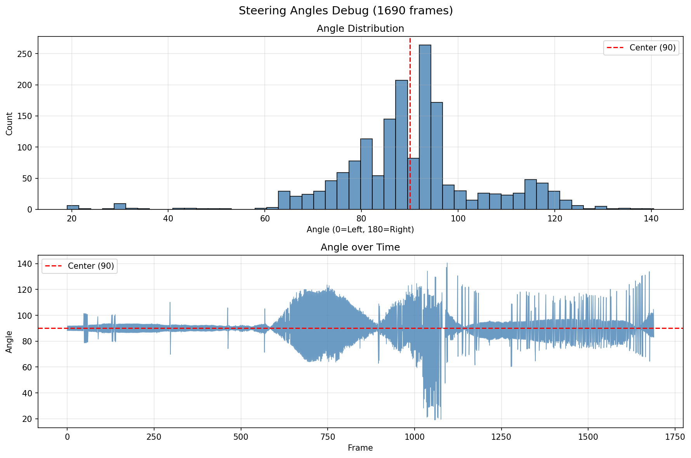
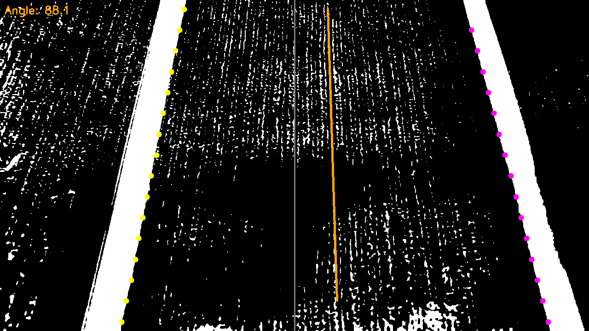
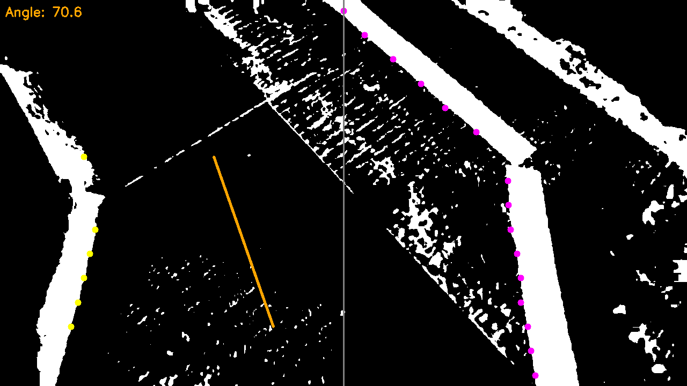
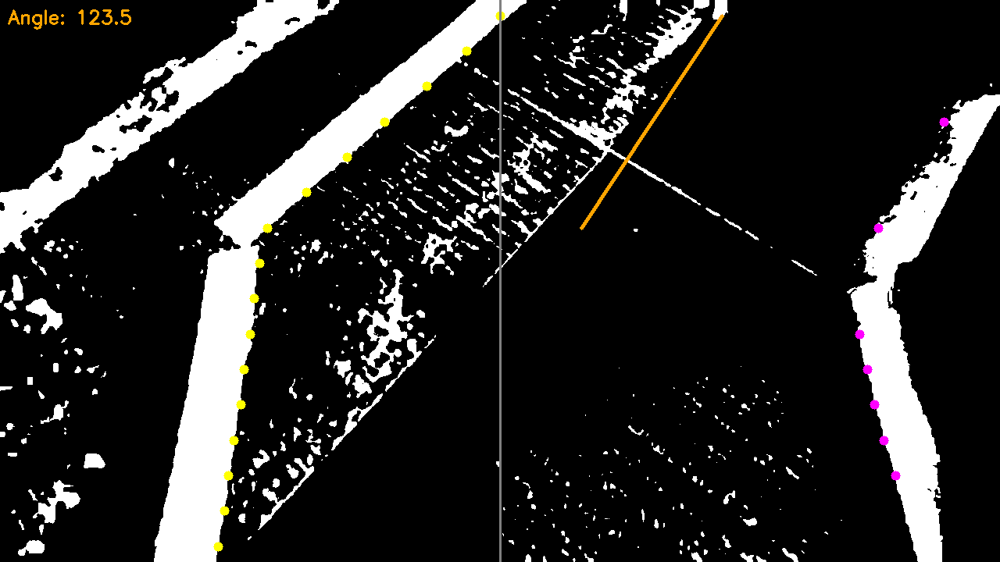
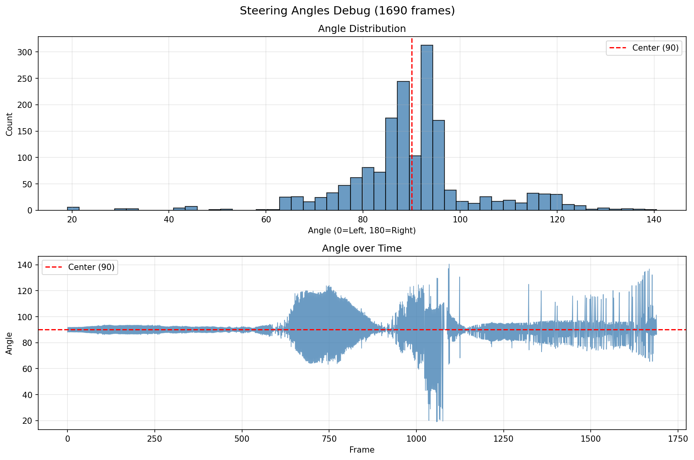

# 자율주행 차선 검출 개선 작업 로그

## 작업 개요

- **소스 비디오**: `TEST2.mp4` (1691프레임, 24fps, 1280x720)
- **작업 디렉토리**: `C:\Users\user\Desktop\self-driving`
- **목적**: 검정 테이프로 된 차선을 검출하고 조향각을 계산하여 학습 데이터 생성

---

## 1단계: 모델 의존성 제거

### 문제
`generate_training_data.py`가 사전 훈련된 모델을 필요로 해서 실행 불가

### 해결
- 모델 로딩 코드 제거
- 프레임 추출 기능만 남김
- 헤uristic 각도 추정 방식으로 전환

---

## 2단계: CLAHE + 블러 전처리 파이프라인 구현

### 문제
이미지가 뭉개져서 차선 검출 실패

### 해결
```python
def preprocess(frame):
    cropped = frame[int(frame.shape[0] * 0.5):, :, :]  # 하단 50% 크롭
    gray = cv2.cvtColor(cropped, cv2.COLOR_BGR2GRAY)
    blur = cv2.GaussianBlur(gray, (3, 3), 0)
    clahe = cv2.createCLAHE(clipLimit=3.0, tileGridSize=(8, 8))
    enhanced = clahe.apply(blur)
    dark_thresh = int(np.percentile(enhanced, 15))
    _, thresh = cv2.threshold(enhanced, dark_thresh, 255, cv2.THRESH_BINARY_INV)
    return cropped, gray, blur, enhanced, thresh, dark_thresh
```

### 파이프라인 순서
1. **그레이스케일 변환**: BGR → Gray
2. **가우시안 블러**: 노이즈 제거 (3x3 커널)
3. **CLAHE**: 적응형 히스토그램 균형화 (clipLimit=3.0, tileGridSize=8x8)
4. **적응형 임계값**: 이미지 내용에 따라 자동 계산 (하위 15% percentile)

---

## 3단계: 어노테이션 도구 구현

### 파일
- `annotate.py`: 2포인트 클릭 방식 어노테이션 도구
- `annotations.json`: 어노테이션 저장 파일

### 기능
- L1/L2 (왼쪽 테이프 내측/외측), R1/R2 (오른쪽 테이프 내측/외측) 라벨링
- 각 이미지당 4개 포인트 클릭 (왼쪽 위/아래, 오른쪽 위/아래)
- JSON 형식으로 저장

### 수정 이력
1. **temp_lines 재초기화 버그 수정**: 루프 안에서 `temp_lines`가 매번 초기화되어 저장 실패 → 루프 밖으로 이동
2. **전역 변수 사용**: 클래스 대신 글로벌 변수로 단순화
3. **색상 업데이트**: 
   - L1/L2: 시안색 (Cyan)
   - R1/R2: 자홍색 (Magenta)
   - 중앙선: 주황색 (Orange)
4. **시각적 개선**: 검출 도트 크기 확대 (반지름 6), 선 두께 확대 (두께 3)

---

## 4단계: 검출 알고리즘 개선

### 원래 방식
- 향상된 그레이스케일 이미지에서 `< dark_thresh` 조건으로 검출

### 개선 방식
- **임계값 이미지 사용**: `thresh > 0` 조건으로 전환
- 이진화된 이미지에서 검출하여 배경과 테이프 분리가 더 깨끗함

### 검출 로직
```python
# 왼쪽 검출 (중앙에서 왼쪽으로 스캔)
for x in range(mid_x, -1, -1):
    if row[x] > 0:  # 임계값 이미지에서 흰색
        # 연속된 흰색 픽셀 구간 찾기
        if run_len >= min_tape_width:
            lx = run_end
            break

# 오른쪽 검출 (중앙에서 오른쪽으로 스캔)
for x in range(mid_x, crop_w):
    if row[x] > 0:
        if run_len >= min_tape_width:
            rx = run_start
            break
```

---

## 5단계: 버그 수정

### 문제 1: break문 위치 오류
- **증상**: 첫 번째 노이즈 픽셀에서 스캔 중단
- **원인**: `break`문이 `if run_len >= min_tape_width` 조건 밖에 위치
- **수정**: `break`를 조건문 안으로 이동

### 문제 2: min_tape_width 부적절
- **증상**: 노이즈가 테이프로误검
- **데이터 분석**:
  - 실제 테이프 폭: 54~86px
  - 노이즈 폭: 1~31px
- **수정**: `min_tape_width`를 30 → 50으로 변경

---

## 6단계: 전체 이미지 검토

### 문제
크롭(하단 50%) 사용 시 곡선 구간이 많이 보이지 않음

### 해결
- 크롭 제거: `frame.copy()` 사용하여 전체 이미지(1280x720) 처리
- 스캔 영역 확대: 16개 스캔 라인 (y=20 ~ y=340)

### 결과 비교
| 구분 | 크롭 (50%) | 전체 이미지 |
|------|-----------|------------|
| 정상 (45-135°) | 1,488장 (88%) | 1,664장 (98.5%) |
| 엣지 (<45 또는 >135°) | 202장 (12%) | 26장 (1.5%) |

---

## 주요 설정값

```python
# 현재 설정
crop_w = 1280          # 이미지 너비
crop_h = 720           # 이미지 높이 (전체)
mid_x = 640            # 중앙 x 좌표
min_tape_width = 50    # 최소 테이프 폭 (px)
dark_thresh = 15%      # 임계값 percentile
scan_ys = 16개         # 스캔 라인 수
CLAHE clipLimit = 3.0
CLAHE tileGridSize = (8, 8)
```

---

## 조향각 계산 공식

```python
# 중앙선 기준 조향각 계산
dx = bot_cx - top_cx  # 중앙선의 x 변화량
dy = bot_y - top_y    # 중앙선의 y 변화량
steer = 90 - np.degrees(np.arctan2(dx, dy))
steer = np.clip(steer, 0, 180)
```

- **0°**: 왼쪽 끝
- **90°**: 중앙 (수직)
- **180°**: 오른쪽 끝

---

## 출력 파일 구조

```
video/
├── train_XXXXXX_000.png    # 원본 프레임
├── train_XXXXXX_180.png    # 좌우 반전 증강
├── steering_angles.png     # 조향각 히스토그램
└── _debug_output/          # 디버그 결과 이미지
    ├── train_000001_000.png
    ├── train_000001_180.png
    └── ...
```

---

## 잔존 문제 및 향후 개선 과제

### 1. 직선 구간 오인식 (미세)
- **증상**: 일부 직선 구간에서 중앙선 계산이 불안정
- **가능한 원인**:
  - 도로 바닥의 그림자, 노면 표시 등 노이즈 간섭
  - CLAHE 적용 후 일부 픽셀 강도 역전 현상
  - 테이프 마모 또는 이물질로 인한 불균일 반사
- **개선 방안**:
  - 다중 프레임 평균화 (Temporal Smoothing)
  - 이상치 필터링 (이전 프레임과 급격히 다른 값 제거)
  - ROI (관심 영역) 제한으로 도로 상단 노이즈 차단

### 2. 곡선/급커브 구간 검출 미흡
- **증상**: 꺾어진 각도에서 차선 검출 실패 또는 부정확한 조향각
- **현재 한계**:
  - 중앙선을 직선으로 가정하고 상하 좌표 2개만 사용
  - 곡선 구간에서 중앙선이 실제 곡률을 반영하지 못함
  - 급커브 시 한쪽 라인이 화면 밖으로 나가면서 검출 실패
- **개선 방안**:
  - 다중 포인트 중앙선 추출 (최소 4~6개 y좌표에서 x 좌표 수집)
  - 곡선 피팅 (2차 함수 또는 스플라인 적용)
  - 곡률 기반 조향각 계산 (중앙선의 2차 미분 사용)
  - 곡선 구간 전용 ROI 확장 (화면 가장자리까지 스캔 범위 확대)

### 3. 검출 파이프라인 고도화 방향
| 현재 | 개선 목표 |
|------|----------|
| 단일 임계값 이진화 | 적응형 이진화 (Adaptive Threshold) |
| 16개 고정 스캔 라인 | 동적 스캔 라인 배치 |
| 프레임 독립 처리 | 시퀀스 기반 처리 (이전 결과 활용) |
| 직선 중앙선 가정 | 곡선 중앙선 피팅 |

---

## 다음 단계

1. `generate_training_data.py`도 전체 이미지로 수정
2. 학습 데이터 생성 실행
3. `preprocess.py` → `train.py` → `test_inference.py` → `result_analysis.py` 순서로 진행

---

## 참고 파일

| 파일 | 설명 |
|------|------|
| `generate_training_data.py` | 학습 데이터 생성 스크립트 |
| `debug_lane.py` | 시각적 디버깅 도구 |
| `annotate.py` | 수동 어노테이션 도구 |
| `annotations.json` | 어노테이션 데이터 (5장 라벨링 완료) |
| `TEST2.mp4` | 소스 비디오 |


---











---

# V2

[](debug_lane_v2.py)




