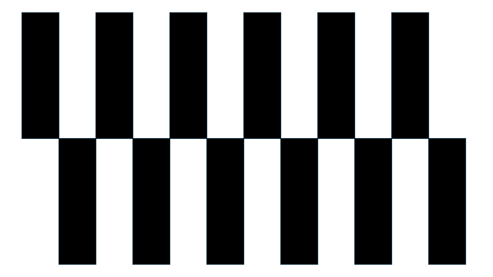
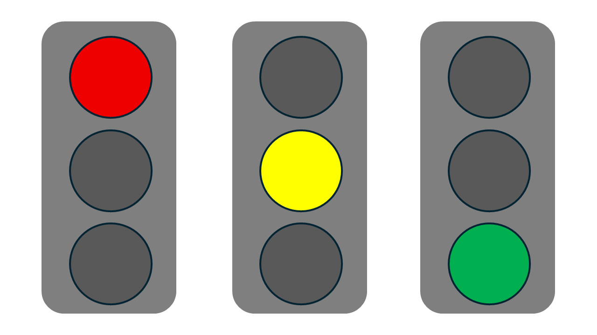
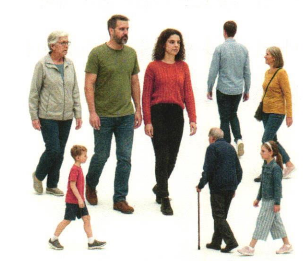

# 9-2 신호등, 보행자, 횡단보도 학습하여 사용자 모델만들기

* 자율주행 환경에 특화된 사용자 정의 객체 인식 모델(Custom Model)을 제작합니다.
* 신호등, 보항자, 횡단보도 등 교통 관련 객체를 중심으로 데이터를 수집하고 라벨링 한 후, <br>
  YOLOv8을 이용해 직접 학습을 진행합니다.
* 이를 통해 학습자는 데이터셋 준비, 학습 파아미터 설정, 모델 평가 등의 과정을 체계적으로 경함하고, <br>
  자신만의 인공지능 모델으 완성할 수 있습니다.

## 라즈베리파이에서 버튼을 눌러 사진 찍어 저장하기

* 라즈베리파이 카메라로 실시간 영상을 표시하고,
* 사용자가 's'키를 누르면 이미지를 저장. 'q'키를 누르면 종료하는 프로그램을 작서합니다.

* 9_2_1.py

```python
import os
from datetime import datetime
import cv2
import mycamera

SAVE_DIR = os.path.join(os.path.dirname(__file__), "pictures")
os.makedirs(SAVE_DIR, exist_ok=True)

if __name__ == "__main__":
    camera = mycamera.MyPiCamera(640, 480)
    while camera.isOpened():
        ok, image = camera.read()
        if not ok:
            break
        image = cv2.flip(image, -1)
        cv2.imshow("mycamera", image)

        key = cv2.waitKey(1) & 0xFF
        if key == ord('s'):
            filename = datetime.now().strftime("%Y%m%d_%H%M%S_%f") + ".png"
            path = os.path.join(SAVE_DIR, filename)
            cv2.imwrite(path, image)
            print(f'saved: {path}')
        elif key == ord('q'):
            break

    cv2.destroyAllWindows()
```

```python
import os
from datetime import datetime
import cv2
#import mycamera

SAVE_DIR = os.path.join(os.path.dirname(__file__), "pictures")
os.makedirs(SAVE_DIR, exist_ok=True)

if __name__ == "__main__":
    #camera = mycamera.MyPiCamera(640, 480)
    camera = cv2.VideoCapture(0)
    camera.set(cv2.CAP_PROP_FRAME_WIDTH, 640)
    camera.set(cv2.CAP_PROP_FRAME_HEIGHT, 480)    
    while camera.isOpened():
        ok, image = camera.read()
        if not ok:
            break
        #image = cv2.flip(image, -1)
        cv2.imshow("mycamera", image)

        key = cv2.waitKey(1) & 0xFF
        if key == ord('s'):
            filename = datetime.now().strftime("%Y%m%d_%H%M%S_%f") + ".png"
            path = os.path.join(SAVE_DIR, filename)
            cv2.imwrite(path, image)
            print(f'saved: {path}')
        elif key == ord('q'):
            break

    cv2.destroyAllWindows()
```

## 압축하기

* 9_2_2.py

```python
import os
import zipfile

def zip_pictures_folder():
    base_dir = os.path.dirname(__file__)
    pictures_dir = os.path.join(base_dir, "pictures")
    zip_path = os.path.join(base_dir, "pictures.zip")

    if not os.path.exists(pictures_dir):
        print("pictures folder not found.")
        return

    with zipfile.ZipFile(zip_path, 'w', zipfile.ZIP_DEFLATED) as zipf:
        for root, dirs, files in os.walk(pictures_dir):
            for file in files:
                file_path = os.path.join(root, file)
                arcname = os.path.relpath(file_path, pictures_dir)
                zipf.write(file_path, arcname)

    print(f"zip created: {zip_path}")

if __name__ == "__main__":
    zip_pictures_folder()

```

## 데이터 라벨링 : Page 331 ~ 

* 저장된 사진에서 객체를 라벨링 합니다. 라벨링 작업은 객체의 정잡을 부여하는 과정으로 사람이 수작업으로 진행합니다.
* https://github.com/HumanSignal/labelImg
* https://github.com/HumanSignal/labelImg/releases
* https://github.com/HumanSignal/labelImg/archive/refs/tags/v1.8.1.zip

* predefined_classes.tx

```
person
crosswalk
traffic_lights_red
traffic_lights_yellow
traffic-lights-greenl
```


## 로컬 학습 방법

```
from ultralytics import YOLO

# 1. 사전 학습된 모델 로드
model = YOLO('yolov8n.pt')

# 2. 나만의 데이터셋으로 학습
model.train(data='my_dataset.yaml', epochs=50, imgsz=640)
```

* 데이터셋 준비

```
my_dataset.yaml:

path: /path/to/dataset
train: images/train
val: images/val
names:
  0: car
  1: person
  2: lane
```

```
디렉토리 구조:

dataset/
├── images/
│   ├── train/
│   └── val/
├── labels/
│   ├── train/
│   └── val/
└── my_dataset.yaml
```

* 라벨링 도구 (무료)
   * LabelImg	간편, 바운딩박스
   * CVAT	고급, 다양한 어노테이션
   * Roboflow	웹에서 라벨링 + 학습

* 추천 순서
   * 이미지 수집 (200장 이상)
   * LabelImg으로 라벨링
   * 로컬에서 model.train() 실행


## 최종목표

  * ai_car_model.pt 모델 만들기









