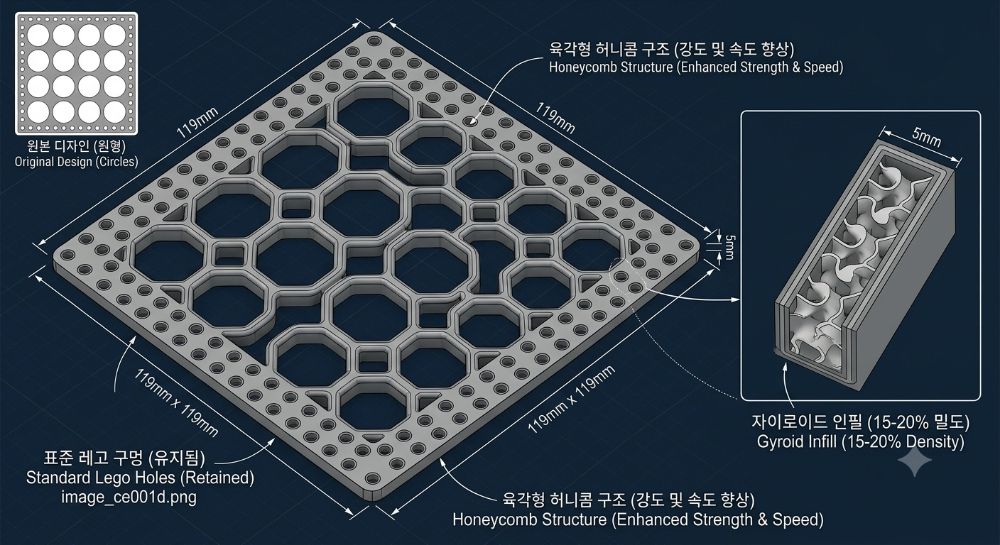

# 3D Printing Design Optimization Report   : Lego-Compatible Component

## Overview
This report outlines design and production strategies for an 119mm x 119mm x 5mm Lego-compatible component. The goal is to maximize structural integrity and printing speed while maintaining compatibility with standard Lego dimensions.

## 1. Structural Design Strategy
To optimize performance, the design shifts from circular cutouts to a reinforced honeycomb pattern.

### Geometry Optimization
*   **Honeycomb Pattern (Internal):** Replacing circular voids with a hexagonal (honeycomb) pattern reduces the printer head's deceleration at curves. This results in faster, more efficient toolpaths.
*   **Uniform Wall Thickness:** The honeycomb design provides consistent rib thickness, eliminating stress concentration points inherent in circular cutouts.
*   **Fillet Application:** Adding 1-2mm fillets to structural intersections enhances durability and reduces crack propagation.

## 2. Comparative Analysis

| Metric | Original Design (Circular) | Optimized Design (Honeycomb) | Reasoning |
| :--- | :--- | :--- | :--- |
| **Print Time** | Base (100%) | ~15-20% Reduction | Reduced deceleration at corners due to linear paths. |
| **Structural Strength** | Moderate | ~20-30% Increase | Uniform stress distribution; efficient rib loading. |
| **Filament Usage** | Base (100%) | ~5-10% Savings | Optimized infill density compensates for wall reinforcement. |
| **Infill Pattern** | Standard Grid | Gyroid (15-20%) | Superior omnidirectional resistance to stress. |

## 3. Slicer Settings for Implementation
To ensure the 5mm thickness delivers maximum strength:

*   **Perimeters/Walls:** Set to 3-4 shells (approximately 1.2mm - 1.6mm). This contributes more to overall rigidity than internal infill density.
*   **Infill Strategy:** Use the **Gyroid** pattern. It offers excellent structural integrity in all axes (X, Y, Z) and is resistant to warping.
*   **Top/Bottom Layers:** 4-5 layers are recommended to ensure surface finish and prevent layer shifting or buckling.
*   **Printing Orientation:** Print flat on the build plate to ensure hole dimensional accuracy.

## 4. Conclusion
Transitioning to a geometric honeycomb layout combined with Gyroid infill settings provides the optimal balance of speed, material efficiency, and structural robustness for Lego-compatible structural plates.
