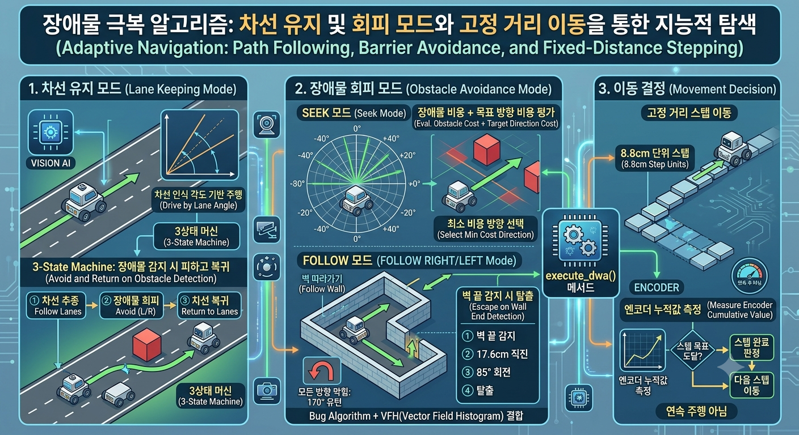
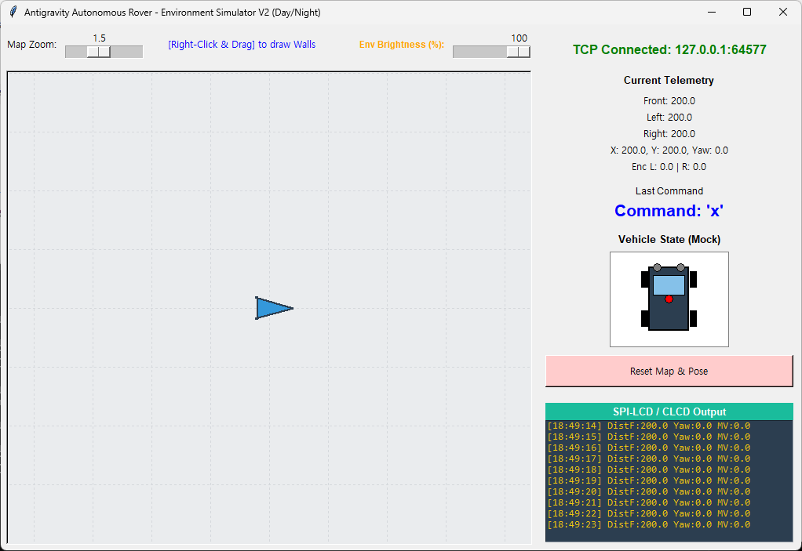
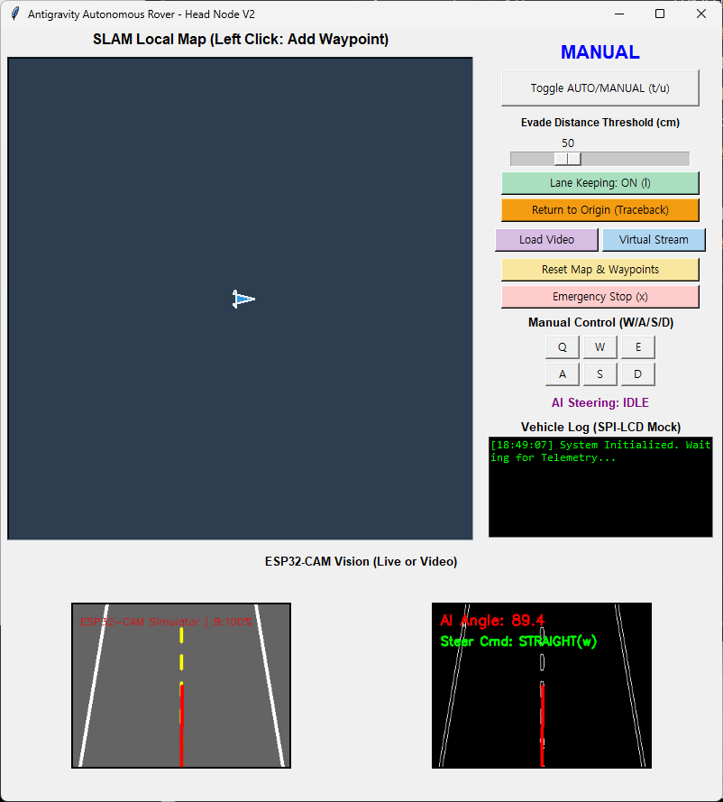

# Autonomous Rover 알고리즘 분석




## 1. 시스템 개요

> 이 프로그램은 자율 주행 로버(Autonomous Rover)로, 시뮬레이터(`simulator_v2.py`)와 헤드 노드(`main_head_v3.py`)로 구성된다. <br>
시뮬레이터는 장애물 환경을 마우스 오른쪽 드래그로 설정하고, 헤드 노드는 AUTO 모드에서 장애물을 극복하며 웨이포인트까지 이동한다.

```
[시뮬레이터 (TCP Server:9999)]

     ↕ (Telemetry 수신/명령 전송)

[UART/TCP 프로세스 (uart_proc.py)]

     ↕ (Queue 기반 IPC)

[헤드 노드 (main_head_v3.py)]  ←→  [비전 프로세스 (vision_proc.py)]
```

---

## 2. 시뮬레이터 (`simulator_v2.py`)




### 2.1 역할
- 장애물 환경 생성 (우클릭 드래그로 벽 그리기)
- 물리 시뮬레이션 (위치, 속도, 엔코더)
- 가상 센서 데이터 생성 (초음파 3방향)
- TCP 서버 역할 (포트 9999)

### 2.2 통신 프로토콜

```
--> 헤드 노드 → 시뮬레이터: 단일 문자 명령 (w/a/s/d/q/e/z/c/x)

--> 시뮬레이터 → 헤드 노드: 텔레메트리 패킷
    S:{front},{left},{right}|Y:{yaw}|E:{enc_l},{enc_r}|C:{crash}
    예: S:50.2,999.0,120.3|Y:45.0|E:120.5,120.5|C:0
```

### 2.3 센서 시뮬레이션 (Raycast)

초음파 센서는 **레이캐스팅(Raycasting)** 방식으로 구현된다.

- **정면 센서**: 로버 정면 방향으로 레이 발사
- **좌/우 센서**: 로버 좌/우 90도 방향으로 레이 발사
- 각 센서는 **원뿔(Cone)** 형태로 3개의 레이를 발사하여 노이즈를 모사

```python
def raycast_cone(self, ox, oy, angle_deg, max_dist=200.0, cone_width=5):
    # 중앙 각도 ± 2.5도 범위에서 3개 레이 발사
    for a in [angle_deg - cone_width/2, angle_deg, angle_deg + cone_width/2]:
        d = self.raycast(ox, oy, a, max_dist)
```

레이캐스트 알고리즘은 **선분-선분 교차 판정**을 사용한다:
- 로버 위치에서 레이 방향까지의 선분과, 장애물 벽 선분의 교차점을 계산
- 모든 벽과의 교차점 중 가장 가까운 거리를 센서 값으로 반환

### 2.4 물리 엔진

- **감속 시뮬레이션**: `v += (target_v - v) * 0.2` (지수 이동 평균)
- **위치 갱신**: `x += v * cos(θ) * dt`, `y += v * sin(θ) * dt`
- **엔코더**: 좌/우 바퀴의 누적 거리 추적 (회전 차이 반영)
- **물리 충돌**: 로버 중심에서 벽까지의 최단 거리 < 12px 이면 충돌, 속도 0

---

## 3. 헤드 노드 (`main_head_v3.py`)



### 3.1 아키텍처

헤드 노드는 멀티프로세스 기반으로 동작한다:

| 프로세스 | 역할 | 통신 |
|----------|------|------|
| 메인 (HeadNodeApp) | 자율주행 알고리즘, GUI | Queue |
| UART 프로세스 | 시뮬레이터/하드웨어 통신 | Queue |
| 비전 프로세스 | AI 차선 인식 | Queue |

### 3.2 실행 루프 (`update_loop`)

50ms 간격으로 다음을 반복执行:

1. **텔레메트리 수신**: 시뮬레이터에서 초음파/엔코더/Yaw 데이터 수신
2. **센서 데이터 필터링**: **중앙값 필터(Median Filter)** - 최근 5개 샘플의 중앙값 사용
3. **위치 추정(Dead Reckoning)**: 엔코더 차이값으로 이동 거리 계산, Yaw 기반 위치 갱신
4. **장애물 맵 구축**: 초음파 거리 < 100cm이면 해당 방향에 장애물 포인트 추가
5. **비전 데이터 수신**: AI 모델이 판별한 차선 조향 각도 수신
6. **자율 주행 실행**: AUTO 모드이면 `execute_dwa()` 호출

---

## 4. 핵심 알고리즘: `execute_dwa()`

이 메서드가 장애물 극복과 이동의 모든 결정을 내린다. 크게 **2가지 모드**로 동작한다.

### 4.1 모드 1: 차선 유지 모드 (Lane Keeping)

`lane_keeping_enabled = True`일 때 동작하며, 비전 AI의 차선 인식 결과를 기반으로 주행한다.

#### 상태 머신

```
NORMAL_DRIVE
    │
    ├─ 장애물 감지 (front < 40cm 또는 side < 20cm)
    ▼
LANE_EVADE
    │
    ├─ 장애물 통과 (front > 50cm, sides > 40cm)
    ▼
LANE_RETURN (1.5초 동안 반대 방향 회전)
    │
    ├─ 1.5초 경과
    ▼
NORMAL_DRIVE (복귀)
```

#### 각 상태의 동작

**NORMAL_DRIVE**: 비전 AI의 각도(`current_angle`)로 조향

```python
err = self.current_angle - 90.0  # 90 = 정중앙
if err > 15.0: cmd = 'a'    # 좌회전
elif err < -15.0: cmd = 'd'  # 우회전
else: cmd = 'w'              # 직진
```

**LANE_EVADE**: 장애물이 있는 반대 방향으로 회피

```python
self.last_evade_cmd = 'q' if r_dist < l_dist else 'e'
# r_dist가 더 가까우면 → 좌측 전진 회전 (q)
# l_dist가 더 가까우면 → 우측 전진 회전 (e)
```

**LANE_RETURN**: 장애물을 지난 후 원래 차선으로 복귀

```python
cmd = 'e' if self.last_evade_cmd == 'q' else 'q'
# 회피 방향의 반대 방향으로 1.5초간 회전
```

---

### 4.2 모드 2: 장애물 회피 모드 (VFH + Bug Algorithm)

`lane_keeping_enabled = False`일 때 동작하며, 웨이포인트를 향해 장애물을 극복하면서 이동한다.

#### 전체 상태 머신

```
┌─────────────────────────────────────────────────┐
│  NORMAL_DRIVE (Waypoint pursuit + VFH 평가)      │
│                                                   │
│  ┌─ 벽 탐지 ──────────────────────────────┐      │
│  │                                          │      │
│  │  FOLLOW_RIGHT / FOLLOW_LEFT             │      │
│  │  (장애물 주변 벽 추적)                    │      │
│  │                                          │      │
│  │  ┌─ 벽 끝 감지 ─────────────┐          │      │
│  │  │                           │          │      │
│  │  │  CLEAR_CORNER_STEP        │          │      │
│  │  │  (1바퀴 직진)             │          │      │
│  │  │           │               │          │      │
│  │  │           ▼               │          │      │
│  │  │  TURN_IN_PLACE (85°)     │          │      │
│  │  │           │               │          │      │
│  │  │           ▼               │          │      │
│  │  │  STEP_FORWARD (직진)     │          │      │
│  │  │           │               │          │      │
│  │  │           ▼               │          │      │
│  │  │  NORMAL_DRIVE 복귀       │          │      │
│  │  └───────────────────────────┘          │      │
│  └──────────────────────────────────────────┘      │
│                                                     │
│  ┌─ 벽 없음 ──────────────────────────────┐        │
│  │  TURN_IN_PLACE → STEP_FORWARD          │        │
│  │  또는 직접 STEP_FORWARD               │        │
│  └──────────────────────────────────────────┘        │
└─────────────────────────────────────────────────────┘
```

#### 4.2.1 Bug Algorithm (SEEK / FOLLOW 모드)

 waypoint 추적과 장애물 회피를 결합한 **Bug Algorithm**을 구현한다.

**SEEK 모드 (직접 이동)**:

웨이포인트를 향해 가장 가까운 방향을 VFH로 탐색한다.

```python
# -40도 ~ +40도 범위를 10도 단위로 평가
for offset in range(-40, 41, 10):
    eval_deg = (robot_theta + offset) % 360

    # 장애물 비용 계산
    obs_cost = 0
    for ox, oy in valid_obs:
        if ang_diff < 15.0 and dist < 50.0:
            obs_cost += (50.0 - dist) * 10.0  # 가까울수록 비용 증가

    if obs_cost > 100: continue  # 너무 위험하면 후보에서 제외

    # 목표 방향 비용
    t_diff = abs(target_deg - eval_deg)
    total_cost = obs_cost + t_diff
```

- **장애물 비용**: 각 후보 방향에서 15도 이내, 50cm 이내에 장애물이 있으면 `(50 - 거리) × 10`만큼 비용 증가
- **목표 방향 비용**: 후보 방향과 목표 웨이포인트 방향의 각도 차이
- **총 비용이 최소인 방향**을 선택

**FOLLOW_RIGHT / FOLLOW_LEFT 모드 (벽 추적)**:

장애물에 갇혔을 때(3방향 모두 < 50cm 또는 정면 < 30cm), 벽을 타고绕行한다.

```python
# FOLLOW_RIGHT의 비용 함수
if min_r_dist > 100.0:
    total_cost = 500.0 - offset  # 우측으로 강하게 회전 유도
else:
    total_cost = abs(min_r_dist - 30.0) * 10.0 + best_r_ang_diff
    # 벽까지 30cm 거리를 유지하도록 유도
```

- **우측 벽 추적**: 후보 방향의 우측 90도에 벽이 있고, 그 거리가 30cm에 가까운 방향을 선택
- **정면 장애물 회피**: 후보 방향 20도 이내, 20cm 이내에 장애물이 있으면 해당 후보 제외

**모드 전이 조건**:

```
SEEK → FOLLOW_RIGHT/LEFT:
  - 3방향 모두 < 50cm 이거나
  - 정면 < 30cm

FOLLOW → SEEK:
  - 현재 목표까지의 거리가 장애물을 만났을 때보다 15cm 이상 가까워지고
  - 목표 방향 20도 이내, 40cm 이내에 장애물이 없을 때
```

#### 4.2.2 VFH (Vector Field Histogram) 기반 방향 결정

SEEK/FOLLOW 모드 모두에서 **-40도 ~ +40도 범위를 10도 단위로 평가**하여 최적 방향을 찾는다. 이것이 핵심적인 방향 결정 알고리즘이다.

```
현재 로버 방향에서:
  -40°  -30°  -20°  -10°   0°  +10°  +20°  +30°  +40°
   │      │     │     │     │     │     │     │     │
   ▼      ▼     ▼     ▼     ▼     ▼     ▼     ▼     ▼
 [비용계산] [비용계산] ... [비용계산] → 최소 비용 방향 선택
```

#### 4.2.3 벽 탈출 (Wall Tracking & Corner Escape)

벽을 추적하다가 벽이 끝나면 모서리를 탈출하는 로직:

```
1. 벽 탐지: 좌/우 거리 < 30cm → wall_tracking = True
2. 벽 끝 감지: 양쪽 모두 > 50cm → CLEAR_CORNER_STEP 진입
3. 직진 1바퀴 (17.6cm): 벽 방향으로 이동
4. 제자리 회전 85도: 벽에서 멀어지는 방향으로
5. 직진 스텝 (8.8cm): 탈출 확인
6. NORMAL_DRIVE 복귀
```

#### 4.2.4 이산 스텝 이동 (Step-Based Movement)

연속적인 주행 대신 **고정 거리 스텝**으로 이동한다:

- **STEP_FORWARD**: 8.8cm (정면 센서가 막히지 않았을 때 1스텝)
- **CLEAR_CORNER_STEP**: 17.6cm (모서리 탈출 시 1바퀴)
- **TURN_IN_PLACE**: 특정 각도만큼 제자리 회전

각 스텝은 **엔코더 누적값**으로 완료를 판정한다.

---

## 5. 장애물 회피 알고리즘 흐름 요약

```
시작 (AUTO 모드 진입)
    │
    ├─ 웨이포인트 있음?
    │   ├─ NO → 정지
    │   └─ YES ↓
    │
    ├─ 정면 < 15cm? → 긴급 후진
    │
    ├─ 현재 모드: SEEK
    │   ├─ 장애물 감지 (3방향 < 50cm 또는 정면 < 30cm)?
    │   │   └─ YES → FOLLOW_RIGHT 또는 FOLLOW_LEFT 모드 전환
    │   ├─ NO → VFH로 최적 방향 계산
    │   │   ├─ 회전 필요 (> 5°) → TURN_IN_PLACE → STEP_FORWARD
    │   │   └─ 정렬됨 → STEP_FORWARD
    │   └─ 목표 도달 → 다음 웨이포인트
    │
    ├─ 현재 모드: FOLLOW_RIGHT/LEFT
    │   ├─ 벽 끝 감지 (양쪽 > 50cm)?
    │   │   └─ YES → CLEAR_CORNER_STEP → TURN_IN_PLACE → NORMAL_DRIVE
    │   ├─ NO → VFH로 벽 추적 방향 계산
    │   │   ├─ 목표에 더 가까워졌고 경로 개방됨 → SEEK 모드 복귀
    │   │   └─ 아니면 벽 추적 계속
    │   └─ 정면 장애물 → 해당 방향 후보 제외
    │
    └─ 모든 방향 막힘 → 유턴 (TURN_IN_PLACE 170°)
```

---

## 6. 핵심 변수 및 파라미터

| 변수 | 값 | 설명 |
|------|-----|------|
| `target_enc_dist` | 8.8 cm | 1스텝 이동 거리 |
| `clear_corner_step` | 17.6 cm | 모서리 탈출 직진 거리 |
| `align_target_angle` | 85° | 모서리 탈출 후 회전 각도 |
| VFH 범위 | -40° ~ +40° | 방향 탐색 범위 (10° 단위) |
| SEEK obs_cost 임계값 | 100 | 이 이상이면 해당 방향 후보 제외 |
| FOLLOW 벽 거리 목표 | 30 cm | 벽을 탈 때 유지하려는 거리 |
| SEEK→FOLLOW 전환 | 50cm (3방향), 30cm (정면) | 장애물 갇힘 감지 임계값 |
| FOLLOW→SEEK 복귀 | 15cm 차이 | 목표까지 거리가 충분히 가까워져야 전환 |
| 센서 필터 | 중앙값 (최근 5개) | 노이즈 제거 |
| 정면 긴급 후진 | < 15cm | 초근접 장애물 |

---

## 7. 비전 시스템 (`vision_proc.py`)

차선 인식용 AI 모델의 동작:

1. 프레임 하단 절반만 크롭 (도로 영역)
2. CLAHE 히스토그램 평활화 → 반전 → 다시 CLAHE
3. 200x66 리사이즈 → 3채널 텐서
4. TorchScript 모델 추론 → 조향 각도 (0~180, 90 = 직진)

헤드 노드에서는 이 각도를 받아:
- `err = angle - 90.0`
- `err > 15°` → 좌회전, `err < -15°` → 우회전, 그 외 → 직진
