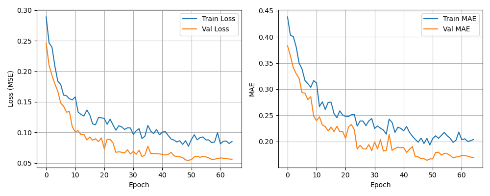

# Self-Driving 자율주행 시뮬레이터 프로젝트

PyTorch/TensorFlow를 활용한 엔드투엔드(end-to-end) 자율주행 모델 개발 가이드.

<br>

---

<br>

## 1. 프로젝트 개요

### 1.1 목표

하나의 주행 영상만으로 다음과 같은 파이프라인을 구축합니다:

```
주행 영상 → 프레임 추출 → 차선 감지 → 가상 조향각 생성
    → CNN 모델 학습 → 실시간 자율주행 시뮬레이터
```

### 1.2 철학: End-to-End Learning

NVIDIA가 2016년 발표한 논문 **"End-to-End Learning for Self-Driving Cars"** (arXiv:1604.07316) 방식을 차용했습니다.

**전통적 방식 (규칙 기반):**
```
영상 → 차선 검출 → 차선 위치 계산 → 조향각 계산 ← 규칙(if/else)이 많아짐
```

**End-to-End 방식 (학습 기반):**
```
영상 → [CNN] → 조향각 출력
```

모든 처리를 단일 신경망이 학습합니다. 중간에 사람이 규칙을 정의할 필요가 없습니다.

### 1.3 사용 기술

| 기술 | 용도 |
|:---|:---|
| **Python 3.x** | 전체 구현 언어 |
| **OpenCV 4** | 영상 처리, 차선 검출, 시각화 |
| **TensorFlow 2 / Keras** | CNN 모델 정의 및 학습 |
| **NumPy** | 데이터 배열 처리 |
| **Matplotlib** | 학습 곡선 시각화 |

<br>

---

<br>

## 2. 전체 구조

```
Self-Driving/
├── Self-driving.mp4            # 원본 주행 영상 (1920x1080, 30fps, 1045프레임)
├── prepare_data.py             # 1단계: 데이터 준비
├── train_model.py              # 2단계: 모델 학습
├── simulator.py                # 3단계: 자율주행 시뮬레이터
│
├── training_data/              # (실행 시 생성)
│   ├── frame_0000.npy ~       # 추출된 프레임 이미지 (160x80 RGB)
│   └── metadata.json           # 각 프레임의 조향각 정보
│
├── steering_model.keras        # (실행 시 생성) 학습된 모델
├── training_history.png        # (실행 시 생성) 학습 곡선 그래프
└── simulator_result.png        # (실행 시 생성) 시뮬레이션 결과
```

<br>

---

<br>

## 3. 데이터 준비 (prepare_data.py)

### 3.1 동작 흐름

```
비디오 프레임 읽기
    ↓
Canny Edge Detection (에지 검출)
    ↓
Hough Transform (직선 검출)
    ↓
좌/우 차선 분류 (기울기 기준)
    ↓
차선 중심 계산 → 조향각 산출 (-1 ~ +1)
    ↓
이미지 리사이즈 (160x80) → .npy 저장
    ↓
메타데이터 JSON 저장
```

### 3.2 차선 검출 원리

```python
ROI (Region of Interest): 프레임 하단 1/3 영역만 사용
    이유: 자율주행에 필요한 건 가까운 도로면, 하늘/풍경은 불필요

Canny Edge: 그레이스케일 → Blur → 에지 검출
    임계값: 50~150 (환경에 따라 조정 가능)

HoughLinesP: 에지 픽셀을 직선으로 변환
    threshold=30, minLineLength=20, maxLineGap=50

좌/우 차선 분류:
    기울기(slope) > 0.2  → 우측 차선
    기울기(slope) < -0.2 → 좌측 차선

조향각 계산:
    차선 중심 = (left_x + right_x) / 2
    offset = (차선중심 - 화면중심) / (화면중심/2)
    steering = clamp(offset, -1, 1)
```

### 3.3 조향각의 의미

| 값 | 의미 |
|:---:|:---|
| **0.0** | 직진 |
| **+0.3 ~ +1.0** | 우회전 (값이 클수록 급회전) |
| **-0.3 ~ -1.0** | 좌회전 (값이 작을수록 급회전) |
| **±0.1 미만** | 거의 직진 |

### 3.4 Ground Truth의 한계

이 프로젝트에서는 **실제 조향각 데이터가 없기 때문에** 차선 검출 결과로 가상의 조향각(Ground Truth)을 생성합니다.

```
한계 1: 차선이 없는 도로(교차로, 주차장)에서는 조향각 생성 불가
한계 2: 그림자, 빛 반사, 노면 마크 등에 의해 잘못된 차선 검출 가능
한계 3: 사람이 실제로 조향한 값과 차선 위치 기반 값은 다를 수 있음
```

이러한 한계를 극복하려면 **실제 차량에서 수집한 조향각 데이터**가 필요합니다.

<br>

---

<br>

## 4. 모델 학습 (train_model.py)

### 4.1 네트워크 아키텍처

NVIDIA E2E 모델을 CPU 환경에 맞게 경량화한 구조입니다.

```
Layer                  Output Shape        Param #
────────────────────────────────────────────────────
Normalization          (80, 160, 3)            3    
Conv2D (5x5, /2)      (40, 80, 16)         1,216
Dropout 0.1                                   
Conv2D (5x5, /2)      (20, 40, 24)         9,624
Dropout 0.1                                   
Conv2D (3x3, /2)      (10, 20, 32)         6,944
Dropout 0.1                                   
Conv2D (3x3, /1)      (10, 20, 48)        13,872
Dropout 0.1                                   
Flatten               (9,600)                   
Dense (64)             64                 614,464
Dropout 0.2                                   
Dense (32)             32                   2,080
Dense (1)               1                      33
────────────────────────────────────────────────────
Total params: ~648,236
```

### 4.2 NVIDIA 원본과의 차이

| 항목 | NVIDIA 원본 (2016) | 이 프로젝트 |
|:---|:---|:---|
| 입력 해상도 | 200x66 (YUV) | 160x80 (RGB) |
| Conv 레이어 | 9층 | 4층 |
| 필터 시작 | 24→36→48→64→64 | 16→24→32→48 |
| Dense 레이어 | 1164→100→50→10 | 64→32→1 |
| 학습 환경 | GPU (Titan X) | CPU |

### 4.3 학습 과정

```python
# 손실 함수: MSE (Mean Squared Error)
# 옵티마이저: Adam (lr=0.001)
# 배치 크기: 32
# 최대 에폭: 100

# 콜백
ModelCheckpoint  → 검증 손실 최저일 때 모델 저장
ReduceLROnPlateau → 5에폭 동안 개선 없으면 학습률 절반
EarlyStopping    → 15에폭 동안 개선 없으면 종료

# 데이터 증강 (ImageDataGenerator)
width_shift_range=0.05   # 좌우 5% 이동
height_shift_range=0.05  # 상하 5% 이동
brightness_range=[0.8, 1.2]  # 밝기 변화
```

### 4.4 CPU 학습 시간 예측

| 데이터 수 | 에폭 | 예상 시간 |
|:---:|:---:|:---:|
| ~300장 | 100 | 5~10분 |
| ~600장 | 100 | 10~20분 |
| ~1000장 | 100 | 20~40분 |

<br>

---

<br>

## 5. 시뮬레이터 (simulator.py)

### 5.1 화면 구성

```
┌─────────────────────────────────────────────────────┐
│                    AI AUTO / HUMAN                    │
│  Steering: +0.321 (+14.4 deg)     GT: +0.315        │
│                                          ┌───────┐  │
│                                          │ GT vs │  │
│                                          │ Pred  │  │
│                                          │ chart │  │
│                                          └───────┘  │
│                                                      │
│                 주행 영상 화면                        │
│                                                      │
│                                                      │
│   ◄═══════════●═══════════►    ← 조향 바            │
│   L           │           R                          │
└─────────────────────────────────────────────────────┘
```

### 5.2 기능

| 키 | 기능 |
|:---:|:---|
| **ESC** | 시뮬레이터 종료 |
| **SPACE** | 일시정지 / 재개 |

### 5.3 화면 요소 설명

| 요소 | 설명 |
|:---|:---|
| **AI AUTO / HUMAN** | 현재 예측 모드 (AI 예측값 / Ground Truth) |
| **Steering** | AI가 예측한 조향각 및 각도(deg) |
| **GT Steering** | 차선 검출로 생성된 원본 조향각 |
| **GT vs Pred 차트** | 최근 100프레임의 GT(노랑)와 예측값(초록) 비교 |
| **조향 바** | 좌(좌회전) / 중앙(직진) / 우(우회전) |

<br>

---

<br>

## 6. 실행 방법

### 6.1 사전 준비

OpenCV와 TensorFlow가 설치되어 있어야 합니다.

```bash
pip install opencv-python numpy tensorflow matplotlib
```

### 6.2 전체 실행

```bash
cd C:\Users\Administrator\Desktop\Self-Driving
```

# 1단계: 데이터 준비

```bash
python prepare_data.py
```

```
(base) C:\Users\user\Desktop\Self-Driving>python prepare_data.py
총 프레임: 1045, FPS: 30.0

영상 처리 시작 (ESC 누르면 중단)...

  Frame 0/1045 | Detected: True | Saved: 1
  Frame 30/1045 | Detected: True | Saved: 11
  Frame 60/1045 | Detected: True | Saved: 21
  Frame 90/1045 | Detected: True | Saved: 31
  Frame 120/1045 | Detected: True | Saved: 41
  Frame 150/1045 | Detected: True | Saved: 51
  Frame 180/1045 | Detected: True | Saved: 61
  Frame 210/1045 | Detected: True | Saved: 71
  Frame 240/1045 | Detected: True | Saved: 81
  Frame 270/1045 | Detected: True | Saved: 91
  Frame 300/1045 | Detected: True | Saved: 101
  Frame 330/1045 | Detected: True | Saved: 111
  Frame 360/1045 | Detected: True | Saved: 121
  Frame 390/1045 | Detected: True | Saved: 131
  Frame 420/1045 | Detected: True | Saved: 141
  Frame 450/1045 | Detected: True | Saved: 151
  Frame 480/1045 | Detected: True | Saved: 161
  Frame 510/1045 | Detected: True | Saved: 171
  Frame 540/1045 | Detected: True | Saved: 181
  Frame 570/1045 | Detected: True | Saved: 191
  Frame 600/1045 | Detected: True | Saved: 200
  Frame 630/1045 | Detected: True | Saved: 210
  Frame 660/1045 | Detected: True | Saved: 220
  Frame 690/1045 | Detected: True | Saved: 230
  Frame 720/1045 | Detected: True | Saved: 240
  Frame 750/1045 | Detected: True | Saved: 250
  Frame 780/1045 | Detected: True | Saved: 260
  Frame 810/1045 | Detected: True | Saved: 270
  Frame 840/1045 | Detected: True | Saved: 280
  Frame 870/1045 | Detected: True | Saved: 290
  Frame 900/1045 | Detected: True | Saved: 300
  Frame 930/1045 | Detected: True | Saved: 310
  Frame 960/1045 | Detected: True | Saved: 320
  Frame 990/1045 | Detected: True | Saved: 330
  Frame 1020/1045 | Detected: True | Saved: 340

완료!
  전체 프레임: 1045
  저장된 샘플: 348
  메타데이터: training_data\metadata.json
  이미지 크기: 160x80
```

# 2단계: 모델 학습

```bash
python train_model.py
```

```
(base) C:\Users\user\Desktop\Self-Driving>python train_model.py
WARNING: All log messages before absl::InitializeLog() is called are written to STDERR
I0000 00:00:1783649438.124526    5728 port.cc:153] oneDNN custom operations are on. You may see slightly different numerical results due to floating-point round-off errors from different computation orders. To turn them off, set the environment variable `TF_ENABLE_ONEDNN_OPTS=0`.
WARNING: All log messages before absl::InitializeLog() is called are written to STDERR
I0000 00:00:1783649439.718880    5728 port.cc:153] oneDNN custom operations are on. You may see slightly different numerical results due to floating-point round-off errors from different computation orders. To turn them off, set the environment variable `TF_ENABLE_ONEDNN_OPTS=0`.
==================================================
Self-Driving Steering Model Training (CPU)
==================================================

[1/4] 데이터 로드 중...
  학습: 278 samples
  검증: 70 samples
  이미지 shape: (80, 160, 3)

[2/4] 데이터 증강 설정...

[3/4] 모델 빌드 중...
C:\Users\user\AppData\Roaming\Python\Python313\site-packages\keras\src\layers\convolutional\base_conv.py:113: UserWarning: Do not pass an `input_shape`/`input_dim` argument to a layer. When using Sequential models, prefer using an `Input(shape)` object as the first layer in the model instead.
  super().__init__(activity_regularizer=activity_regularizer, **kwargs)
I0000 00:00:1783649444.259743    5728 cpu_feature_guard.cc:227] This TensorFlow binary is optimized to use available CPU instructions in performance-critical operations.
To enable the following instructions: SSE3 SSE4.1 SSE4.2 AVX AVX2 AVX_VNNI FMA, in other operations, rebuild TensorFlow with the appropriate compiler flags.
WARNING:tensorflow:TensorFlow GPU support is not available on native Windows for TensorFlow >= 2.11. Even if CUDA/cuDNN are installed, GPU will not be used. Please use WSL2 or the TensorFlow-DirectML plugin.
Model: "sequential"
┏━━━━━━━━━━━━━━━━━━━━━━━━━━━━━━━━━━━━━━┳━━━━━━━━━━━━━━━━━━━━━━━━━━━━━┳━━━━━━━━━━━━━━━━━┓
┃ Layer (type)                         ┃ Output Shape                ┃         Param # ┃
┡━━━━━━━━━━━━━━━━━━━━━━━━━━━━━━━━━━━━━━╇━━━━━━━━━━━━━━━━━━━━━━━━━━━━━╇━━━━━━━━━━━━━━━━━┩
│ conv2d (Conv2D)                      │ (None, 40, 80, 16)          │           1,216 │
├──────────────────────────────────────┼─────────────────────────────┼─────────────────┤
│ dropout (Dropout)                    │ (None, 40, 80, 16)          │               0 │
├──────────────────────────────────────┼─────────────────────────────┼─────────────────┤
│ conv2d_1 (Conv2D)                    │ (None, 20, 40, 24)          │           9,624 │
├──────────────────────────────────────┼─────────────────────────────┼─────────────────┤
│ dropout_1 (Dropout)                  │ (None, 20, 40, 24)          │               0 │
├──────────────────────────────────────┼─────────────────────────────┼─────────────────┤
│ conv2d_2 (Conv2D)                    │ (None, 10, 20, 32)          │           6,944 │
├──────────────────────────────────────┼─────────────────────────────┼─────────────────┤
│ dropout_2 (Dropout)                  │ (None, 10, 20, 32)          │               0 │
├──────────────────────────────────────┼─────────────────────────────┼─────────────────┤
│ conv2d_3 (Conv2D)                    │ (None, 10, 20, 48)          │          13,872 │
├──────────────────────────────────────┼─────────────────────────────┼─────────────────┤
│ dropout_3 (Dropout)                  │ (None, 10, 20, 48)          │               0 │
├──────────────────────────────────────┼─────────────────────────────┼─────────────────┤
│ flatten (Flatten)                    │ (None, 9600)                │               0 │
├──────────────────────────────────────┼─────────────────────────────┼─────────────────┤
│ dense (Dense)                        │ (None, 64)                  │         614,464 │
├──────────────────────────────────────┼─────────────────────────────┼─────────────────┤
│ dropout_4 (Dropout)                  │ (None, 64)                  │               0 │
├──────────────────────────────────────┼─────────────────────────────┼─────────────────┤
│ dense_1 (Dense)                      │ (None, 32)                  │           2,080 │
├──────────────────────────────────────┼─────────────────────────────┼─────────────────┤
│ dense_2 (Dense)                      │ (None, 1)                   │              33 │
└──────────────────────────────────────┴─────────────────────────────┴─────────────────┘
 Total params: 648,233 (2.47 MB)
 Trainable params: 648,233 (2.47 MB)
 Non-trainable params: 0 (0.00 B)

[4/4] 학습 시작 (최대 100 epoch, CPU)...
==================================================
Epoch 1/100
9/9 ━━━━━━━━━━━━━━━━━━━━ 2s 76ms/step - loss: 0.3095 - mae: 0.4473 - val_loss: 0.2708 - val_mae: 0.4233 - learning_rate: 0.0010
Epoch 2/100
9/9 ━━━━━━━━━━━━━━━━━━━━ 1s 60ms/step - loss: 0.2578 - mae: 0.4200 - val_loss: 0.2702 - val_mae: 0.4306 - learning_rate: 0.0010
Epoch 3/100
9/9 ━━━━━━━━━━━━━━━━━━━━ 1s 59ms/step - loss: 0.2365 - mae: 0.4001 - val_loss: 0.2217 - val_mae: 0.3977 - learning_rate: 0.0010
Epoch 4/100
9/9 ━━━━━━━━━━━━━━━━━━━━ 1s 55ms/step - loss: 0.2195 - mae: 0.3879 - val_loss: 0.2870 - val_mae: 0.4428 - learning_rate: 0.0010
Epoch 5/100
9/9 ━━━━━━━━━━━━━━━━━━━━ 1s 60ms/step - loss: 0.2082 - mae: 0.3698 - val_loss: 0.1685 - val_mae: 0.3410 - learning_rate: 0.0010
Epoch 6/100
9/9 ━━━━━━━━━━━━━━━━━━━━ 1s 57ms/step - loss: 0.1822 - mae: 0.3531 - val_loss: 0.1733 - val_mae: 0.3290 - learning_rate: 0.0010
Epoch 7/100
9/9 ━━━━━━━━━━━━━━━━━━━━ 1s 59ms/step - loss: 0.1526 - mae: 0.3016 - val_loss: 0.1671 - val_mae: 0.3026 - learning_rate: 0.0010
Epoch 8/100
9/9 ━━━━━━━━━━━━━━━━━━━━ 1s 61ms/step - loss: 0.1360 - mae: 0.2781 - val_loss: 0.1583 - val_mae: 0.2909 - learning_rate: 0.0010
Epoch 9/100
9/9 ━━━━━━━━━━━━━━━━━━━━ 1s 60ms/step - loss: 0.1428 - mae: 0.2858 - val_loss: 0.1463 - val_mae: 0.2964 - learning_rate: 0.0010
Epoch 10/100
9/9 ━━━━━━━━━━━━━━━━━━━━ 1s 55ms/step - loss: 0.1452 - mae: 0.2955 - val_loss: 0.1759 - val_mae: 0.3154 - learning_rate: 0.0010
Epoch 11/100
9/9 ━━━━━━━━━━━━━━━━━━━━ 1s 55ms/step - loss: 0.1342 - mae: 0.2729 - val_loss: 0.1592 - val_mae: 0.2883 - learning_rate: 0.0010
Epoch 12/100
9/9 ━━━━━━━━━━━━━━━━━━━━ 1s 56ms/step - loss: 0.1233 - mae: 0.2631 - val_loss: 0.1664 - val_mae: 0.2911 - learning_rate: 0.0010
Epoch 13/100
9/9 ━━━━━━━━━━━━━━━━━━━━ 1s 57ms/step - loss: 0.1227 - mae: 0.2566 - val_loss: 0.1598 - val_mae: 0.2881 - learning_rate: 0.0010
Epoch 14/100
9/9 ━━━━━━━━━━━━━━━━━━━━ 1s 55ms/step - loss: 0.1142 - mae: 0.2513 - val_loss: 0.1540 - val_mae: 0.2901 - learning_rate: 0.0010
Epoch 15/100
9/9 ━━━━━━━━━━━━━━━━━━━━ 1s 55ms/step - loss: 0.1166 - mae: 0.2477 - val_loss: 0.1470 - val_mae: 0.2700 - learning_rate: 5.0000e-04
Epoch 16/100
9/9 ━━━━━━━━━━━━━━━━━━━━ 1s 60ms/step - loss: 0.1225 - mae: 0.2592 - val_loss: 0.1366 - val_mae: 0.2650 - learning_rate: 5.0000e-04
Epoch 17/100
9/9 ━━━━━━━━━━━━━━━━━━━━ 1s 54ms/step - loss: 0.1061 - mae: 0.2391 - val_loss: 0.1417 - val_mae: 0.2660 - learning_rate: 5.0000e-04
Epoch 18/100
9/9 ━━━━━━━━━━━━━━━━━━━━ 1s 55ms/step - loss: 0.1071 - mae: 0.2398 - val_loss: 0.1399 - val_mae: 0.2647 - learning_rate: 5.0000e-04
Epoch 19/100
9/9 ━━━━━━━━━━━━━━━━━━━━ 1s 60ms/step - loss: 0.1101 - mae: 0.2413 - val_loss: 0.1330 - val_mae: 0.2497 - learning_rate: 5.0000e-04
Epoch 20/100
9/9 ━━━━━━━━━━━━━━━━━━━━ 1s 57ms/step - loss: 0.1137 - mae: 0.2395 - val_loss: 0.1430 - val_mae: 0.2631 - learning_rate: 5.0000e-04
Epoch 21/100
9/9 ━━━━━━━━━━━━━━━━━━━━ 1s 55ms/step - loss: 0.1141 - mae: 0.2478 - val_loss: 0.1342 - val_mae: 0.2562 - learning_rate: 5.0000e-04
Epoch 22/100
9/9 ━━━━━━━━━━━━━━━━━━━━ 1s 60ms/step - loss: 0.1089 - mae: 0.2342 - val_loss: 0.1272 - val_mae: 0.2415 - learning_rate: 5.0000e-04
Epoch 23/100
9/9 ━━━━━━━━━━━━━━━━━━━━ 1s 59ms/step - loss: 0.1077 - mae: 0.2332 - val_loss: 0.1214 - val_mae: 0.2364 - learning_rate: 5.0000e-04
Epoch 24/100
9/9 ━━━━━━━━━━━━━━━━━━━━ 1s 56ms/step - loss: 0.1099 - mae: 0.2384 - val_loss: 0.1383 - val_mae: 0.2507 - learning_rate: 5.0000e-04
Epoch 25/100
9/9 ━━━━━━━━━━━━━━━━━━━━ 1s 60ms/step - loss: 0.1000 - mae: 0.2234 - val_loss: 0.1161 - val_mae: 0.2346 - learning_rate: 5.0000e-04
Epoch 26/100
9/9 ━━━━━━━━━━━━━━━━━━━━ 1s 57ms/step - loss: 0.1031 - mae: 0.2309 - val_loss: 0.1267 - val_mae: 0.2406 - learning_rate: 5.0000e-04
Epoch 27/100
9/9 ━━━━━━━━━━━━━━━━━━━━ 1s 56ms/step - loss: 0.0980 - mae: 0.2221 - val_loss: 0.1310 - val_mae: 0.2518 - learning_rate: 5.0000e-04
Epoch 28/100
9/9 ━━━━━━━━━━━━━━━━━━━━ 1s 55ms/step - loss: 0.1027 - mae: 0.2324 - val_loss: 0.1365 - val_mae: 0.2423 - learning_rate: 5.0000e-04
Epoch 29/100
9/9 ━━━━━━━━━━━━━━━━━━━━ 1s 55ms/step - loss: 0.1075 - mae: 0.2316 - val_loss: 0.1305 - val_mae: 0.2489 - learning_rate: 5.0000e-04
Epoch 30/100
9/9 ━━━━━━━━━━━━━━━━━━━━ 1s 55ms/step - loss: 0.1016 - mae: 0.2288 - val_loss: 0.1383 - val_mae: 0.2391 - learning_rate: 5.0000e-04
Epoch 31/100
9/9 ━━━━━━━━━━━━━━━━━━━━ 1s 56ms/step - loss: 0.1031 - mae: 0.2243 - val_loss: 0.1389 - val_mae: 0.2437 - learning_rate: 2.5000e-04
Epoch 32/100
9/9 ━━━━━━━━━━━━━━━━━━━━ 1s 54ms/step - loss: 0.0994 - mae: 0.2285 - val_loss: 0.1283 - val_mae: 0.2414 - learning_rate: 2.5000e-04
Epoch 33/100
9/9 ━━━━━━━━━━━━━━━━━━━━ 1s 54ms/step - loss: 0.0978 - mae: 0.2239 - val_loss: 0.1324 - val_mae: 0.2444 - learning_rate: 2.5000e-04
Epoch 34/100
9/9 ━━━━━━━━━━━━━━━━━━━━ 1s 55ms/step - loss: 0.0932 - mae: 0.2155 - val_loss: 0.1253 - val_mae: 0.2429 - learning_rate: 2.5000e-04
Epoch 35/100
9/9 ━━━━━━━━━━━━━━━━━━━━ 1s 55ms/step - loss: 0.0948 - mae: 0.2179 - val_loss: 0.1244 - val_mae: 0.2402 - learning_rate: 2.5000e-04
Epoch 36/100
9/9 ━━━━━━━━━━━━━━━━━━━━ 1s 55ms/step - loss: 0.0945 - mae: 0.2193 - val_loss: 0.1241 - val_mae: 0.2344 - learning_rate: 1.2500e-04
Epoch 37/100
9/9 ━━━━━━━━━━━━━━━━━━━━ 1s 56ms/step - loss: 0.0908 - mae: 0.2144 - val_loss: 0.1260 - val_mae: 0.2317 - learning_rate: 1.2500e-04
Epoch 38/100
9/9 ━━━━━━━━━━━━━━━━━━━━ 1s 55ms/step - loss: 0.0933 - mae: 0.2104 - val_loss: 0.1257 - val_mae: 0.2337 - learning_rate: 1.2500e-04
Epoch 39/100
9/9 ━━━━━━━━━━━━━━━━━━━━ 1s 55ms/step - loss: 0.0873 - mae: 0.2107 - val_loss: 0.1241 - val_mae: 0.2352 - learning_rate: 1.2500e-04
Epoch 40/100
9/9 ━━━━━━━━━━━━━━━━━━━━ 1s 55ms/step - loss: 0.0905 - mae: 0.2116 - val_loss: 0.1228 - val_mae: 0.2289 - learning_rate: 1.2500e-04

==================================================
학습 완료!
  소요 시간: 22.3s
  최종 Train Loss: 0.090494
  최종 Val Loss:   0.122770
  최종 Train MAE:  0.211587
  최종 Val MAE:    0.228854
  모델 저장: steering_model.keras
```

# 3단계: 시뮬레이터 실행

```bash
python simulator.py
```

```
(base) C:\Users\user\Desktop\Self-Driving>python simulator.py
WARNING: All log messages before absl::InitializeLog() is called are written to STDERR
I0000 00:00:1783649485.703626   14092 port.cc:153] oneDNN custom operations are on. You may see slightly different numerical results due to floating-point round-off errors from different computation orders. To turn them off, set the environment variable `TF_ENABLE_ONEDNN_OPTS=0`.
WARNING: All log messages before absl::InitializeLog() is called are written to STDERR
I0000 00:00:1783649487.190810   14092 port.cc:153] oneDNN custom operations are on. You may see slightly different numerical results due to floating-point round-off errors from different computation orders. To turn them off, set the environment variable `TF_ENABLE_ONEDNN_OPTS=0`.
WARNING:tensorflow:TensorFlow GPU support is not available on native Windows for TensorFlow >= 2.11. Even if CUDA/cuDNN are installed, GPU will not be used. Please use WSL2 or the TensorFlow-DirectML plugin.
모델 로드 완료: steering_model.keras
영상: 1045 프레임, 30.0 FPS

=== Self-Driving Simulator ===
  SPACE: 일시정지/재개
  ESC: 종료


영상 끝 — 처음으로 돌아갑니다.

영상 끝 — 처음으로 돌아갑니다.

영상 끝 — 처음으로 돌아갑니다.

영상 끝 — 처음으로 돌아갑니다.

영상 끝 — 처음으로 돌아갑니다.

==================================================
시뮬레이션 종료
  실행 시간: 174.6s
  예측 프레임: 1915
  GT vs Pred MAE: 0.1991
  GT vs Pred MSE: 0.087517
  결과 저장 완료
```




### 6.3 각 단계별 결과 확인

**prepare_data.py 실행 후:**
- `training_data/` 폴더에 `frame_0000.npy` ~ 파일들 생성
- `metadata.json`에 각 프레임의 조향각 기록
- 실행 중 실시간으로 차선 검출 결과 확인 가능 (ESC로 중단)

**train_model.py 실행 후:**
- `steering_model.keras` — 학습된 모델 파일
- `training_history.png` — 학습 곡선 (loss, MAE)

**simulator.py 실행 후:**
- 모델이 실시간으로 조향각 예측
- GT와 예측값 비교 그래프 표시
- ESC 누르면 최종 통계 출력


<br>

---

<br>

## 7. 결과 해석

### 7.1 학습이 잘 된 경우

```
Val Loss (MSE): 0.01 ~ 0.05  (낮을수록 좋음)
Val MAE:        0.05 ~ 0.15  (조향각 오차 0.1 = 약 4.5도)
```

학습 곡선에서 Train Loss와 Val Loss가 함께 감소하면 정상입니다.

### 7.2 과적합 (Overfitting)

```
Train Loss: 계속 감소 → 0.001
Val Loss:  감소하다가 다시 증가 ← 과적합 신호
```

EarlyStopping이 자동으로 중단시킵니다.

### 7.3 예측이 부정확한 경우

원인과 해결 방법:

| 현상 | 원인 | 해결 |
|:---|:---|:---|
| 모든 예측이 0에 가까움 | 차선 검출 실패로 조향각 대부분이 0 | Canny 임계값 조정 |
| 좌/우 편향 | 데이터 불균형 (우회전만 많음) | 좌회전 구간 추가 또는 데이터 균형 |
| 예측이 튐(noisy) | 모델이 너무 큼 / 데이터 부족 | Dropout 증가 / 데이터 증강 강화 |

### 7.4 시뮬레이터 화면 해석

- **GT(노랑선)와 Pred(초록선)가 비슷한 궤적** → 모델이 잘 학습됨
- **Pred가 GT를 따라가지 못함** → 학습 부족 또는 데이터 문제
- **조향 바가 중앙에 계속 고정** → 모델이 직진만 예측 (학습 실패)

<br>

---

<br>

## 8. 심화: 더 나은 모델을 위한 방향

### 8.1 실제 조향각 데이터 수집

가장 큰 한계는 **가상 조향각**입니다. 더 나은 결과를 위해:

```
방법 1: 게임 시뮬레이터 사용 (예: CARLA, AirSim)
방법 2: USB 게임핸들로 수동 주행 → 조향각 기록
방법 3: 실제 차량에 카메라 + OBD2 + 조향각 센서 장착
```

### 8.2 CNN → Transformer 도입

최근 연구에서는 CNN 대신 Vision Transformer(ViT)가 더 좋은 성능을 보입니다.

### 8.3 이미지 해상도 향상

CPU 환경이 아니라 GPU를 사용할 수 있다면 입력 해상도를 높여 더 세밀한 특징 학습이 가능합니다.

### 8.4 데이터 증강 다양화

```python
datagen = ImageDataGenerator(
    rotation_range=5,        # 회전
    zoom_range=0.05,         # 확대/축소
    width_shift_range=0.1,  # 좌우 이동
    height_shift_range=0.05, # 상하 이동
    brightness_range=[0.7, 1.3],  # 밝기 변화
    shear_range=0.05,         # 전단 변환
)
```

### 8.5 시계열 고려 (RNN/LSTM)

단일 프레임이 아닌 **연속된 프레임(시퀀스)** 을 입력으로 사용하면 조향각 예측이 더 부드러워집니다.

```python
model = Sequential([
    TimeDistributed(Conv2D(32, (3,3)), input_shape=(10, 80, 160, 3)),
    TimeDistributed(Flatten()),
    LSTM(64),
    Dense(1)
])
```

<br>

---

<br>

## 9. 참고 자료

| 자료 | 링크 |
|:---|:---|
| NVIDIA DAVE-2 논문 | https://arxiv.org/abs/1604.07316 |
| OpenCV 문서 | https://docs.opencv.org/ |
| TensorFlow Keras | https://www.tensorflow.org/guide/keras |

<br>


