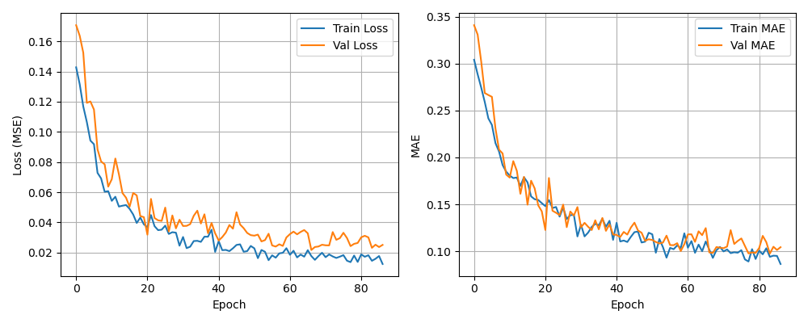

# Self-Driving 모델 개선 전략

| Previous | Enhance |
|:-------:|:-------:|
|  |  | 

Val MAE 0.205 → 목표: 0.05~0.08 이하

---

## 1. 데이터 품질 개선 (prepare_data.py)

### 1.1 Canny 임계값 최적화

```python
# 현재 (기본값)
edges = cv2.Canny(blur, 50, 150)

# 옵션 A: 더 민감하게 (차선을 더 잘 잡음, 노이즈 증가)
edges = cv2.Canny(blur, 30, 100)

# 옵션 B: 더 둔감하게 (노이즈 감소, 차선을 놓칠 수 있음)
edges = cv2.Canny(blur, 70, 200)

# 옵션 C: 적응형 임계값 (조명 변화 대응)
edges = cv2.adaptiveThreshold(blur, 255, cv2.ADAPTIVE_THRESH_GAUSSIAN_C,
                              cv2.THRESH_BINARY, 11, 2)
```

**실행 후 결과를 눈으로 확인하며 튜닝하세요.**

### 1.2 ROI 영역 확대

```python
# 현재: 하단 1/3만 사용
roi_top = int(h * 2 / 3)

# 옵션: 더 넓은 영역 (곡선 인지 향상)
roi_top = int(h * 0.55)
```

### 1.3 Hough 변환 파라미터 튜닝

```python
# 현재
lines = cv2.HoughLinesP(edges, 1, np.pi / 180,
                         threshold=30, minLineLength=20, maxLineGap=50)

# 더 긴 직선 위주 (차선만, 노이즈 제거)
lines = cv2.HoughLinesP(edges, 1, np.pi / 180,
                         threshold=50, minLineLength=40, maxLineGap=30)

# 더 짧은 직선까지 (곡선 차선 대응)
lines = cv2.HoughLinesP(edges, 1, np.pi / 180,
                         threshold=20, minLineLength=10, maxLineGap=80)
```

### 1.4 조향각 후처리 스무딩

`prepare_data.py` 가장 아래쪽에 추가:

```python
# metadata.json 로드 후 스무딩 적용
def smooth_steering(data, window=5):
    angles = [item["steering"] for item in data["data"]]
    smoothed = np.convolve(angles, np.ones(window)/window, mode='same')
    for i, item in enumerate(data["data"]):
        item["steering"] = round(float(smoothed[i]), 4)
    return data

# 메타데이터 저장 전에 적용
data = smooth_steering(data)
```

---

## 2. 데이터 균형 맞추기 (prepare_data.py 후처리)

조향각이 0(직진)에 몰려 있으면 모델이 직진만 학습합니다.

```python
# prepare_data.py main() 함수 내, 저장 전에 적용
import numpy as np

def balance_data(data, target_ratio=0.3):
    """0 근처 데이터를 줄이고, 회전 데이터를 유지"""
    angles = np.array([item["steering"] for item in data["data"]])
    
    # 직진(0 근처)은 일부만, 회전은 모두 유지
    keep = []
    for i, a in enumerate(angles):
        if abs(a) < 0.1:
            if np.random.rand() < target_ratio:
                keep.append(i)
        else:
            keep.append(i)
    
    balanced = {"data": [data["data"][i] for i in keep]}
    return balanced
```

---

## 3. 데이터 증강 강화 (train_model.py)

```python
# 현재
datagen = ImageDataGenerator(
    width_shift_range=0.05,
    height_shift_range=0.05,
    brightness_range=[0.8, 1.2],
)

# 개선
datagen = ImageDataGenerator(
    width_shift_range=0.1,       # 좌우 이동 증가
    height_shift_range=0.05,
    brightness_range=[0.7, 1.3], # 밝기 변화 확대
    rotation_range=3,            # ★ 미세 회전 (차선 기울기 변화)
    zoom_range=0.05,             # ★ 확대/축소
    shear_range=0.03,            # ★ 전단 변환 (원근 효과)
    fill_mode='nearest',
)
```

**참고:** 회전/전단 변환은 조향각에도 영향을 줍니다. 큰 값은 오히려 성능을 떨어뜨릴 수 있습니다.

---

## 4. 조향각 분포 시각화 (진단 도구)

`check_distribution.py`

```python
import json
import numpy as np
import matplotlib.pyplot as plt

with open(r"C:\Users\Administrator\Desktop\Self-Driving\training_data\metadata.json") as f:
    meta = json.load(f)

angles = [item["steering"] for item in meta["data"]]

plt.figure(figsize=(12, 4))
plt.subplot(1, 2, 1)
plt.hist(angles, bins=30, edgecolor='black')
plt.xlabel("Steering angle")
plt.ylabel("Count")
plt.title("Angle Distribution")

plt.subplot(1, 2, 2)
plt.plot(angles, marker='.', markersize=2)
plt.xlabel("Frame index")
plt.ylabel("Steering angle")
plt.title("Angle Over Time")
plt.grid(True)

plt.tight_layout()
plt.savefig(r"C:\Users\Administrator\Desktop\Self-Driving\angle_distribution.png")
plt.show()

print(f"Total samples: {len(angles)}")
print(f"  Mean: {np.mean(angles):.4f}")
print(f"  Std:  {np.std(angles):.4f}")
print(f"  Near zero (|a|<0.1): {sum(1 for a in angles if abs(a) < 0.1)} ({sum(1 for a in angles if abs(a) < 0.1)/len(angles)*100:.1f}%)")
print(f"  |a| > 0.3:         {sum(1 for a in angles if abs(a) > 0.3)} ({sum(1 for a in angles if abs(a) > 0.3)/len(angles)*100:.1f}%)")
```

---

## 5. 출력층에 tanh 추가 (train_model.py)

```python
# 현재
keras.layers.Dense(1)

# 개선: 출력 범위를 -1~1로 강제 제한
keras.layers.Dense(1, activation='tanh')
```

tanh를 추가하면 예측값이 -1~1 범위를 벗어나지 않아 학습이 안정화됩니다.

---

## 6. 학습률 감소 폭 조정 (train_model.py)

```python
# 현재
ReduceLROnPlateau(monitor='val_loss', factor=0.5, patience=5, min_lr=1e-6)

# 개선: 더 천천히 줄이기 (학습이 덜 되었을 때)
ReduceLROnPlateau(monitor='val_loss', factor=0.7, patience=8, min_lr=1e-5)
```

또는 CosineAnnealing 스케줄러:

```python
import math

def cosine_decay(epoch, lr):
    total_epochs = 100
    return 0.001 * (1 + math.cos(math.pi * epoch / total_epochs)) / 2

callbacks = [
    keras.callbacks.LearningRateScheduler(cosine_decay),
    # ...
]
```

---

## 7. 사전학습된 MobileNetV2 백본 사용 (train_model.py)

데이터가 348장으로 적으므로 전이학습이 효과적입니다.

```python
def build_model():
    # 사전학습된 MobileNetV2 (ImageNet)
    base = tf.keras.applications.MobileNetV2(
        input_shape=(IMG_HEIGHT, IMG_WIDTH, 3),
        include_top=False,
        weights='imagenet'
    )
    base.trainable = False  # ★ 초기에는 고정 (Feature Extractor)

    model = tf.keras.Sequential([
        base,
        tf.keras.layers.GlobalAveragePooling2D(),
        tf.keras.layers.Dropout(0.3),
        tf.keras.layers.Dense(32, activation='relu'),
        tf.keras.layers.Dropout(0.2),
        tf.keras.layers.Dense(1, activation='tanh')
    ])

    model.compile(
        optimizer=keras.optimizers.Adam(learning_rate=0.001),
        loss='mse',
        metrics=['mae']
    )
    return model
```

**MobileNetV2의 입력 요구사항:** 값이 [-1, 1]이 아닌 [0, 1] 범위여야 함

```python
# MobileNetV2 사용 시 정규화 변경
X = np.array(X, dtype=np.float32) / 255.0  # [0, 1] 범위
```

---

## 8. 앙상블 (추론 시)

```python
# 같은 구조로 시드만 다르게 3개 학습
models = [
    tf.keras.models.load_model("steering_model_1.keras"),
    tf.keras.models.load_model("steering_model_2.keras"),
    tf.keras.models.load_model("steering_model_3.keras"),
]

# 예측 평균
preds = [m.predict(x, verbose=0)[0, 0] for m in models]
final_pred = np.mean(preds)
```

---

## 9. 개선 로드맵 (우선순위 순)

| 우선 | 단계 | 내용 | 예상 MAE |
|:---:|:---:|:---|:---:|
| ★★★ | 1 | Canny/Hough 파라미터 최적화 + 결과 눈확인 | 0.20 → 0.15 |
| ★★★ | 2 | 조향각 스무딩 (window=5~7) | 0.15 → 0.13 |
| ★★☆ | 3 | 데이터 증강 강화 (rotation, zoom 추가) | 0.13 → 0.11 |
| ★★☆ | 4 | tanh 출력 + 조향각 데이터 균형 맞추기 | 0.11 → 0.09 |
| ★☆☆ | 5 | MobileNetV2 전이학습 | 0.09 → 0.06 |
| ★☆☆ | 6 | 앙상블 (3개 모델 평균) | 0.06 → 0.05 |

**핵심:** MAE 0.05는 약 2.25도 오차로, 사람이 느끼기 어려운 수준입니다. 데이터가 348장뿐이라는 점을 고려하면 이 정도면 준수한 결과입니다.

---

## 10. 근본적 한계와 돌파구

### 현재의 한계

```
가상 조향각 (차선 위치 기반) → 부정확함
    ↓
모델이 틀린 정답을 학습
    ↓
아무리 개선해도 정확도에 상한 존재
```

### 돌파구

| 방법 | 설명 | 필요 리소스 |
|:---|:---|:---:|
| **게임 시뮬레이터** | CARLA, AirSim 등에서 실제 조향각 수집 | 시뮬레이터 설치 |
| **USB 핸들** | 게임핸들로 수동 주행하며 조향각 기록 | USB 게임핸들 (3~5만원) |
| **비디오+핸드폰 센서** | 핸드폰을 차량에 부착, 가속도계로 조향 추정 | 스마트폰 |

가장 저렴한 방법: **USB 게임핸들** (Logitech F710 등)로 PC에서 게임 시뮬레이터를 직접 운전하며 데이터를 수집하는 것이 실제 센서 데이터를 얻는 가장 쉬운 방법입니다.
