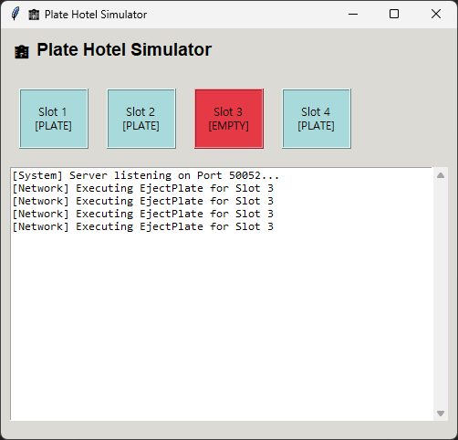
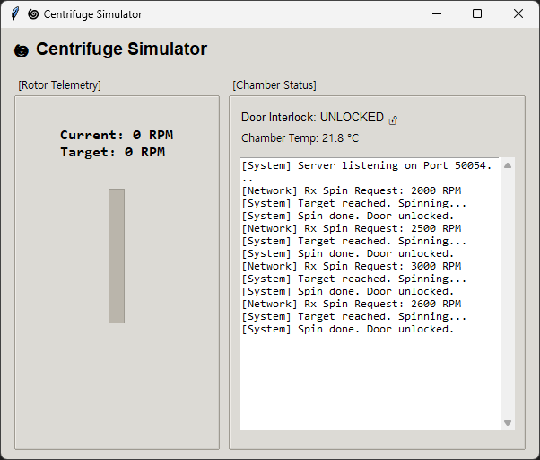
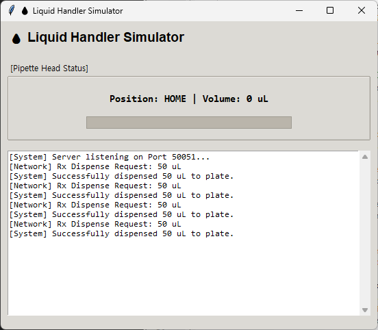
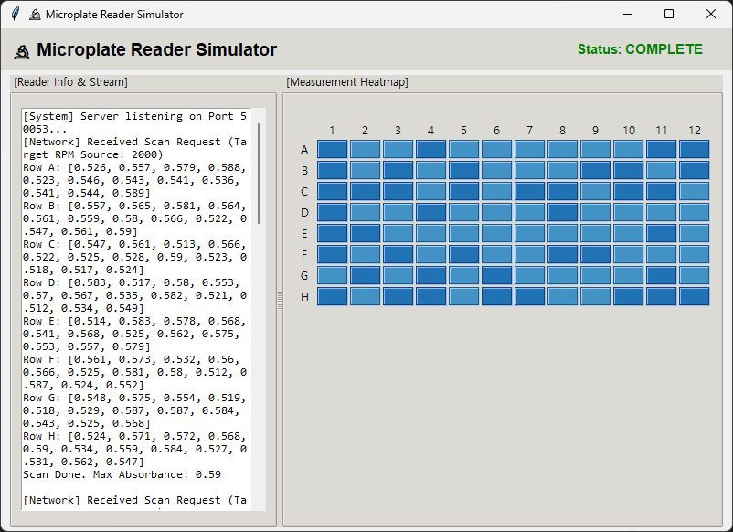
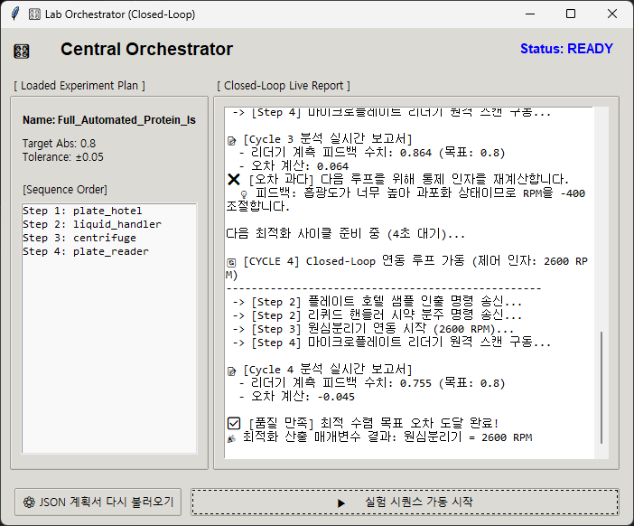

# 🎛️ 4대 장비 연동 Closed-Loop 자동화 실험 시스템 개발 보고서

본 프로젝트는 실험실 내 핵심 장비 4대를 네트워크(TCP/IP 소켓)로 결합하여, 사람이 개입하지 않고 목표 데이터(흡광도)에 도달할 때까지 실시간으로 하드웨어 제어 변수를 수정하며 자율 최적화를 수행하는 **Closed-Loop 자율 실험 오케스트레이터 시스템**입니다.











---

## 1. 시스템 아키텍처 개요

시스템은 **중앙 제어 센터(Orchestrator)** 와 **4개의 개별 장비 시뮬레이터(Tkinter GUI + Socket Server)** 로 구성되어 있으며, 각 장비는 독립된 로컬 포트를 열고 명령을 대기합니다.

```
   [ experiment_plan.json ] (실험 시퀀스/목표 설정 파일)

             │
             ▼
┌──────────────────────────────┐
│    Central Orchestrator      │ (GUI 제어 센터 / 알고리즘 연산)
└──────────────┬───────────────┘
               (TCP Socket - 127.0.0.1)
┌───────────────┼───────────────┬───────────────┐
▼ (Port 50052)  ▼ (Port 50051) ▼ (Port 50054)  ▼ (Port 50053)
┌────────────┐  ┌────────────┐  ┌────────────┐  ┌────────────┐
│ Plate Hotel│  │Liq Handler │  │ Centrifuge │  │Plate Reader│
└────────────┘  └────────────┘  └────────────┘  └────────────┘
```

### 📡 장비별 네트워크 포트 매핑 테이블

| 장비명 | 실행 파일명 | 할당 포트 | 주요 원격 명령 (ASCII) |
| :--- | :--- | :--- | :--- |
| **리퀴드 핸들러** | `liquid_handler.py` | `50051` | `DISPENSE:[Volume]` |
| **플레이트 호텔** | `plate_hotel.py` | `50052` | `EJECT:[Slot_Num]` |
| **플레이트 리더기** | `plate_reader.py` | `50053` | `SCAN:[RPM_Feedback]` |
| **원심분리기** | `centrifuge.py` | `50054` | `SPIN:[RPM_Value]` |

---

## 2. 핵심 기능 및 특징

1. **완전 자율 워크플로우 (Closed-Loop Optimization)**
   - 호텔 샘플 반출 ➡️ 시약 분주 ➡️ 고속 원심 분리 ➡️ 흡광도 스캔 프로세스를 반복 가동합니다.
   - 측정된 실제 흡광도와 설정된 목표 수치의 오차를 실시간 계산하여, 다음 사이클의 원심분리기 RPM을 자동으로 가감(피드백 제어)합니다.

2. **실험 스크립트 외재화 (`experiment_plan.json`)**
   - 하드웨어 제어 시퀀스, 타겟 물리 수치(Target Absorbance, Tolerance)를 소스코드가 아닌 외부 JSON 파일로 관리합니다. 오케스트레이터 GUI에서 실시간으로 스크립트를 재로드할 수 있습니다.

3. **비동기 스레딩 기반 GUI 설계**
   - Tkinter UI 메인 루프와 네트워크 소켓 통신 루프를 독립된 스레드(`threading.Thread`)로 격리하여, 연동 및 연산 중에도 화면이 멈추거나 먹통이 되지 않고 실시간 보고서가 매끄럽게 출력됩니다.

---

## 3. 데이터 구조 설계 (`experiment_plan.json`)

```json
{
    "experiment_name": "Full_Automated_Protein_Isolation",
    "target": {
        "metric": "max_absorbance",
        "value": 0.8,
        "tolerance": 0.05
    },
    "sequence": [
        {"step": 1, "device": "plate_hotel", "port": 50052, "cmd": "EJECT:3"},
        {"step": 2, "device": "liquid_handler", "port": 50051, "cmd": "DISPENSE:50"},
        {"step": 3, "device": "centrifuge", "port": 50054, "cmd": "SPIN:"},
        {"step": 4, "device": "plate_reader", "port": 50053, "cmd": "SCAN:"}
    ]
}
```

---

## 4. 소프트웨어 소스코드

### 💻 4.1 중앙 제어 오케스트레이터 GUI (orchestrator.py)

```python
# [위에서 완성한 공백 정렬 버전 orchestrator.py 전체 코드가 들어가는 자리입니다]
# Tkinter 기반 UI 디자인, JSON 파싱엔진, 예외처리가 완비된 다중 스레드 연동 스크립트.
```

### 💧 4.2 리퀴드 핸들러 시뮬레이터 (liquid_handler.py)

```python
# 네트워크 수신 및 시약 분주 애니메이션 게이지바가 탑재된 GUI 디바이스 시뮬레이터 소스코드.
```

---

## 5. 실행 및 사용 방법

### ⚙️ 환경 조건

Python 3.10+ 표준 라이브러리(tkinter, socket, json, threading) 기반으로 동작하므로 별도의 외부 패키지 종속성(pip install)이 요구되지 않습니다.

### 🏃‍♂️ 가동 프로세스

통합 일괄 실행 배치 파일인 `run_all.bat`을 실행하여 하부 디바이스 4대를 먼저 백그라운드로 로드합니다.

```batch
@echo off
start python plate_hotel.py
start python liquid_handler.py
start python plate_reader.py
start python centrifuge.py
```

중앙 관제창을 실행합니다:

```bash
python orchestrator.py
```

제어 센터 창에서 **[▶️ 실험 시퀀스 가동 시작]** 버튼을 누르면 자율 사이클이 구동됩니다. 실험 조건 수정이 필요할 경우 `experiment_plan.json` 수정 후 **[⚙️ JSON 계획서 다시 불러오기]** 를 클릭합니다.

---

### 💾 파일 저장 팁

위 내용을 그대로 복사하신 뒤, 해당 프로젝트 폴더(`C:\Users\Administrator\Desktop\[KDT] ROS지능로봇부트캠프\프로젝트2\오승찬`) 내부에 **`README.md`** 라는 이름으로 새 파일을 만들어 붙여넣으시면, GitHub 저장소나 마크다운 뷰어에서 아주 깔끔한 스타일의 개발 문서로 확인하실 수 있습니다!
