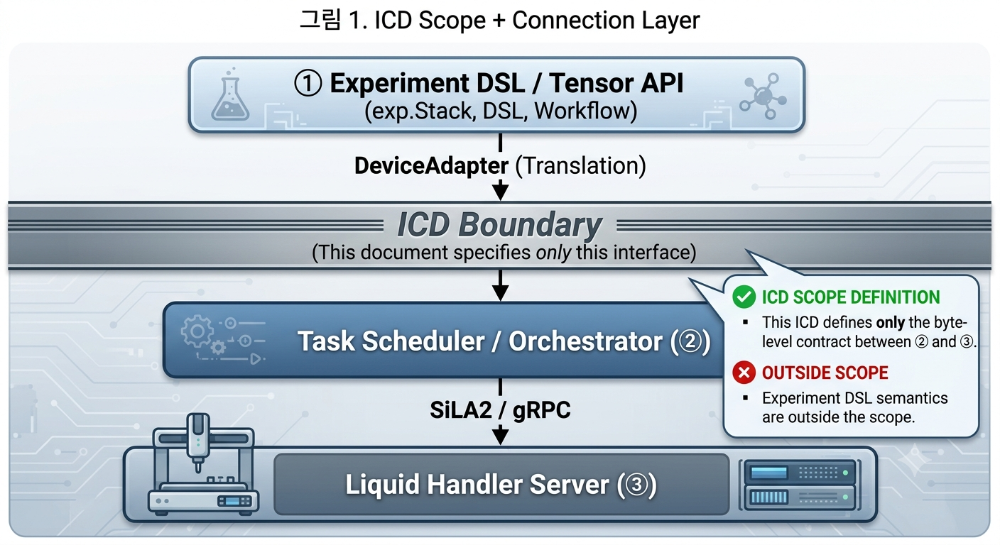
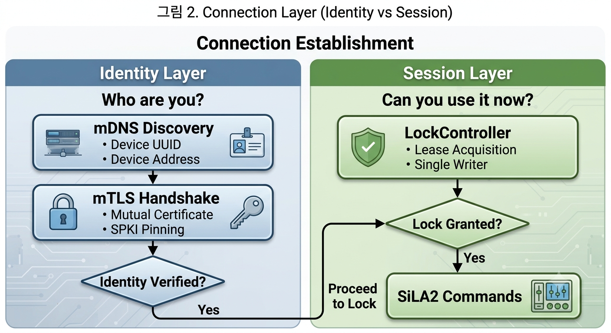
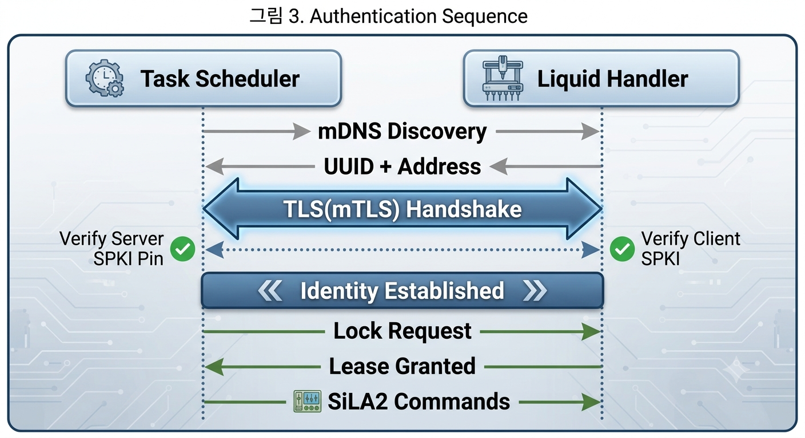
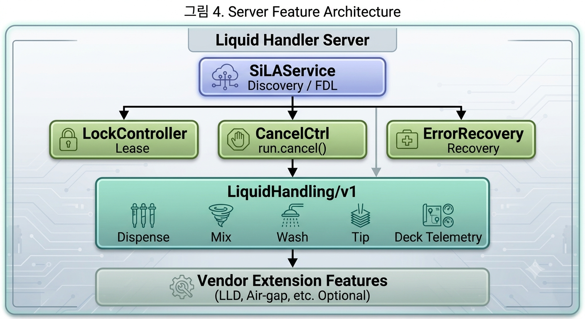
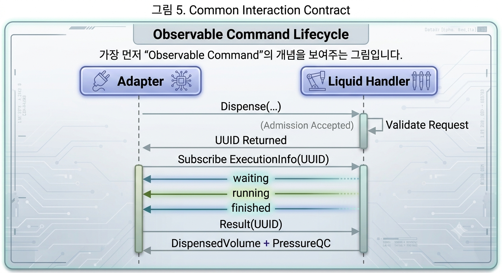
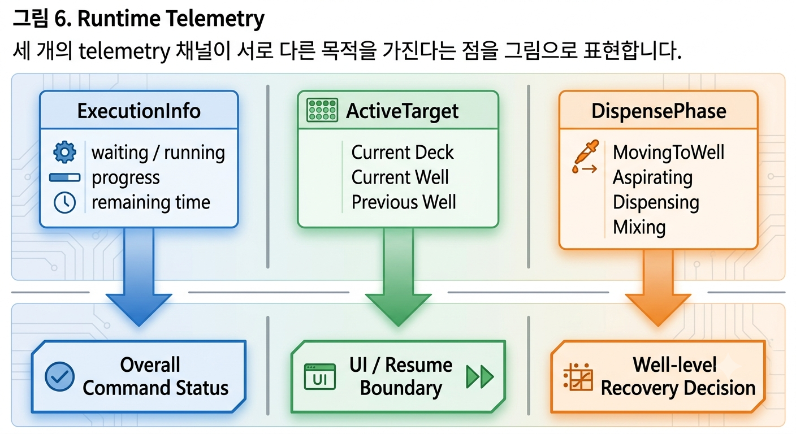
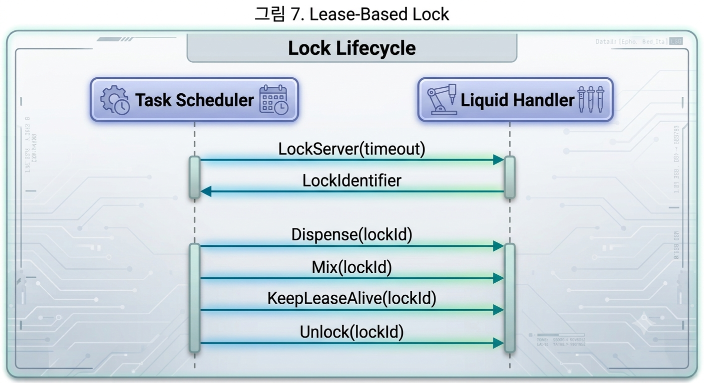
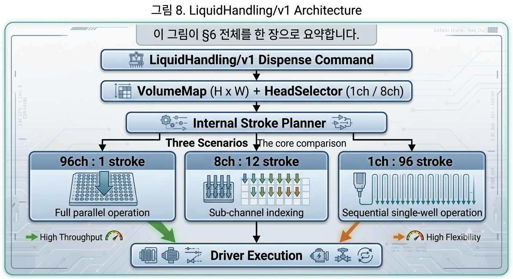
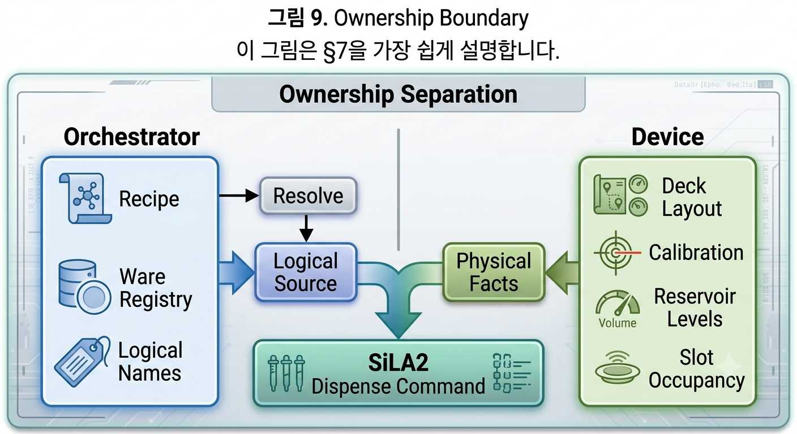
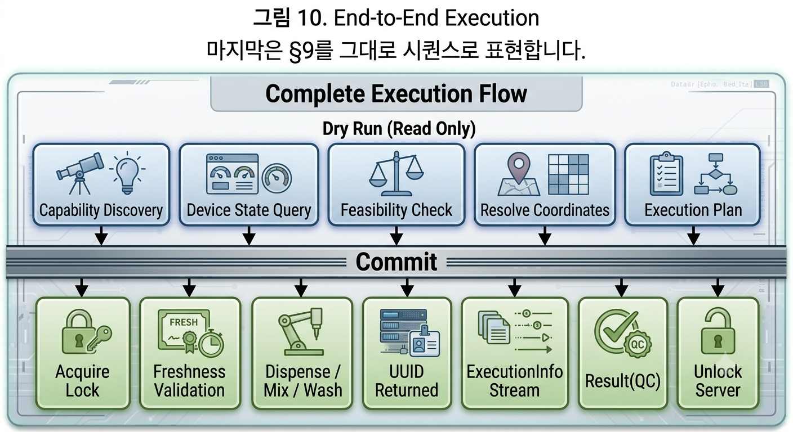

# ICD 정리 요약 — Liquid Handler ↔ Task Scheduler (SiLA2)

> 원본: `icd-liquid-handler-2-3.md` (DESIGN FINAL) 을 구조 중심으로 재정리한 요약본.  <br>
> 세부 FDL XML·표는 원본을 참고하고, 이 문서는 "왜 이렇게 설계했는가"의 흐름을 따라가기 위한 지도 역할.

---

## 0. 이 문서가 규정하는 범위 (한 문장 요약)

**오케스트레이터(②)와 리퀴드 핸들러 장비(③) 사이, SiLA2/gRPC로 오가는 "바이트 계약"만 규정.** <br>
실험 DSL(①, `exp.Stack`, 텐서 API)은 범위 밖이며, ②의 `DeviceAdapter`가 그것을 SiLA2 command로 번역하는 지점부터가 이 문서의 관할.

```
① 실험 DSL          (범위 밖 — layer1)
② DeviceAdapter      ← pass를 SiLA2 command로 번역  ─┐
════════════════════ SiLA2 / gRPC / HTTP2 ══════════│  이 ICD
③ Liquid Handler 서버 ← FDL 선언을 실행, stroke로 분해 ─┘
④ 물리 핸들러(헤드·덱·리저버)
```

---

## 1. 핵심 설계 축 — 전체를 관통하는 4가지 원칙

문서 전체가 아래 4가지 원칙의 반복 적용이라고 보면 훨씬 읽기 쉬워집니다.

| 원칙 | 의미 | 적용 사례 |
|---|---|---|
| **① 단방향 명령** | 모든 command는 Orchestrator → Device로만 개시.  <br>장비는 telemetry만 push | §2 명령 방향,  §5.1 Observable command |
| **② single-writer** | 한 시점 한 장비에 lease 소유자는 정확히 1개 | `LockController` (§5.2) |
| **③ 상태 소유권 분리** | "무엇을 아는가"를 물리 장비(Device)와  <br>논리 정체성(Orchestrator)이 절반씩 나눠 가짐 | §7 |
| **④ 장비는 catalog를 모른다** | 장비는 ware의 의미·내용물·기하 카탈로그를 갖지 않고,  <br> 그때그때 인라인으로 전달받은 좌표·profile만 검증 | §6.3, §7, §8 |

이 네 가지를 기억하면 세부 조항들이 "왜 이렇게까지 하나"가 아니라 자연스러운 귀결로 읽힙니다.

---

## 2. 연결 계층 (§2~3) — "누구인지"와 "지금 쓸 권한이 있는지"의 분리

두 계층이 독립적으로 동작합니다.



| 계층 | 질문 | 메커니즘 |
|---|---|---|
| **전송·identity** | 상대가 등록된 신원인가 (위장 아님) | **mTLS + TOFU SPKI Pinning** |
| **세션 인가** | 지금 쓸 권한자인가 | **LockController (lease)** |

**mTLS + SPKI Pinning 흐름 (Stage 1→2):**

1. mDNS로 장비 UUID·주소 발견
2. TLS(≥1.2) mTLS 핸드셰이크: 서버는 클라이언트 공개키가 pin과 일치하는지, 클라이언트는 서버 공개키가 pin + 발견된 UUID와 바인딩되는지 상호 확인
3. 성립하면 이후 Lock → command 진행. 실패하면 command 단계 도달 전 연결 거부

**왜 CA 대신 pin인가:** 랩 전역 CA 개인키가 유출되면 피해 범위가 전체 장비로 퍼지지만, 개체별 SPKI pinning은 한 장비가 뚫려도 피해가 그 장비 하나로 한정됩니다. 폐기도 CRL 없이 **pin 삭제 한 번**으로 즉시 처리됩니다.

**경계:** 이 절은 오케스트레이터 ↔ 장비 간 인증만 다룹니다. 사용자 레벨 인증(RBAC 등)은 ①↔② 경계의 몫입니다.



---

## 3. 서버가 노출하는 Feature 목록 (§4)

| Feature | 필수 여부 | 역할 |
|---|:---:|---|
| `SiLAService` | 필수 | 서버 identity, FDL 조회, 레지스트리 등록 진입점 |
| `LockController` | 필수 | lease(Lock) — single-writer 강제 |
| `CancelController` | 필수 | 취소(`run.cancel()`)의 백엔드 |
| `ErrorRecoveryService` | 권장 | 물리 오류 회복 협상 |
| **`LiquidHandling/v1`** | 필수 | **분주 능력의 본체** — `Dispense`/`Mix`/`Wash`/tip + 덱·리저버 telemetry |
| 벤더 Feature | 선택 | LLD, air-gap 등 벤더 전용 확장 |



---

## 4. 공통 상호작용 계약 (§5)

### 4.1 모든 실행 command는 Observable (분주는 수 초~수십 초 걸리므로)



```
Adapter → Dispense(...)              → 서버가 구조 검증 후 UUID 반환
Adapter → Subscribe ExecutionInfo(UUID) → status/progress/remaining time 스트림
Adapter → Result(UUID)               → DispensedVolume + PressureQc
```

- UUID 반환은 "서버가 admission 검증을 통과시켰다"는 뜻이지, 물리 실행이 시작됐다는 뜻이 아닙니다. 실제 실행 durability는 그 뒤 driver accept 시점에 성립합니다.
- 진행 상황은 3개 채널로 분리되어 있습니다:



| 채널 | 무엇을 알려주나 | 용도 |
|---|---|---|
| `ExecutionInfo` | 상태(waiting/running/finished) + 진행률 + 남은 시간 | 실행 UI, UUID 수명 관리 |
| `ActiveTarget` (Lane A) | 현재/직전 완료 덱·well | 실험자용 진행 표시, **취소 시 재분주 경계 판단** |
| `DispensePhase` | well 내부 세부 단계 (MovingToWell/Dispensing/Mixing/…) | 에러 시 해당 well 재사용 가능 여부 판단 |

- 취소는 `finishedWithError`로 종료되며 **결과 회수 불가**. 그래서 "얼마나 분주됐는지"는 위 두 telemetry의 마지막 관측값을 조합해서 재구성합니다.

### 4.2 Lock = lease (§5.2)

1. `LockServer(LockIdentifier, Timeout)`로 배타 점유 획득
2. 이후 모든 lock-protected command는 `LockIdentifier`를 메타데이터로 동반해야 함
3. 완료/실패 시 `UnlockServer`
4. TTL은 유한해야 하고(무기한 금지), 주기적 `KeepLeaseAlive`로 갱신
5. 관리자 break-glass(강제 해제) 절차 존재 — 감사 로그 필수

### 4.3 취소·오류 회복 (§5.3)

- **취소**: `CancelCommand`/`CancelAll` — 동일 Lock·동일 client에 귀속된 command만 대상. 물리적으로 안전하지 않으면 서버가 `OperationNotSupported`로 거부 가능.
- **회복 가능 오류**: 즉시 종료 대신 `RecoverableErrors` property에 정지 대기 → 스케줄러가 서버가 광고한 continuation option(`Retry`/`SkipWell`/`Continue`/`Abort`) 중 선택.



---

## 5. Domain Feature — `LiquidHandling/v1` 상세 (§6)


### 5.1 명령 단위: pass 1개 = command 1개 (per-well 아님)

- `Dispense` 하나가 볼륨 맵 전체(H×W)를 싣습니다. well 단위로 command를 쪼개지 않습니다.
- 볼륨 맵 → 실제 stroke(흡입/토출 동작) 분해는 **서버 내부 책임**입니다. 96채널=1 stroke, 8채널=12 stroke, 1채널=96 stroke — 클라이언트는 몰라도 됩니다.

### 5.2 멀티 헤드 (2026-07-11 개정으로 추가된 부분)

- `HeadSelector`로 어느 헤드(1채널/8채널)를 쓸지 지정합니다.
- `VolumeMap`의 shape는 헤드와 무관하게 항상 타깃 ware 기하(H×W)입니다 — 헤드는 stroke 분해 방식만 바꿉니다.
- **ganged 8채널 제약**: 8채널 헤드가 플런저 1개로 8개 시린지를 같이 구동하면(`PerChannelIndependent=false`), 한 stroke의 8 well은 **반드시 동일 볼륨**이어야 하고 열 내부 개별 skip이 불가능합니다. 비균일·부분 열은 1채널 헤드로 라우팅해야 하며, 위반 시 `HeadMapIncompatible` 오류입니다.

### 5.3 볼륨 맵 데이터 타입 (§6.2)

- SiLA2에 2D 배열 타입이 없어서 **행-우선 `List<List<Real>>`**로 표현 (단위 µL, 범위 제약 포함).
- 크기는 항상 인라인 전송(Binary Transfer 미사용). ragged list 등은 물리 동작 전 오류로 거부.

### 5.4 주요 Command 요약 (§6.3)

| Command | 역할 |
|---|---|
| `Dispense` | 분주 |
| `DispenseAndMix` | 분주 직후 같은 well에서 혼합 ("바로 혼합") |
| `Mix` | 독립적인 나중 혼합 |
| `Wash` | 선택된 헤드 전체 팁 세척 |
| `PickTips` / `EjectTips` | 팁 장착/제거 |
| `KeepLeaseAlive` | lease 갱신용 no-op |

- 논리 라벨(`SourceLabel`)과 물리 주소(deck slot, well 좌표)를 **둘 다** 함께 보냅니다. 장비는 논리 의미를 모르고, 물리 주소·기하만 검증합니다.
- 액체 특성은 별도 ID가 아니라 오케스트레이터가 해석한 numeric `LiquidProfile`을 인라인 전송합니다.

### 5.5 주요 Property (telemetry, §6.4)

| Property | 용도 |
|---|---|
| `DeviceStatus` | idle/busy/error |
| `ReservoirLevels` | 잔량 → dry_run feasibility |
| `DeckOccupancy` | 물리 점유 감지 |
| `DeckIdentity` / `DeckSections` / `CalibrationStatus` | 운용 덱 식별자 (raw 좌표·transform 제외) |
| `HeadGeometry` | 헤드별 footprint·볼륨범위·ganged 여부 |
| `TransferLimits` | 장비 내부 payload 전송 한계 |
| `ResultQcModes` | 결과 QC 정책 |

> raw deck layout·calibration table·pose 진단값은 별도 service-admin 표면에서만 노출되고, 이 운용 property들에는 섞이지 않습니다.

### 5.6 정의된 실행 오류 (§6.5)

| 오류 | 발생 조건 | 등급 |
|---|---|---|
| `VolumeOutOfRange` | 볼륨이 선택 헤드 범위 밖 | terminal |
| `GeometryMismatch` | 좌표·shape 불일치 | terminal |
| `HeadMapIncompatible` | ganged 헤드 위반 등 | terminal |
| `SourceEmpty`/`InsufficientVolume` | 리저버 부족 | recoverable |
| `WareNotPresent` | 슬롯 점유 불일치 | terminal |
| `TipPolicyUnsupported` | 지원 안 하는 tip 정책 | terminal |
| `TipPickupFailed` | 물리 팁 픽업 실패 | recoverable |
| `ResourceExhausted` | 내부 큐/버퍼 한계 | terminal |
| `NotDispatched` | UUID는 발급됐지만 물리 실행 전 리셋 확정 | terminal |

대부분의 terminal 오류는 실행 전 `dry_run` 단계에서 미리 걸러지도록 설계되어 있습니다.

---

## 6. 상태 소유권 분리 (§7) — 누가 무엇을 아는가



| 상태 | 소유자 | 비고 |
|---|---|---|
| 물리 덱 구성(id·calibration·slot) | **Device** | 장비의 fact |
| 물리 점유·잔량 | **Device** | 센서 값 |
| ware 정체성·내용물 | **Orchestrator Registry** | ware는 장비 간 이동하므로 장비 종속 아님 |
| 논리 `src` → 물리 주소 바인딩 | **Orchestrator** (실행 시 해소) | recipe는 논리 이름만 알면 됨 |

**해소 흐름:** recipe의 논리 이름(`src="buffer"`) → 스케줄러가 레지스트리에서 실제 위치 확인 → Adapter가 물리 주소·좌표·profile을 채운 command로 번역해서 전송. 서버는 "지금 덱에 놓인 용기"만 인지할 뿐, 랩 전역 ware 카탈로그는 모릅니다.

---

## 7. Capability → Registry 매핑 (§8) 핵심만



서버가 노출하는 FDL/property가 스케줄러의 매칭·feasibility 판단 입력으로 어떻게 승격되는지 보여주는 표입니다. 핵심 흐름만 요약하면:

- `LiquidHandling/v1` 존재 → `capability="liquid_handling"`으로 장비 매칭
- `HeadGeometry` → stroke 수 산출 → ETA 추정
- `TransferLimits` → payload 전략(inline 최대 96 well 등) 결정
- `DeckIdentity` 등 → ware/deck catalog binding 및 calibration freshness 검증

---

## 8. 전체 실행 시퀀스 (§9) — 가장 압축된 요약



```
[dry_run — 장비에 실제 명령 없음, read-only 조회만]
  capability·constraint 확인
  덱·잔량·헤드 등 상태 조회
  → 스케줄러가 feasibility 검증 + 좌표/profile 해소 → Plan 생성

[run 커밋 — single-writer]
  Lock 획득 (LockServer)
  freshness 재검증 (dry_run 스냅샷과 다르면 Plan 무효화)
  pass 반복:
    Dispense/Mix/Wash 전송 → UUID
    ExecutionInfo 구독 (진행 상황)
    Result 조회 (DispensedVolume + QC)
  Unlock (UnlockServer)
```

즉, **"먼저 물어보고(dry_run), 확정되면 잠그고 실행한다(run)"**는 한 문장으로 요약됩니다.

---

## 참고: 원본 문서에서 더 봐야 할 부분

이 요약은 흐름 파악용입니다. 실제 FDL XML 작성, `VolumeMap` 타입 상세 XSD, Command별 전체 파라미터 목록은 원본 §6.2~6.4를 직접 참조하시는 게 정확합니다.
