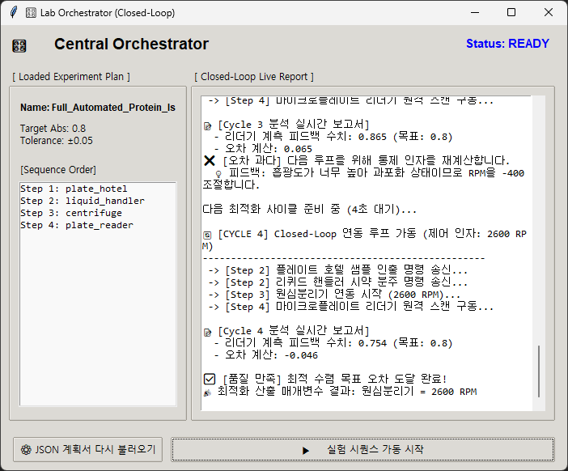
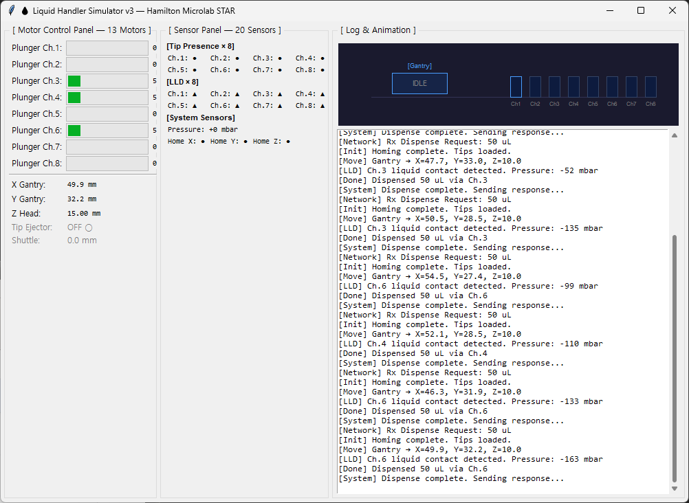
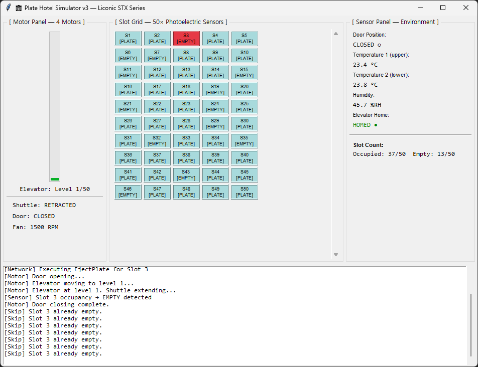
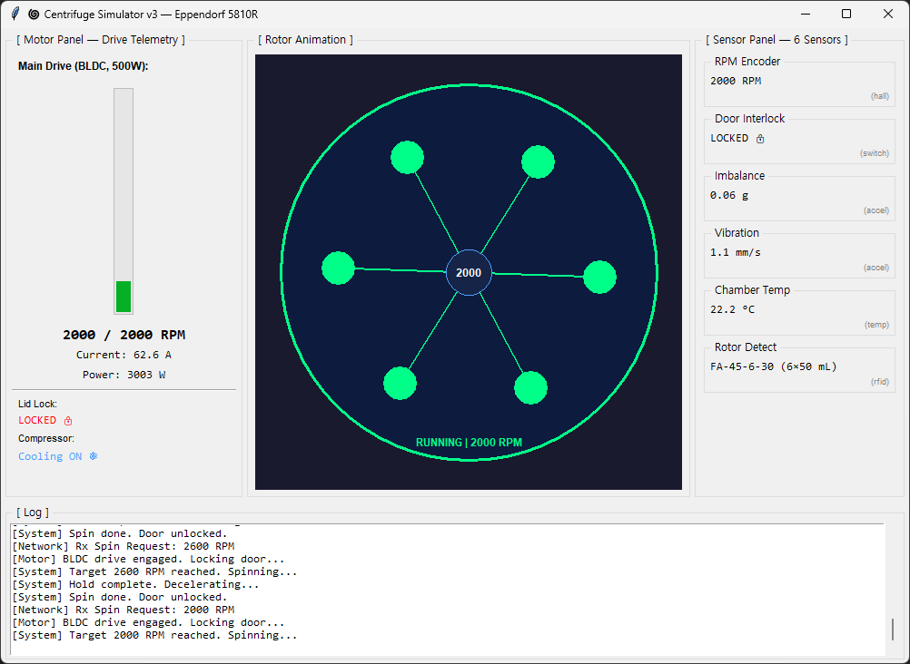
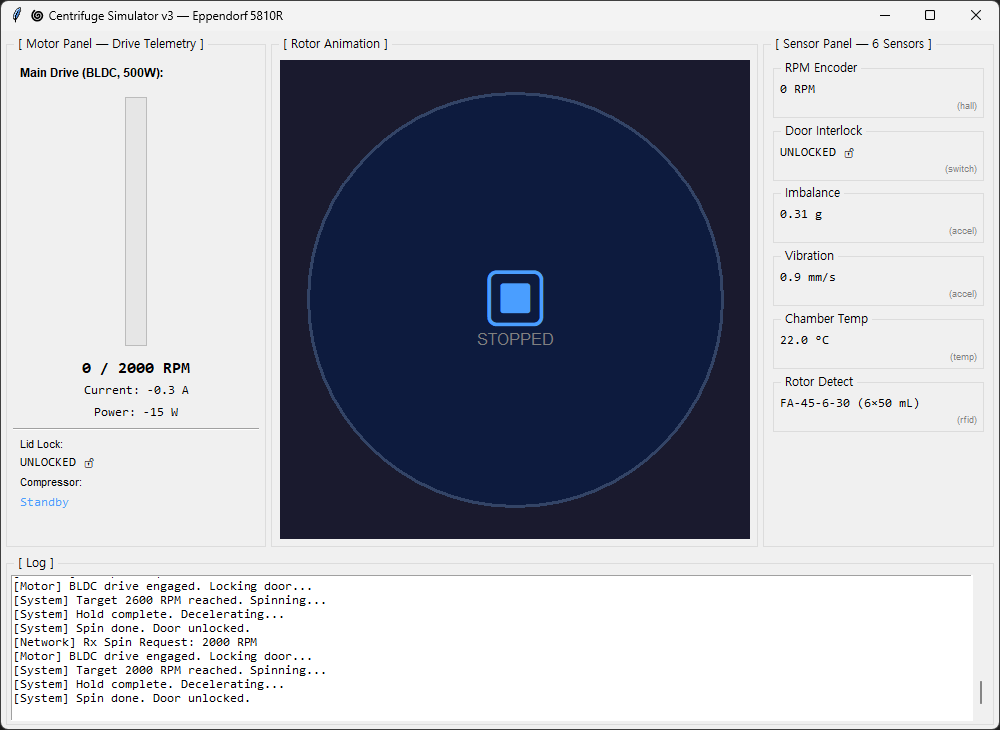
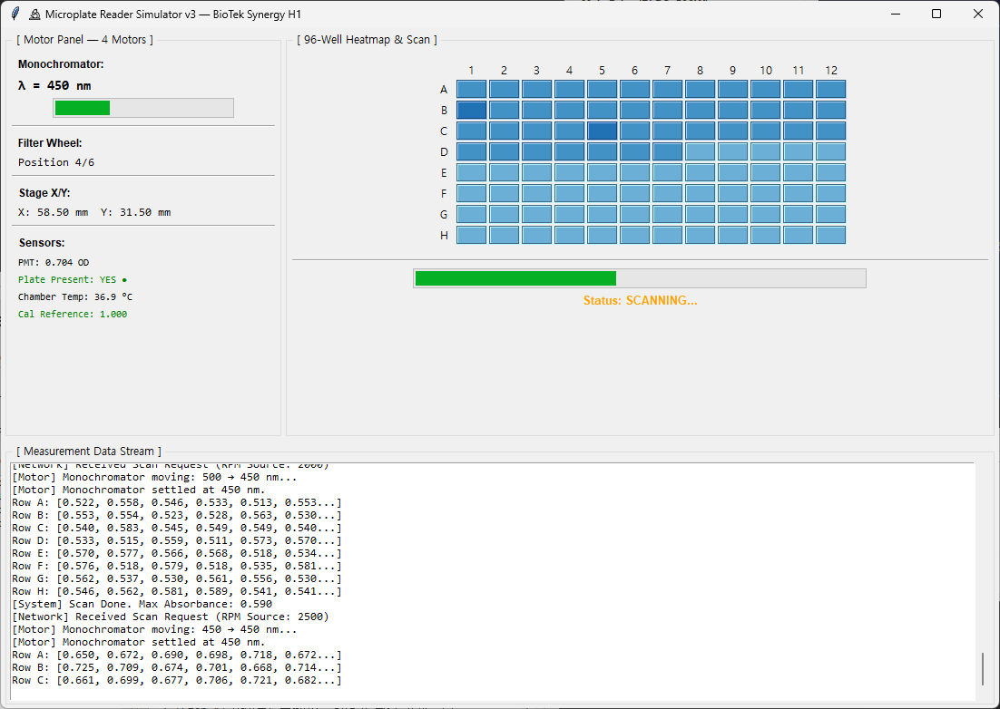

# v3 — 장비 제원 반영 시뮬레이터 고도화

> 실제 대응 장비의 모터·센서 구성을 추정하여 각 시뮬레이터 GUI에 반영. <br>
> v3 목표: 단순 상태 표시를 넘어 **"무슨 모터가 어떻게 움직이고, 어떤 센서가 무슨 값을 읽는지"** 를 실시간으로 표시.

---

## 개요

v1/v2의 시뮬레이터는 단순 진행 바와 텍스트 로그만 표시했다면,
v3는 각 장비의 **실물 제원에 기반한 모터·센서 구성을 GUI에 표시**하고
명령 실행 시 이들의 상태가 변화하는 모습을 보여준다.



---

## 1. 리퀴드 핸들러 (Liquid Handler)



**대응 실제 장비:** Hamilton Microlab STAR (Hamilton, Switzerland)

### 추정 제원

| 구성 요소 | 개수 | 상세 |
|---|---|---|
| **모터** | **13** | |
| ├ X축 갠트리 모터 | 1 | 스테핑, 0.1 mm 분해능, 500 mm/s |
| ├ Y축 갠트리 모터 | 1 | 스테핑, 0.1 mm 분해능, 300 mm/s |
| ├ Z축 피펫 헤드 모터 | 1 | 스테핑, 0.05 mm 분해능, 200 mm/s |
| ├ 피펫 채널 플런저 모터 | 8 | 개별 독립, 0.1 µL 분해능, 50 µL/s |
| ├ 팁 이젝터 모터 | 1 | 온/오프 솔레노이드 |
| └ 리저버 셔틀 모터 | 1 | 스테핑, 2개 리저버 트레이 |
| **센서** | **20** | |
| ├ 팁 장착 감지 (채널별) | 8 | 정전용량형, tip 유무 이진 출력 |
| ├ 액체 레벨 감지 (LLD) | 8 | 정전용량형, 액면 접촉 시 신호 |
| ├ 압력 모니터링 (클로그) | 1 | 차압 센서, 흡인 경로 내 압력 |
| ├ X/Y/Z 홈 센서 | 3 | 광학 리미트 스위치 |
| └ 리저버 레벨 센서 | 2 | 초음파, 잔량 mm 단위 |

### v3 GUI 개선점
- **Motor Panel**: X/Y/Z 실시간 좌표, 채널별 플런저 위치 막대 그래프
- **Sensor Panel**: 팁 장착·LLD·압력 상태를 아이콘 + 색상으로 표시
- **Dispense 애니메이션**: 채널별 분주량이 막대 그래프로 실시간 증가

---

## 2. 플레이트 호텔 (Plate Hotel)



**대응 실제 장비:** Liconic STX Series (Liconic, Liechtenstein)

### 추정 제원

| 구성 요소 | 개수 | 상세 |
|---|---|---|
| **모터** | **4** | |
| ├ 수직 엘리베이터 모터 | 1 | 스테핑 + 볼스크류, 50개 슬롯, 200 mm/s |
| ├ 수평 셔틀 모터 | 1 | DC 브러시드, 인출/복귀 2위치 |
| ├ 도어 모터 | 1 | DC, 개폐 2위치 |
| └ 냉각 팬 모터 | 1 | EC 팬, 온도 제어 |
| **센서** | **55** | |
| ├ 슬롯 점유 센서 | 50 | 광전 센서, slot별 plate 유무 |
| ├ 도어 위치 센서 | 1 | 마이크로스위치, open/closed |
| ├ 온도 센서 | 2 | PT100, 챔버 내 2지점 |
| ├ 습도 센서 | 1 | 정전용량형 |
| └ 엘리베이터 홈 센서 | 1 | 광학 리미트 |

### v3 GUI 개선점
- **Slot Grid**: 50개 슬롯을 5×10 그리드로 시각화, 점유 상태 색상 표시
- **Motor Panel**: 엘리베이터 위치 레벨(1-50), 셔틀·도어 상태
- **Environment Panel**: 온도/습도 실시간 표시, 냉각 팬 RPM

---

## 3. 원심분리기 (Centrifuge)





**대응 실제 장비:** Eppendorf 5810R (Eppendorf, Germany)

### 추정 제원

| 구성 요소 | 개수 | 상세 |
|---|---|---|
| **모터** | **3** | |
| ├ 주축 드라이브 모터 | 1 | BLDC, 0~14,000 RPM, 500 W |
| ├ 뚜껑 잠금 모터 | 1 | DC 솔레노이드, locked/unlocked |
| └ 냉각 컴프레셔 모터 | 1 | 왕복동식, 4°C~30°C |
| **센서** | **6** | |
| ├ RPM 엔코더 | 1 | 홀 센서, actual RPM 피드백 |
| ├ 도어 인터록 센서 | 1 | 마이크로스위치, 잠금 확인 |
| ├ 불균형 감지 센서 | 1 | 진동 센서(가속도계), run 중 연속 모니터링 |
| ├ 챔버 온도 센서 | 1 | PT1000, -10°C~40°C |
| ├ 로터 감지 센서 | 1 | RFID/기계식, 로터 종류 자동 인식 |
| └ 진동 모니터 | 1 | MEMS 가속도계, imbalance detection |

### v3 GUI 개선점
- **Motor Panel**: BLDC 모터 RPM 실시간 곡선, 전류 소모(A), 온도
- **Sensor Panel**: 도어 인터록, 불균형 레벨, 로터 종류 표시
- **Rotor Animation**: 회전하는 로터 그래픽(원형), RPM에 따라 속도 변화
- **Safety**: 불균형 감지 시 `Emergency Stop` 표시등

---

## 4. 플레이트 리더기 (Microplate Reader)



**대응 실제 장비:** BioTek Synergy H1 (Agilent BioTek, USA)

### 추정 제원

| 구성 요소 | 개수 | 상세 |
|---|---|---|
| **모터** | **4** | |
| ├ 모노크로메이터 회절격자 모터 | 1 | 스테핑, 200~999 nm, 1 nm 스텝 |
| ├ 필터 휠 모터 | 1 | DC, 6-position 필터 휠 |
| ├ X축 스테이지 모터 | 1 | 스테핑, well 간 이동 |
| └ Y축 스테이지 모터 | 1 | 스테핑, well 간 이동 |
| **센서** | **5** | |
| ├ PMT 광검출기 | 1 | 광전자증배관, 흡광도/형광 검출 |
| ├ 플레이트 장착 감지 | 1 | 광전 센서, plate 유무 |
| ├ 온도 센서 | 1 | PT1000, 챔버 37°C 제어 |
| ├ 모노크로메이터 기준 센서 | 1 | 홈 포지션 광학 센서 |
| └ 교정 기준 검출기 | 1 | 안정 광원, drift 보정용 |

### v3 GUI 개선점
- **Motor Panel**: 측정 파장(nm) + 모노크로메이터 위치, X/Y 스테이지 well 좌표
- **Sensor Panel**: PMT 신호 레벨, 챔버 온도, plate 장착 상태
- **Scan Animation**: 96-well을 X/Y stage가 순차 스캔하는 과정을 하이라이트

---

## 5. 통합 변경사항

| 항목 | v2 | v3 |
|---|---|---|
| 모터 정보 표시 | 없음 | 각 장비별 모터 수·종류·실시간 위치/상태 |
| 센서 정보 표시 | 없음 | 각 장비별 센서 수·종류·실시간 값 |
| GUI 복잡도 | 단순 라벨 + 진행 바 | Motor/Sensor 패널 분할 + 애니메이션 |
| 실제 장비 매핑 | README에만 기술 | GUI 타이틀에 실제 장비명 표시 |
| 안전 기능 | 없음 | 불균형 감지, 도어 인터록, 리밋 센서 표시 |

---

## 6. 파일 구성

```
Self-Driving_Lab/
├── README.md               (v1 원본)
├── icd-liquid-handler.md   (v1 ICD)
├── v2/
│   └── icd-liquid-handler.md  (v2 ICD — 누락 항목 보강)
├── v3/                     (본 디렉토리)
│   ├── README.md           (본 문서 — 개발 내용 정리)
│   ├── orchestrator.py     (중앙 제어 — v3 장비 대응)
│   ├── liquid_handler.py   (리퀴드 핸들러 — 13모터·20센서)
│   ├── plate_hotel.py      (플레이트 호텔 — 4모터·55센서)
│   ├── centrifuge.py       (원심분리기 — 3모터·6센서)
│   ├── plate_reader.py     (플레이트 리더기 — 4모터·5센서)
│   ├── experiment_plan.json
│   └── run_all.bat
└── *.py (v1 원본)
```


---


```
(base) C:\Users\Administrator\Desktop\[KDT] ROS지능로봇부트캠프\프로젝트2\오승찬\Self-Driving_Lab\v3>python test_runner.py --auto

============================================================
장비 시뮬레이터 자동 실행
============================================================
  🚀 Plate Hotel (PID 17332) — plate_hotel.py
  🚀 Liquid Handler (PID 42320) — liquid_handler.py
  🚀 Centrifuge (PID 41004) — centrifuge.py
  🚀 Plate Reader (PID 39260) — plate_reader.py

  장비 4개 실행 중. 연결 대기 중...
  ✅ PASS Liquid Handler (Port 50051) — 연결 성공 (1s)
  ✅ PASS Centrifuge (Port 50054) — 연결 성공 (1s)
  ✅ PASS Plate Reader (Port 50053) — 연결 성공 (1s)
  ✅ PASS Plate Hotel (Port 50052) — 연결 성공 (2s)

  모든 장비 연결 완료 (2초 소요)
============================================================
통합 Closed-Loop 테스트 (T1 ~ T6)
============================================================

============================================================
실행: T1_Normal_ClosedLoop
설명: 정상 Closed-Loop 최적화 - 목표 흡광도 0.8, 초기 RPM 2000
목표: 0.8 ±0.05
초기 RPM: 2000 / 최대 반복: 5
============================================================

🔄 [Cycle 1] RPM=2000
  → plate_hotel: EJECT:3
  ← SUCCESS
  → liquid_handler: DISPENSE:50
  ← DISPENSE_SUCCESS
  → centrifuge: SPIN:2000
  ← SPIN_SUCCESS
  → plate_reader: SCAN:2000
  ← 0.59
  📊 측정: 0.5890 / 오차: -0.2110 / 목표: 0.8
  ↻ RPM 조정: 2500 (오차 방향: +)

🔄 [Cycle 2] RPM=2500
  → plate_hotel: EJECT:3
  ← SUCCESS
  → liquid_handler: DISPENSE:50
  ← DISPENSE_SUCCESS
  → centrifuge: SPIN:2500
  ← SPIN_SUCCESS
  → plate_reader: SCAN:2500
  ← 0.727
  📊 측정: 0.7270 / 오차: -0.0730 / 목표: 0.8
  ↻ RPM 조정: 3000 (오차 방향: +)

🔄 [Cycle 3] RPM=3000
  → plate_hotel: EJECT:3
  ← SUCCESS
  → liquid_handler: DISPENSE:50
  ← DISPENSE_SUCCESS
  → centrifuge: SPIN:3000
  ← SPIN_SUCCESS
  → plate_reader: SCAN:3000
  ← 0.865
  📊 측정: 0.8650 / 오차: 0.0650 / 목표: 0.8
  ↻ RPM 조정: 2600 (오차 방향: -)

🔄 [Cycle 4] RPM=2600
  → plate_hotel: EJECT:3
  ← SUCCESS
  → liquid_handler: DISPENSE:50
  ← DISPENSE_SUCCESS
  → centrifuge: SPIN:2600
  ← SPIN_SUCCESS
  → plate_reader: SCAN:2600
  ← 0.755
  📊 측정: 0.7550 / 오차: -0.0450 / 목표: 0.8
  ✅ PASS 수렴! 최적 RPM = 2600

============================================================
실행: T2_HighTarget_RPMUpperLimit
설명: 고흡광도 목표(1.2) - 물리 모델 상한 초과로 수렴 실패 예상
목표: 1.2 ±0.05
초기 RPM: 2000 / 최대 반복: 5
============================================================

🔄 [Cycle 1] RPM=2000
  → plate_hotel: EJECT:2
  ← SUCCESS
  → liquid_handler: DISPENSE:100
  ← DISPENSE_SUCCESS
  → centrifuge: SPIN:2000
  ← SPIN_SUCCESS
  → plate_reader: SCAN:2000
  ← 0.589
  📊 측정: 0.5890 / 오차: -0.6110 / 목표: 1.2
  ↻ RPM 조정: 2500 (오차 방향: +)

🔄 [Cycle 2] RPM=2500
  → plate_hotel: EJECT:2
  ← SUCCESS
  → liquid_handler: DISPENSE:100
  ← DISPENSE_SUCCESS
  → centrifuge: SPIN:2500
  ← SPIN_SUCCESS
  → plate_reader: SCAN:2500
  ← 0.727
  📊 측정: 0.7270 / 오차: -0.4730 / 목표: 1.2
  ↻ RPM 조정: 3000 (오차 방향: +)

🔄 [Cycle 3] RPM=3000
  → plate_hotel: EJECT:2
  ← SUCCESS
  → liquid_handler: DISPENSE:100
  ← DISPENSE_SUCCESS
  → centrifuge: SPIN:3000
  ← SPIN_SUCCESS
  → plate_reader: SCAN:3000
  ← 0.865
  📊 측정: 0.8650 / 오차: -0.3350 / 목표: 1.2
  ↻ RPM 조정: 3500 (오차 방향: +)

🔄 [Cycle 4] RPM=3500
  → plate_hotel: EJECT:2
  ← SUCCESS
  → liquid_handler: DISPENSE:100
  ← DISPENSE_SUCCESS
  → centrifuge: SPIN:3500
  ← SPIN_SUCCESS
  → plate_reader: SCAN:3500
  ← 1.001
  📊 측정: 1.0020 / 오차: -0.1980 / 목표: 1.2
  ↻ RPM 조정: 4000 (오차 방향: +)

🔄 [Cycle 5] RPM=4000
  → plate_hotel: EJECT:2
  ← SUCCESS
  → liquid_handler: DISPENSE:100
  ← DISPENSE_SUCCESS
  → centrifuge: SPIN:4000
  ← SPIN_SUCCESS
  → plate_reader: SCAN:4000
  ← 1.14
  📊 측정: 1.1390 / 오차: -0.0610 / 목표: 1.2
  ↻ RPM 조정: 4000 (오차 방향: +)

❌ FAIL 최대 반복 횟수(5) 초과. 수렴 실패.

============================================================
실행: T3_LowTarget_RPMLowerLimit
설명: 저흡광도 목표(0.3) - RPM 하한 1000 도달 테스트
목표: 0.3 ±0.05
초기 RPM: 2000 / 최대 반복: 5
============================================================

🔄 [Cycle 1] RPM=2000
  → plate_hotel: EJECT:1
  ← SUCCESS
  → liquid_handler: DISPENSE:30
  ← DISPENSE_SUCCESS
  → centrifuge: SPIN:2000
  ← SPIN_SUCCESS
  → plate_reader: SCAN:2000
  ← 0.59
  📊 측정: 0.5890 / 오차: 0.2890 / 목표: 0.3
  ↻ RPM 조정: 1600 (오차 방향: -)

🔄 [Cycle 2] RPM=1600
  → plate_hotel: EJECT:1
  ← SUCCESS
  → liquid_handler: DISPENSE:30
  ← DISPENSE_SUCCESS
  → centrifuge: SPIN:1600
  ← SPIN_SUCCESS
  → plate_reader: SCAN:1600
  ← 0.48
  📊 측정: 0.4790 / 오차: 0.1790 / 목표: 0.3
  ↻ RPM 조정: 1200 (오차 방향: -)

🔄 [Cycle 3] RPM=1200
  → plate_hotel: EJECT:1
  ← SUCCESS
  → liquid_handler: DISPENSE:30
  ← DISPENSE_SUCCESS
  → centrifuge: SPIN:1200
  ← SPIN_SUCCESS
  → plate_reader: SCAN:1200
  ← 0.369
  📊 측정: 0.3700 / 오차: 0.0700 / 목표: 0.3
  ↻ RPM 조정: 1000 (오차 방향: -)

🔄 [Cycle 4] RPM=1000
  → plate_hotel: EJECT:1
  ← SUCCESS
  → liquid_handler: DISPENSE:30
  ← DISPENSE_SUCCESS
  → centrifuge: SPIN:1000
  ← SPIN_SUCCESS
  → plate_reader: SCAN:1000
  ← 0.313
  📊 측정: 0.3130 / 오차: 0.0130 / 목표: 0.3
  ✅ PASS 수렴! 최적 RPM = 1000

============================================================
실행: T4_TightTolerance_PrecisionTest
설명: 정밀 수렴 테스트 - Tolerance ±0.01, 초기 RPM 3000
목표: 0.8 ±0.01
초기 RPM: 3000 / 최대 반복: 5
============================================================

🔄 [Cycle 1] RPM=3000
  → plate_hotel: EJECT:3
  ← SUCCESS
  → liquid_handler: DISPENSE:50
  ← DISPENSE_SUCCESS
  → centrifuge: SPIN:3000
  ← SPIN_SUCCESS
  → plate_reader: SCAN:3000
  ← 0.865
  📊 측정: 0.8650 / 오차: 0.0650 / 목표: 0.8
  ↻ RPM 조정: 2600 (오차 방향: -)

🔄 [Cycle 2] RPM=2600
  → plate_hotel: EJECT:3
  ← SUCCESS
  → liquid_handler: DISPENSE:50
  ← DISPENSE_SUCCESS
  → centrifuge: SPIN:2600
  ← SPIN_SUCCESS
  → plate_reader: SCAN:2600
  ← 0.755
  📊 측정: 0.7550 / 오차: -0.0450 / 목표: 0.8
  ↻ RPM 조정: 3100 (오차 방향: +)

🔄 [Cycle 3] RPM=3100
  → plate_hotel: EJECT:3
  ← SUCCESS
  → liquid_handler: DISPENSE:50
  ← DISPENSE_SUCCESS
  → centrifuge: SPIN:3100
  ← SPIN_SUCCESS
  → plate_reader: SCAN:3100
  ← 0.892
  📊 측정: 0.8920 / 오차: 0.0920 / 목표: 0.8
  ↻ RPM 조정: 2700 (오차 방향: -)

🔄 [Cycle 4] RPM=2700
  → plate_hotel: EJECT:3
  ← SUCCESS
  → liquid_handler: DISPENSE:50
  ← DISPENSE_SUCCESS
  → centrifuge: SPIN:2700
  ← SPIN_SUCCESS
  → plate_reader: SCAN:2700
  ← 0.781
  📊 측정: 0.7820 / 오차: -0.0180 / 목표: 0.8
  ↻ RPM 조정: 3200 (오차 방향: +)

🔄 [Cycle 5] RPM=3200
  → plate_hotel: EJECT:3
  ← SUCCESS
  → liquid_handler: DISPENSE:50
  ← DISPENSE_SUCCESS
  → centrifuge: SPIN:3200
  ← SPIN_SUCCESS
  → plate_reader: SCAN:3200
  ← 0.919
  📊 측정: 0.9200 / 오차: 0.1200 / 목표: 0.8
  ↻ RPM 조정: 2800 (오차 방향: -)

❌ FAIL 최대 반복 횟수(5) 초과. 수렴 실패.

============================================================
실행: T5_SlotVolumeVariation
설명: 슬롯/볼륨 변경 테스트 - Slot 4, 150 µL 분주
목표: 0.8 ±0.05
초기 RPM: 2000 / 최대 반복: 5
============================================================

🔄 [Cycle 1] RPM=2000
  → plate_hotel: EJECT:4
  ← SUCCESS
  → liquid_handler: DISPENSE:150
  ← DISPENSE_SUCCESS
  → centrifuge: SPIN:2000
  ← SPIN_SUCCESS
  → plate_reader: SCAN:2000
  ← 0.59
  📊 측정: 0.5890 / 오차: -0.2110 / 목표: 0.8
  ↻ RPM 조정: 2500 (오차 방향: +)

🔄 [Cycle 2] RPM=2500
  → plate_hotel: EJECT:4
  ← SUCCESS
  → liquid_handler: DISPENSE:150
  ← DISPENSE_SUCCESS
  → centrifuge: SPIN:2500
  ← SPIN_SUCCESS
  → plate_reader: SCAN:2500
  ← 0.726
  📊 측정: 0.7260 / 오차: -0.0740 / 목표: 0.8
  ↻ RPM 조정: 3000 (오차 방향: +)

🔄 [Cycle 3] RPM=3000
  → plate_hotel: EJECT:4
  ← SUCCESS
  → liquid_handler: DISPENSE:150
  ← DISPENSE_SUCCESS
  → centrifuge: SPIN:3000
  ← SPIN_SUCCESS
  → plate_reader: SCAN:3000
  ← 0.864
  📊 측정: 0.8650 / 오차: 0.0650 / 목표: 0.8
  ↻ RPM 조정: 2600 (오차 방향: -)

🔄 [Cycle 4] RPM=2600
  → plate_hotel: EJECT:4
  ← SUCCESS
  → liquid_handler: DISPENSE:150
  ← DISPENSE_SUCCESS
  → centrifuge: SPIN:2600
  ← SPIN_SUCCESS
  → plate_reader: SCAN:2600
  ← 0.753
  📊 측정: 0.7550 / 오차: -0.0450 / 목표: 0.8
  ✅ PASS 수렴! 최적 RPM = 2600

============================================================
실행: T6_ExtremeValues_StressTest
설명: 극한값 스트레스 - 초기 RPM=4000(최대), 분주=300µL(최대)
목표: 0.7 ±0.05
초기 RPM: 4000 / 최대 반복: 3
============================================================

🔄 [Cycle 1] RPM=4000
  → plate_hotel: EJECT:1
  ← SUCCESS
  → liquid_handler: DISPENSE:300
  ← DISPENSE_SUCCESS
  → centrifuge: SPIN:4000
  ← SPIN_SUCCESS
  → plate_reader: SCAN:4000
  ← 1.14
  📊 측정: 1.1400 / 오차: 0.4400 / 목표: 0.7
  ↻ RPM 조정: 3600 (오차 방향: -)

🔄 [Cycle 2] RPM=3600
  → plate_hotel: EJECT:1
  ← SUCCESS
  → liquid_handler: DISPENSE:300
  ← DISPENSE_SUCCESS
  → centrifuge: SPIN:3600
  ← SPIN_SUCCESS
  → plate_reader: SCAN:3600
  ← 1.03
  📊 측정: 1.0300 / 오차: 0.3300 / 목표: 0.7
  ↻ RPM 조정: 3200 (오차 방향: -)

🔄 [Cycle 3] RPM=3200
  → plate_hotel: EJECT:1
  ← SUCCESS
  → liquid_handler: DISPENSE:300
  ← DISPENSE_SUCCESS
  → centrifuge: SPIN:3200
  ← SPIN_SUCCESS
  → plate_reader: SCAN:3200
  ← 0.92
  📊 측정: 0.9200 / 오차: 0.2200 / 목표: 0.7
  ↻ RPM 조정: 2800 (오차 방향: -)

❌ FAIL 최대 반복 횟수(3) 초과. 수렴 실패.

============================================================
통합 테스트 결과 요약
============================================================
  ✅ PASS T1
  ❌ FAIL T2
  ✅ PASS T3
  ❌ FAIL T4
  ✅ PASS T5
  ❌ FAIL T6

  장비 프로세스 정리 중...
  ✅ 모든 장비 프로세스 종료 완료

(base) C:\Users\Administrator\Desktop\[KDT] ROS지능로봇부트캠프\프로젝트2\오승찬\Self-Driving_Lab\v3>
```
