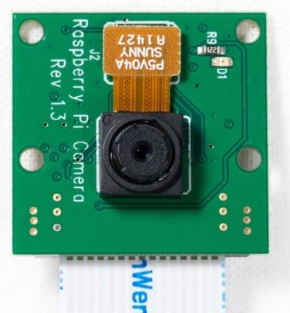
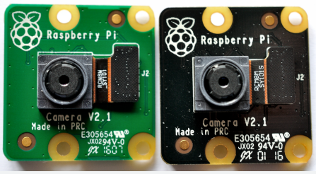

# Raspberry Pi 4 Camera Setup Guide

Raspberry Pi 4에서 Camera 1.3 / 2.1 연결 및 동작 확인 가이드

---

## V1.3 




## V2.1 




---

## 1. 호환성

| 카메라 | 센서 | 해상도 | Pi 4 호환 |
|--------|------|--------|-----------|
| Camera Module 1.3 | OmniVision OV5647 | 5MP (2592x1944) | OK |
| Camera Module 2.1 | Sony IMX219 | 8MP (3280x2464) | OK |

공식 문서: *"All Raspberry Pi camera modules are compatible with all Raspberry Pi computers with CSI connectors."*

Pi 4는 표준 15핀 CSI 커넥터를 사용하므로, 카메라에 포함된 **표준-표준 리본 케이블**로 바로 연결합니다.

---

## 2. 하드웨어 연결

```
1. sudo poweroff  (전원 완전히 끄기)
2. CSI 포트 래치(검은색 걸쇠)를 위로 열기
3. 리본 케이블 삽입
   - 파란색 접촉면이 Pi 바깥쪽을 향하도록
   - Pi 4: micro HDMI 포트와 오디오 잭 사이, "CAMERA" 라벨 위치
4. 래치를 양쪽 균등하게 눌러 닫기
5. 전원 연결 후 부팅
```

> **주의**: Pi 5는 22핀 커넥터를 사용하므로 어댑터 케이블이 필요하지만, Pi 4는 그럴 필요 없습니다.

---

## 3. 소프트웨어 설치

### 방법 A: 자동 설치 스크립트

```bash
sudo bash setup_camera.sh
```

### 방법 B: 수동 설치

```bash
sudo apt update && sudo apt upgrade -y
sudo apt install -y rpicam-apps libcamera-dev python3-picamera2
```

### config.txt 설정 (Camera 1.3 OV5647 필수)

Camera 1.3(OV5647)은 `camera_auto_detect`으로는 타임아웃 문제가 발생할 수 있습니다.
**overlay를 수동 지정**해야 합니다.

`/boot/firmware/config.txt` (또는 `/boot/config.txt`)에:

```ini
#camera_auto_detect=1
dtoverlay=ov5647
gpu_mem=128
```

> **재부팅 필수**: `sudo reboot`

---

## 4. 카메라 인식 확인

### CLI 도구

```bash
# 카메라 목록 확인
rpicam-hello --list-cameras

# 레거시 (Bookworm 이전)
libcamera-hello --list-cameras
```

정상 연결 시 아래와 같은 출력이 나옵니다:

```
Available cameras
-----------------
0 : imx219 [3280x2464 10-bit RGGB] (/base/soc/i2c0mux/i2c@1/imx219@10)
    Modes: 'SRGGB10_CSI2P' : 640x480/...
```

카메라가 2대 연결되어 있으면 `0`, `1` 두 개가 표시됩니다.

### Picamera2 (Python)

```python
from picamera2 import Picamera2
cameras = Picamera2.global_camera_info()
print(f"Found {len(cameras)} camera(s): {cameras}")
```

---

## 5. 빠른 테스트 (CLI)

```bash
# 사진 촬영
rpicam-still -o test.jpg

# 5초 프리뷰 후 사진
rpicam-still -t 5000 -o test.jpg

# 영상 녹화 (3초)
rpicam-vid -t 3000 -o test.h264
```

> Bookworm 이전 OS에서는 `libcamera-still`, `libcamera-vid` 사용

---

## 6. Python 테스트 코드

`test_camera.py` - 카메라 인식, 사진 촬영, 영상 녹화를 자동으로 수행합니다.

```bash
python3 test_camera.py
```

실행 결과:
- `test_camera_0.jpg` - 카메라 0번 사진
- `test_camera_1.jpg` - 카메라 1번 사진
- `test_video.h264` - 3초 영상

---

## 7. rpicam-apps 명령어 참조

| 명령어 | 기능 |
|--------|------|
| `rpicam-hello` | 프리뷰 (테스트용) |
| `rpicam-still` | 사진 촬영 |
| `rpicam-jpeg` | 빠른 JPEG 촬영 |
| `rpicam-vid` | 영상 녹화 |

### 유용한 옵션

| 옵션 | 설명 |
|------|------|
| `-o file` | 출력 파일명 |
| `-t ms` | 실행 시간 (밀리초) |
| `--width N` | 가로 해상도 |
| `--height N` | 세로 해상도 |
| `--rotation 0/90/180/270` | 회전 |
| `--hflip` | 수평 뒤집기 |
| `--vflip` | 수직 뒤집기 |
| `--list-cameras` | 연결된 카메라 목록 |

---

## 8. Picamera2 Python 라이브러리

### 설치

```bash
sudo apt install python3-picamera2
```

### 기본 사용법

```python
from picamera2 import Picamera2
import time

# 카메라 초기화 (카메라 0번)
picam = Picamera2(camera_num=0)
config = picam.create_still_configuration()
picam.configure(config)
picam.start()
time.sleep(2)

# 사진 촬영
picam.capture_file("photo.jpg")
picam.stop()
```

### 영상 녹화

```python
from picamera2 import Picamera2
from picamera2.encoders import H264Encoder
import time

picam = Picamera2(camera_num=0)
config = picam.create_video_configuration(
    main={"size": (1280, 720)}
)
picam.configure(config)

encoder = H264Encoder(10000000)
picam.start_recording(encoder, "output.h264")
time.sleep(5)
picam.stop_recording()
picam.stop()
picam.close()
```

---

## 9. 트러블슈팅

| 증상 | 원인 | 해결 |
|------|------|------|
| `no cameras available` | 케이블 연결 불량 | 전원 off 후 케이블 재연결 |
| `no cameras available` | overlay 미설정 | config.txt에 `dtoverlay=ov5647` 추가 후 재부팅 |
| `Camera frontend has timed out` | OV5647 타임아웃 | `camera_auto_detect=1` 비활성화 + `dtoverlay=ov5647` 수동 지정 |
| `rpicam-hello: not found` | rpicam-apps 미설치 | `sudo apt install rpicam-apps` |
| 이미지 회전됨 | 카메라 장착 방향 | `--rotation 180` 또는 `--hflip --vflip` |
| Picamera2 import 에러 | 미설치 | `sudo apt install python3-picamera2` |

---

## 10. 파일 목록

| 파일 | 설명 |
|------|------|
| `setup_camera.sh` | 자동 설치 스크립트 |
| `quick_test.sh` | 셸 기반 빠른 테스트 |
| `test_camera.py` | Python 카메라 테스트 코드 |
| `README.md` | 이 문서 |

---

## 참고 링크

- [공식 카메라 문서](https://www.raspberrypi.com/documentation/accessories/camera.html)
- [카메라 소프트웨어 문서](https://www.raspberrypi.com/documentation/computers/camera_software.html)
- [rpicam-apps 가이드](https://raspberry.tips/en/raspberrypi-tutorials/set-up-raspberry-pi-camera-photos-videos-2026)
